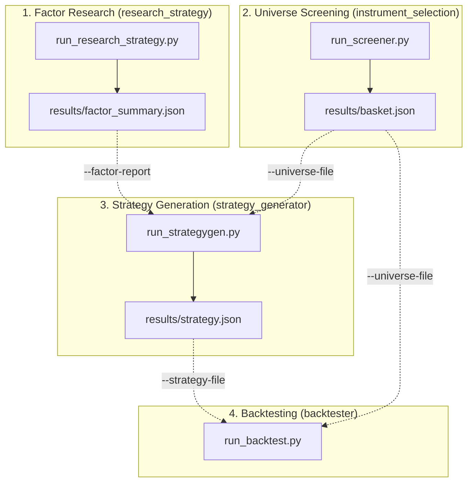

# Quantitative Trading Workspace

A modular, end-to-end quantitative trading research, asset selection, strategy generation, and backtesting framework.

This workspace consists of five integrated components that form a complete quantitative workflow:

- `common/`: Shared market data loaders, indicators, portfolio backtester, allocation templates, factor taxonomy, and synthetic test generators.
- `research_strategy/`: Researched quantitative trading strategies (17 TAA, timing, breakout, and static portfolio models) and factor summary exporter.
- `instrument_selection/`: Strategy-agnostic screening, predictability testing (Hurst, candlestick, momentum), correlation clustering, and basket selection tool.
- `strategy_generator/`: Portfolio strategy generator searching allocation templates and mined turning-point patterns, validated via Equivalent Random Search (ERS) and factor research tie-breaking.
- `backtester/`: Standalone backtesting engine evaluating fixed strategy specifications (`strategy.json`) across standard or rolling walk-forward windows.

---

## Workspace Architecture & Data Flow

The workspace components are designed as an integrated pipeline where outputs from upstream research and screening stages flow directly into strategy search and backtesting.



---

## Setup & Environment

All projects in this workspace share a single `uv`-managed Python environment. From the workspace root directory, initialize or synchronize the environment:

```bash
uv sync
```

---

## End-to-End Quantitative Workflow

### Step 1: Factor Research (`research_strategy`)

Run quantitative factor research across 17 implemented strategy formulations to characterize performance across factor categories (`absolute_momentum_trend`, `relative_momentum`, `volatility_targeting`, `mean_reversion`, `breadth`, `correlation_diversification`, etc.).

```bash
# Run factor research on real market data (yfinance)
uv run python research_strategy/run_research_strategy.py --strategy all --data-provider yfinance

# Offline/synthetic mode (default testing policy)
uv run python research_strategy/run_research_strategy.py --strategy all
```

**Primary Output**: `research_strategy/results/factor_summary.json` containing aggregated performance metrics grouped by quantitative factor tag.

---

### Step 2: Universe Screening & Basket Selection (`instrument_selection`)

Screen a candidate ticker universe using hard investability screens (liquidity floor and minimum trading history), measure statistical structure (Hurst exponent, candlestick patterns, time-series momentum), evaluate pairwise correlation and clustering, and extract an optimized asset basket.

```bash
# Screen candidate universe and select a diversified basket using threshold-gated greedy selection
uv run python instrument_selection/run_screener.py \
  --universe SPY QQQ IWM EFA EEM GLD TLT XLE XLF XLK XLV XLU \
  --select-method threshold --select-max-k 8
```

**Primary Outputs**:
- `instrument_selection/results/basket.json` (Selected asset ticker list)
- `instrument_selection/results/screening_report.csv` (Detailed metrics and composite scores)
- `instrument_selection/results/correlation_matrix.csv` (Pairwise correlation matrix)

---

### Step 3: Strategy Generation (`strategy_generator`)

Generate an optimal portfolio allocation strategy for the selected asset basket. This process grid-searches 9 portfolio allocation templates (plus optional turning-point indicator patterns mined from historical price swings), validates candidates via Equivalent Random Search (ERS), and uses the factor research report as a tie-breaker when top candidates perform within an epsilon threshold.

```bash
# Generate allocation strategy consuming the screened basket and factor research report
uv run python strategy_generator/run_strategygen.py \
  --universe-file instrument_selection/results/basket.json \
  --factor-report research_strategy/results/factor_summary.json \
  --mine-patterns --mode generate
```

**Primary Output**: `strategy_generator/results/strategy.json` containing the selected template name, tuned hyperparameter values, performance metrics, ERS validation status, and optional pattern specification.

---

### Step 4: Out-of-Sample & Walk-Forward Backtesting (`backtester`)

Evaluate the generated fixed strategy specification (`strategy.json`) against the screened asset basket. The `backtester` component provides both standard full-horizon backtests and rolling walk-forward consistency analysis with zero re-optimization.

```bash
# Standard evaluation over full history
uv run python backtester/run_backtest.py \
  --strategy-file strategy_generator/results/strategy.json \
  --universe-file instrument_selection/results/basket.json \
  --mode standard

# Walk-forward rolling consistency check (1-year rolling windows, 0.5-year steps)
uv run python backtester/run_backtest.py \
  --strategy-file strategy_generator/results/strategy.json \
  --universe-file instrument_selection/results/basket.json \
  --mode walkforward --window-years 1.0 --step-years 0.5
```

**Primary Outputs**:
- `backtester/results/backtest_equity.csv` (Daily portfolio equity curve)
- `backtester/results/backtest_weights.csv` (Daily dense asset target weights)
- `backtester/results/walkforward_report.csv` (Window-by-window performance breakdown for walkforward mode)

---

## Inter-Project Data Handoff Schemas

### 1. `research_strategy/results/factor_summary.json`

JSON object mapping factor taxonomy categories to backtest performance aggregates across researched strategies:

```json
{
  "factors": {
    "relative_momentum": {
      "avg_sharpe_ratio": 0.85,
      "avg_cagr": 0.12,
      "avg_max_drawdown": 0.15,
      "count": 5
    },
    "volatility_targeting": {
      "avg_sharpe_ratio": 0.78,
      "avg_cagr": 0.10,
      "avg_max_drawdown": 0.11,
      "count": 3
    }
  },
  "caveat": "Note on provider used for evaluation..."
}
```

### 2. `instrument_selection/results/basket.json`

JSON specification of a selected asset universe, consumed directly by `strategy_generator` and `backtester` via `--universe-file`:

```json
{
  "basket": ["SPY", "QQQ", "EEM", "GLD", "TLT"],
  "method": "threshold",
  "date_generated": "2026-08-19T00:00:00Z"
}
```

### 3. `strategy_generator/results/strategy.json`

Exported strategy specification consumed directly by `backtester` via `--strategy-file`:

```json
{
  "template_name": "HierarchicalRiskParityAllocation",
  "params": {
    "lookback_days": 126,
    "rebalance_freq_days": 21
  },
  "explanation": "Hierarchical Risk Parity allocation...",
  "sharpe_ratio": 1.15,
  "cagr": 0.142,
  "max_drawdown": 0.125,
  "calmar_ratio": 1.136,
  "win_rate": 0.54,
  "profit_factor": 1.35,
  "trusted": true,
  "ers_passed": true,
  "ers_percentile": 0.94,
  "factor_context": null,
  "factor_tiebreak_used": false,
  "pattern_spec": null
}
```

---

## Offline Testing Policy & Unit Tests

All unit tests across the repository run offline without requiring external network access or live market data, utilizing synthetic data generation (`SyntheticDataProvider` or Brownian motion generators in `common/testing.py`).

Run tests for individual components or the entire workspace:

```bash
# Run all workspace unit tests
uv run pytest

# Run tests for specific projects
uv run pytest research_strategy/tests -v
uv run pytest instrument_selection/tests -v
uv run pytest strategy_generator/tests -v
uv run pytest backtester/tests -v
uv run pytest common/tests -v
```

---

## Directory Reference Index

| Project Directory | Purpose | Key Entry Point |
|---|---|---|
| `common/` | Shared core infrastructure, indicators, data loaders, allocation templates, and backtester engine | N/A (Imported module) |
| `research_strategy/` | Evaluates 17 quantitative trading strategies and exports factor research summaries | `research_strategy/run_research_strategy.py` |
| `instrument_selection/` | Characterizes instruments, performs hard investability screening, and selects diversified baskets | `instrument_selection/run_screener.py` |
| `strategy_generator/` | Grid-searches allocation templates & mined indicator patterns to generate validated strategies | `strategy_generator/run_strategygen.py` |
| `backtester/` | Standalone CLI evaluating fixed strategy files over single or rolling walkforward windows | `backtester/run_backtest.py` |
