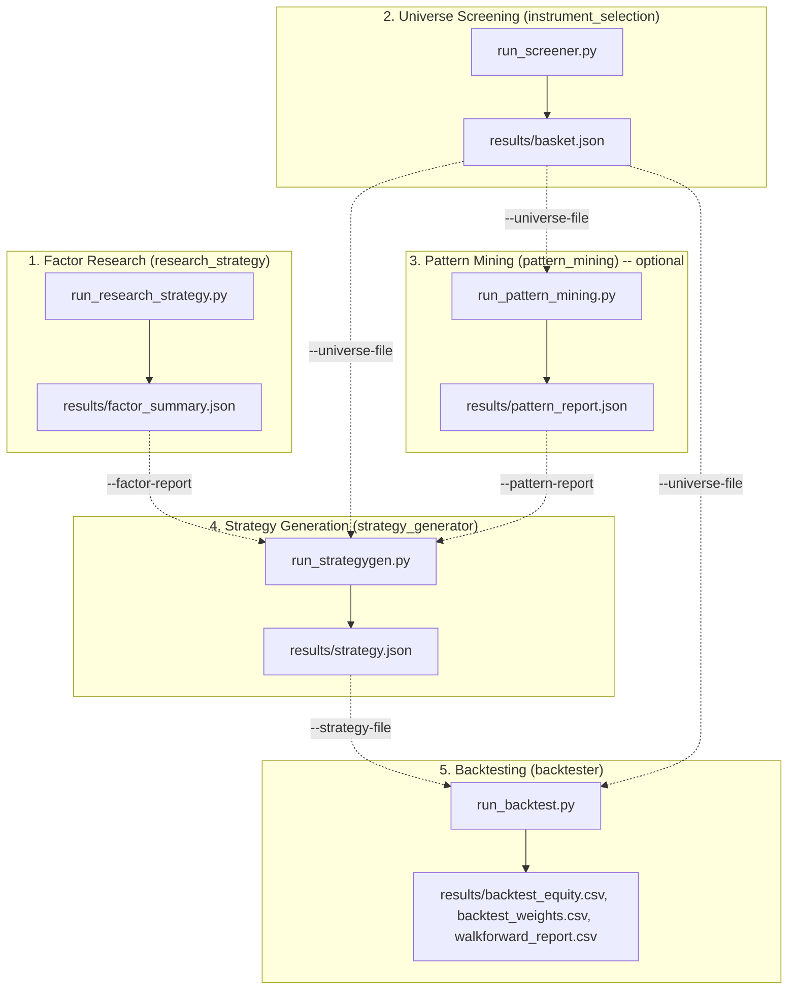

# Quantitative Trading Workspace

A modular, end-to-end quantitative trading research, asset selection, strategy generation, and backtesting framework.

This workspace consists of six integrated components that form a complete quantitative workflow:

- `common/`: Shared market data loaders, indicators, portfolio backtester, allocation templates, factor taxonomy, rebalance scheduling, shuffle-null significance testing, CLI/reporting scaffolding, and synthetic test generators.
- `research_strategy/`: Researched quantitative trading strategies (17 TAA, timing, breakout, and static portfolio models) and factor summary exporter.
- `instrument_selection/`: Strategy-agnostic screening, predictability testing (Hurst, candlestick, momentum), correlation clustering, and basket selection tool.
- `pattern_mining/`: Turning-point indicator pattern mining (Bonferroni-corrected shuffle-null significance test), writing a durable `pattern_report.json` for `strategy_generator` to consume.
- `strategy_generator/`: Portfolio strategy generator searching allocation templates and mined turning-point patterns, validated via Equivalent Random Search (ERS) and factor research tie-breaking.
- `backtester/`: Standalone backtesting engine evaluating fixed strategy specifications (`strategy.json`) across standard or rolling walk-forward windows.

Each project directory has its own README with a full CLI argument reference, sample commands, and
data-shape/schema documentation; `common/README.md` is the workspace's single source of truth for
every DataFrame/JSON shape shared by 2+ projects. This file gives the end-to-end picture; follow the
links below for the full detail on any one piece.

---

## Workspace Architecture & Data Flow

The workspace components are designed as an integrated pipeline where outputs from upstream research and screening stages flow directly into strategy search and backtesting.



All 5 stages also share a single OHLCV cache directory at `data/` (repo root) — a symbol/interval/
date-range fetched by one stage is reused by every other stage instead of being re-downloaded and
cached separately per project. See `common/README.md`'s "Shared OHLCV cache directory" section for
the cache filename convention and the `--cache-ttl-days` staleness knob.

---

## Setup & Environment

All projects in this workspace share a single `uv`-managed Python environment. From the workspace root directory, initialize or synchronize the environment:

```bash
uv sync
```

---

## End-to-End Quantitative Workflow

### Step 1: Factor Research (`research_strategy`)

Run quantitative factor research across 17 implemented strategy formulations to characterize performance across factor categories (`absolute_momentum_trend`, `relative_momentum`, `volatility_targeting`, `mean_reversion`, `breadth`, `correlation_diversification`, etc.).

```bash
# Run factor research on real market data (yfinance)
uv run python research_strategy/run_research_strategy.py --strategy all --data-provider yfinance

# Offline/synthetic mode (default testing policy)
uv run python research_strategy/run_research_strategy.py --strategy all
```

**Primary Output**: `research_strategy/results/factor_summary.json` containing aggregated performance metrics grouped by quantitative factor tag.

See `research_strategy/README.md` for the full CLI argument reference, every strategy formulation,
and more sample commands (single-strategy runs, custom config files, plain-English `--description`
strategies).

---

### Step 2: Universe Screening & Basket Selection (`instrument_selection`)

Screen a candidate ticker universe using hard investability screens (liquidity floor and minimum trading history), measure statistical structure (Hurst exponent, candlestick patterns, time-series momentum), evaluate pairwise correlation and clustering, and extract an optimized asset basket.

```bash
# Screen candidate universe and select a diversified basket using threshold-gated greedy selection
uv run python instrument_selection/run_screener.py \
  --universe SPY QQQ IWM EFA EEM GLD TLT XLE XLF XLK XLV XLU \
  --select-method threshold --select-max-k 8
```

**Primary Outputs**:
- `instrument_selection/results/basket.json` (Selected asset ticker list)
- `instrument_selection/results/screening_report.csv` (Detailed metrics and composite scores)
- `instrument_selection/results/correlation_matrix.csv` (Pairwise correlation matrix)

See `instrument_selection/README.md` for the full CLI argument reference, the scoring methodology,
and sample commands for every `--select-method` (`top_k`, `cluster`, `greedy`, `threshold`,
`max_diversification`).

---

### Step 3: Pattern Mining (`pattern_mining`) — optional

Mine the selected asset basket's aggregate portfolio price history for statistically significant
technical-indicator patterns preceding major turning points (peaks/troughs), via a Bonferroni-
corrected shuffle-null significance test. Writes a durable report independent of any single
`strategy_generator` run, reusable across multiple generation attempts/parameter sweeps.

```bash
# Mine patterns on the screened basket
uv run python pattern_mining/run_pattern_mining.py \
  --universe-file instrument_selection/results/basket.json --data-provider synthetic
```

**Primary Output**: `pattern_mining/results/pattern_report.json` containing every tested
(indicator, turning-point-type) combination's significance result.

See `pattern_mining/README.md` for the full CLI argument reference, the significance-test
methodology, and its disclosed hindsight/multiple-comparisons caveats. Skip this step entirely to
have `strategy_generator` search only its 9 static allocation templates (plus any
`--research-strategy` templates).

---

### Step 4: Strategy Generation (`strategy_generator`)

Generate an optimal portfolio allocation strategy for the selected asset basket. This process grid-searches 9 portfolio allocation templates (plus, optionally, Step 3's mined turning-point indicator patterns), validates candidates via Equivalent Random Search (ERS), and uses the factor research report as a tie-breaker when top candidates perform within an epsilon threshold.

```bash
# Generate allocation strategy consuming the screened basket, factor research report, and pattern report
uv run python strategy_generator/run_strategygen.py \
  --universe-file instrument_selection/results/basket.json \
  --factor-report research_strategy/results/factor_summary.json \
  --pattern-report pattern_mining/results/pattern_report.json --mode generate
```

**Primary Output**: `strategy_generator/results/strategy.json` containing the selected template name, tuned hyperparameter values, performance metrics, ERS validation status, and optional pattern specification.

See `strategy_generator/README.md` for the full CLI argument reference and the ERS/factor-tiebreak
mechanism.

---

### Step 5: Out-of-Sample & Walk-Forward Backtesting (`backtester`)

Evaluate the generated fixed strategy specification (`strategy.json`) against the screened asset basket. The `backtester` component provides both standard full-horizon backtests and rolling walk-forward consistency analysis with zero re-optimization.

```bash
# Standard evaluation over full history
uv run python backtester/run_backtest.py \
  --strategy-file strategy_generator/results/strategy.json \
  --universe-file instrument_selection/results/basket.json \
  --mode standard

# Walk-forward rolling consistency check (1-year rolling windows, 0.5-year steps)
uv run python backtester/run_backtest.py \
  --strategy-file strategy_generator/results/strategy.json \
  --universe-file instrument_selection/results/basket.json \
  --mode walkforward --window-years 1.0 --step-years 0.5
```

**Primary Outputs**:
- `backtester/results/backtest_equity.csv` (Daily portfolio equity curve)
- `backtester/results/backtest_weights.csv` (Daily dense asset target weights)
- `backtester/results/walkforward_report.csv` (Window-by-window performance breakdown for walkforward mode)

See `backtester/README.md` for the full CLI argument reference and `backtester/SCHEMAS.md` for
exact output column definitions.

### Automated: `run_pipeline.py`

`run_pipeline.py` (repo root) chains all 5 steps above end-to-end in a single command, auto-wiring
each step's output file (`factor_summary.json` -> `basket.json` -> `pattern_report.json` ->
`strategy.json`) into the next step's input flag via subprocess calls, and writes a
`pipeline_manifest_*.json` run summary under `results/`. It only exposes the flags a typical
end-to-end run needs to vary; anything else requires running the 5 steps manually as shown above.
Step 3 (pattern_mining) only runs when `--mine-patterns` is passed — otherwise it's skipped and
step 4 searches only its static (and any `--research-strategy`) templates.

```bash
# Full pipeline on synthetic data (no real market data/network)
uv run python run_pipeline.py --universe SPY QQQ IWM EFA EEM GLD TLT --data-provider synthetic

# Preview the 5 resolved commands without running anything
uv run python run_pipeline.py --universe SPY QQQ IWM EFA EEM GLD TLT --dry-run

# With turning-point pattern mining (step 3) and a stricter basket cap (step 2)
uv run python run_pipeline.py --universe SPY QQQ IWM EFA EEM GLD TLT XLE XLF XLK XLV XLU \
  --data-provider synthetic --select-method threshold --select-max-k 6 --mine-patterns

# Walk-forward evaluation (step 5) with a baseline-symbol comparison against SPY
uv run python run_pipeline.py --universe SPY QQQ IWM EFA EEM GLD TLT --data-provider synthetic \
  --mode walkforward --baseline-symbol SPY --baseline-template equal_weight

# Faster run: skip the equity-curve charts steps 4/5 would otherwise write
uv run python run_pipeline.py --universe SPY QQQ IWM EFA EEM GLD TLT --data-provider synthetic --no-plots

# Treat the shared data/ cache as stale after 1 day (useful for a rolling/live --end date;
# irrelevant for a fixed historical range, which never goes stale)
uv run python run_pipeline.py --universe SPY QQQ IWM EFA EEM GLD TLT --data-provider synthetic --cache-ttl-days 1

# Blend in research_strategy strategies as additional candidates (step 4), and grid-search +
# ERS-validate the winner's params on this universe before the final backtest (step 5)
uv run python run_pipeline.py --universe SPY QQQ IWM EFA EEM GLD TLT --data-provider synthetic \
  --research-strategy baa_keller adaptive_grid --optimize --n-random-search 100

# A real end-to-end run against real market data (only pass --data-provider yfinance
# deliberately -- every other example above defaults to synthetic per this workspace's
# no-real-market-data-by-default convention)
uv run python run_pipeline.py --universe SPY QQQ IWM EFA EEM GLD TLT --data-provider yfinance
```

See `run_pipeline.py --help` for the full flag list; anything not exposed here (e.g. custom
`--start`/`--end`, `--n-days`/`--seed`, `--top-n`, walk-forward window/step sizing,
`--factor-tiebreak-epsilon`) requires running the 5 steps manually per the commands above.

---

## Inter-Project Data Handoff Schemas

Full field-level schemas for every artifact below live in the owning project's own README (or
`backtester/SCHEMAS.md`) — see the "Data Shapes & Schemas" section there. What follows is a
representative example of each, kept in sync with the authoritative source; don't treat this
section as the schema of record if the two ever disagree.

### 1. `research_strategy/results/factor_summary.json`

Aggregates each researched strategy's backtest performance (Sharpe/CAGR/max drawdown/Calmar) by
factor taxonomy tag, plus the run context and a `caveat` that must be read before trusting anything
in it (its wording changes depending on whether the run used real or synthetic data — see
`research_strategy/README.md` §2b):

```json
{
  "run_context": {"data_provider": "synthetic", "seed": 42, "n_days": 1200, "start": "...", "end": "..."},
  "factor_performance": {
    "relative_momentum": {
      "n_strategies": 5,
      "mean_sharpe_ratio": 0.85, "median_sharpe_ratio": 0.81,
      "mean_cagr": 0.12, "median_cagr": 0.11,
      "mean_max_drawdown": 0.15, "median_max_drawdown": 0.14,
      "mean_calmar_ratio": 0.80, "median_calmar_ratio": 0.77
    }
  },
  "strategy_factor_tags": {"momentum_rotation": ["relative_momentum"]},
  "caveat": "Computed on provider='synthetic', seed=42, n_days=1200, ... to .... Synthetic GBM data has NO real momentum/mean-reversion/volatility-clustering structure by construction, ..."
}
```

### 2. `instrument_selection/results/basket.json`

JSON specification of a selected asset universe, consumed directly by `strategy_generator` and `backtester` via `--universe-file`:

```json
{
  "basket": ["SPY", "QQQ", "EEM", "GLD", "TLT"],
  "method": "threshold",
  "date_generated": "2026-08-19T00:00:00Z"
}
```

### 3. `strategy_generator/results/strategy.json`

Exported strategy specification consumed directly by `backtester` via `--strategy-file`:

```json
{
  "template_name": "HierarchicalRiskParityAllocation",
  "params": {
    "lookback_days": 126,
    "rebalance_freq_days": 21
  },
  "explanation": "Hierarchical Risk Parity allocation...",
  "sharpe_ratio": 1.15,
  "cagr": 0.142,
  "max_drawdown": 0.125,
  "calmar_ratio": 1.136,
  "win_rate": 0.54,
  "profit_factor": 1.35,
  "trusted": true,
  "ers_passed": true,
  "ers_percentile": 0.94,
  "factor_context": null,
  "factor_tiebreak_used": false,
  "pattern_spec": null,
  "research_strategy_spec": null
}
```

`pattern_spec` and `research_strategy_spec` are mutually exclusive — non-null only when the winner came
from `--pattern-report` or `--research-strategy` respectively (see `strategy_generator/README.md`'s
"Data Shapes & Schemas" section for both fields' full schemas).

---

## Offline Testing Policy & Unit Tests

All unit tests across the repository run offline without requiring external network access or live market data, utilizing synthetic data generation (`SyntheticDataProvider` or Brownian motion generators in `common/testing.py`).

Each project's test suite must be run separately, one path at a time -- none of the 7 `tests/`
directories (including the root-level `tests/`, covering `run_pipeline.py`) has an `__init__.py`,
so collecting more than one in a single `pytest` invocation (e.g. a bare `uv run pytest` from the
repo root) fails with `import file mismatch` errors on the handful of same-named test files
(`test_allocation_templates.py`, `test_indicators.py`, etc.) that exist in more than one project.
There is no single command that runs every test in the workspace at once:

```bash
uv run pytest research_strategy/tests -v
uv run pytest instrument_selection/tests -v
uv run pytest pattern_mining/tests -v
uv run pytest strategy_generator/tests -v
uv run pytest backtester/tests -v
uv run pytest common/tests -v
uv run pytest tests -v
```

---

## Directory Reference Index

| Project Directory | Purpose | Key Entry Point | Docs |
|---|---|---|---|
| `common/` | Shared core infrastructure, indicators, data loaders, allocation templates, and backtester engine | N/A (Imported module) | `common/README.md` |
| `research_strategy/` | Evaluates 17 quantitative trading strategies and exports factor research summaries | `research_strategy/run_research_strategy.py` | `research_strategy/README.md` |
| `instrument_selection/` | Characterizes instruments, performs hard investability screening, and selects diversified baskets | `instrument_selection/run_screener.py` | `instrument_selection/README.md` |
| `pattern_mining/` | Mines turning-point indicator patterns via a Bonferroni-corrected shuffle-null significance test | `pattern_mining/run_pattern_mining.py` | `pattern_mining/README.md` |
| `strategy_generator/` | Grid-searches allocation templates & mined indicator patterns to generate validated strategies | `strategy_generator/run_strategygen.py` | `strategy_generator/README.md` |
| `backtester/` | Standalone CLI evaluating fixed strategy files over single or rolling walkforward windows | `backtester/run_backtest.py` | `backtester/README.md`, `backtester/SCHEMAS.md` |
| `run_pipeline.py` | Chains all 5 pipeline steps end-to-end via subprocess, auto-wiring each step's output into the next | `run_pipeline.py` | This README |
| `data/` | Shared OHLCV cache directory, written/read by all 5 stages (provider-aware filenames, optional `--cache-ttl-days` staleness) | N/A (cache, not code) | `common/README.md` §7 |
| `fundamental_screener/` | Standalone (not pipeline-wired) real-fundamentals buy/sell screener; also produces a `backtester`-compatible strategy | `fundamental_screener/run_fundamental_screener.py` | `fundamental_screener/README.md` |
| `bnn_forecaster/` | Standalone (not pipeline-wired) AutoBNN probabilistic-forecast buy/sell screener; own isolated `uv` environment (see its README) | `bnn_forecaster/run_bnn_forecaster.py` | `bnn_forecaster/README.md` |
