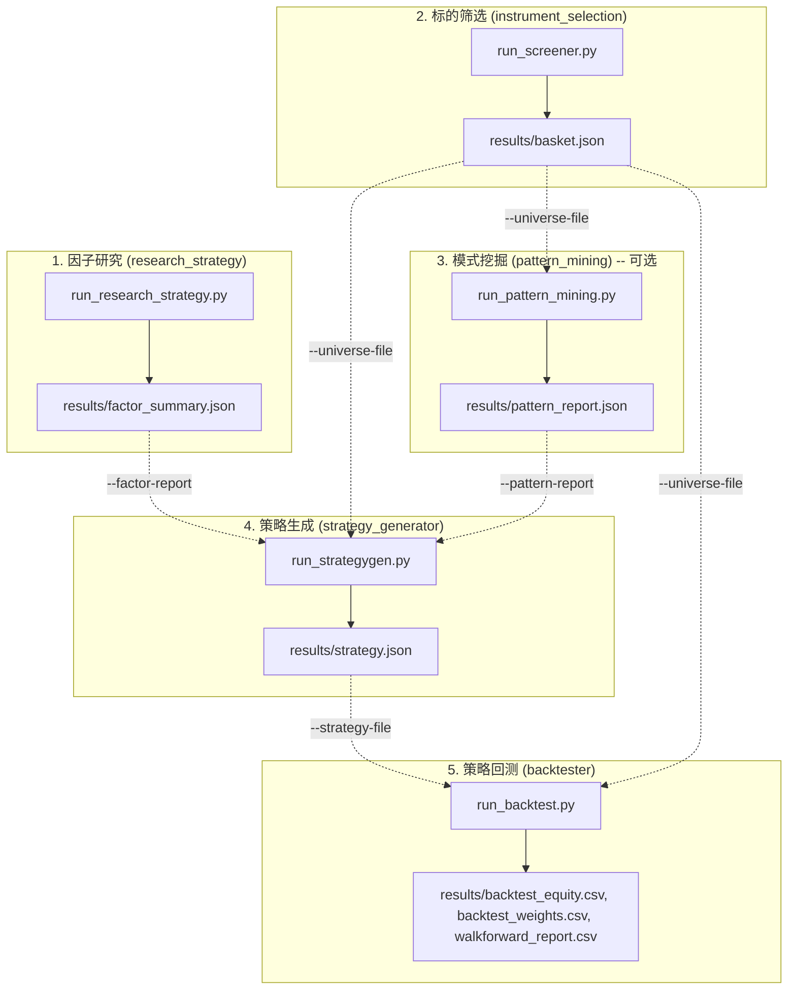

[ [English](README.md) | 简体中文 ]

# 量化交易工作区 (Quantitative Trading Workspace)

一个模块化、端到端的量化交易研究、资产筛选、策略生成与回测框架。

本工作区组织为两个项目组，每个项目组拥有独立的 `uv` 环境，以及位于仓库根目录的共享基础设施：

- **`pipeline/`** -- 核心研究/回测流水线项目组（共享一个 `uv` 环境）：
  - `research_strategy/`：量化交易策略研究（包含 17 种战术资产配置 TAA、定时择时、突破和静态组合模型）及因子汇总导出器。
  - `instrument_selection/`：策略无关的标的筛选、可预测性测试（Hurst 指数、蜡烛图形态、动量）、相关性聚类和组合篮子选择工具。
  - `pattern_mining/`：拐点指标模式挖掘（基于 Bonferroni 矫正的打乱置换零假设显著性检验），生成供 `strategy_generator` 消费的持久化 `pattern_report.json`。
  - `strategy_generator/`：组合策略生成器，搜索配置模板与挖掘出的拐点模式，通过等效随机搜索（ERS）验证并结合因子研究进行平局决胜。
  - `fundamental_screener/`：独立（未接入流水线）的真实基本面买入/卖出筛选器。
  - `run_pipeline.py`：通过子进程端到端串联 research_strategy -> instrument_selection -> pattern_mining -> strategy_generator -> `backtester`。
- **`ml/`** -- 基于 ML/DL 的策略项目组，每个项目拥有**独立隔离**的 `uv` 环境：
  - `bnn_forecaster/`：独立（未接入流水线）的 AutoBNN 概率预测买入/卖出筛选器。
- **根目录共享部分**（无独立的 `pyproject.toml`/虚拟环境 -- 由运行它们的项目组虚拟环境通过 `sys.path` 注入调用）：
  - `common/`：共享的市场数据加载器、技术指标、组合回测器、配置模板、因子分类学、再平衡调度、打乱置换显著性检验、CLI/报告脚手架以及合成数据生成器。
  - `backtester/`：独立的策略回测引擎，评估固定策略规范（`strategy.json`）在标准区间或滚动 Walk-Forward 窗口下的表现。

每个项目目录均包含独立的 README，附带完整的 CLI 参数说明、示例命令和数据 Schema 文档；`common/README_ZH.md` 是工作区内由 2 个或以上项目共享的每个 DataFrame/JSON 数据结构的唯一权威来源。本文件提供端到端的全景图；如需了解具体模块的详细信息，请参阅以下链接。

---

## 工作区架构与数据流

工作区组件设计为一个集成流水线，上游研究和筛选阶段的输出直接流入策略搜索和回测阶段。



所有 5 个阶段还共享位于仓库根目录 `data/` 的单个 OHLCV 缓存目录——任何阶段获取的标的/周期/日期范围数据都会被其他阶段复用，无需按项目重复下载和缓存。参阅 `common/README_ZH.md` 的“共享 OHLCV 缓存目录”章节了解缓存文件名规范及 `--cache-ttl-days` 过期控制。

---

## 环境安装与配置

`pipeline/` 和 `ml/bnn_forecaster/` 分别管理各自的 `uv` 环境。请根据需要初始化/同步对应环境：

```bash
cd pipeline && uv sync              # research_strategy, instrument_selection, pattern_mining,
                                     # strategy_generator, fundamental_screener, run_pipeline.py
cd ml/bnn_forecaster && uv sync      # bnn_forecaster 独立的隔离环境 (AutoBNN/JAX/TFP)
```

根目录下的 `common/` 和 `backtester/` 没有独立环境——使用适合您所触及策略的项目组虚拟环境运行它们即可，例如 `pipeline/.venv/Scripts/python.exe backtester/run_backtest.py ...`。

---

## 端到端量化工作流

### 第 1 步：因子研究 (`research_strategy`)

在 17 种已实现的策略结构上运行量化因子研究，评估不同因子类别（`absolute_momentum_trend`、`relative_momentum`、`volatility_targeting`、`mean_reversion`、`breadth`、`correlation_diversification` 等）的表现特征。

```bash
# 从 pipeline/ 目录运行（或从根目录使用 pipeline/.venv/Scripts/python.exe）
# 在真实市场数据上运行因子研究 (yfinance)
uv run python research_strategy/run_research_strategy.py --strategy all --data-provider yfinance

# 离线/合成数据模式（默认测试策略）
uv run python research_strategy/run_research_strategy.py --strategy all
```

**主要输出**：`pipeline/research_strategy/results/factor_summary.json`，包含按量化因子标签分组的聚合性能指标。

参阅 `pipeline/research_strategy/README_ZH.md` 获取完整 CLI 参数参考、每种策略公式及更多示例命令（单策略运行、自定义配置文件、自然语言 `--description` 策略）。

---

### 第 2 步：标的筛选与资产组合选择 (`instrument_selection`)

使用硬性可投资性门槛（流动性下限和最小交易历史）筛选候选标的，测量统计结构（Hurst 指数、蜡烛图形态、时间序列动量），评估两两相关性及聚类，并提取优化后的资产组合。

```bash
# 从 pipeline/ 目录运行
# 筛选候选标的并通过阈值门控贪心选择法挑选分散化的资产组合
uv run python instrument_selection/run_screener.py \
  --universe SPY QQQ IWM EFA EEM GLD TLT XLE XLF XLK XLV XLU \
  --select-method threshold --select-max-k 8
```

**主要输出**：
- `pipeline/instrument_selection/results/basket.json`（已选资产代码列表）
- `pipeline/instrument_selection/results/screening_report.csv`（详细指标与综合评分）
- `pipeline/instrument_selection/results/correlation_matrix.csv`（两两相关性矩阵）

参阅 `pipeline/instrument_selection/README_ZH.md` 获取完整 CLI 参数参考、评分方法及每种选择方法（`top_k`、`cluster`、`greedy`、`threshold`、`max_diversification`）的示例命令。

---

### 第 3 步：模式挖掘 (`pattern_mining`) — 可选

通过基于 Bonferroni 矫正的打乱置换零假设显著性检验，从选定资产组合的聚合价格历史中挖掘重大拐点（顶/底）前具备统计显著性的技术指标模式。写入独立于单次 `strategy_generator` 运行的持久化报告，可在多次生成尝试/参数扫面中复用。

```bash
# 从 pipeline/ 目录运行
# 对筛选后的资产组合进行模式挖掘
uv run python pattern_mining/run_pattern_mining.py \
  --universe-file instrument_selection/results/basket.json --data-provider synthetic
```

**主要输出**：`pipeline/pattern_mining/results/pattern_report.json`，包含每个测试的 (指标, 拐点类型) 组合显著性检验结果。

参阅 `pipeline/pattern_mining/README_ZH.md` 获取完整 CLI 参数参考、显著性检验方法及其披露的事后偏误/多重比较注意事项。若跳过此步骤，`strategy_generator` 将仅在其 9 个静态配置模板（及任何 `--research-strategy` 模板）中进行搜索。

---

### 第 4 步：策略生成 (`strategy_generator`)

为选定的资产组合生成最优资产配置策略。该过程网格搜索 9 个组合配置模板（以及可选的第 3 步挖掘出的拐点指标模式），通过等效随机搜索（ERS）验证候选策略，并在顶尖候选策略性能在 epsilon 阈值内时使用因子研究报告进行平局决胜。

```bash
# 从 pipeline/ 目录运行
# 消费筛选后的资产组合、因子研究报告和模式挖掘报告以生成配置策略
uv run python strategy_generator/run_strategygen.py \
  --universe-file instrument_selection/results/basket.json \
  --factor-report research_strategy/results/factor_summary.json \
  --pattern-report pattern_mining/results/pattern_report.json --mode generate
```

**主要输出**：`pipeline/strategy_generator/results/strategy.json`，包含选定的模板名称、调优后的超参数值、性能指标、ERS 验证状态及可选的模式规范。

参阅 `pipeline/strategy_generator/README_ZH.md` 获取完整 CLI 参数参考及 ERS/因子决胜机制。

---

### 第 5 步：样本外与 Walk-Forward 滚动回测 (`backtester`)

评估生成的固定策略规范（`strategy.json`）在筛选后的资产组合上的表现。`backtester` 组件提供标准的全历史回测以及零重新优化的滚动 Walk-Forward 一致性分析。

```bash
# 从仓库根目录运行
# 全历史标准评估
uv run python backtester/run_backtest.py \
  --strategy-file pipeline/strategy_generator/results/strategy.json \
  --universe-file pipeline/instrument_selection/results/basket.json \
  --mode standard

# Walk-Forward 滚动一致性检查（1 年滚动窗口，0.5 年步长）
uv run python backtester/run_backtest.py \
  --strategy-file pipeline/strategy_generator/results/strategy.json \
  --universe-file pipeline/instrument_selection/results/basket.json \
  --mode walkforward --window-years 1.0 --step-years 0.5
```

**主要输出**：
- `backtester/results/backtest_equity.csv`（每日组合权益曲线）
- `backtester/results/backtest_weights.csv`（每日稠密资产目标权重）
- `backtester/results/walkforward_report.csv`（Walk-Forward 模式下的逐窗口性能细分）

参阅 `backtester/README_ZH.md` 获取完整 CLI 参数参考，参阅 `backtester/SCHEMAS_ZH.md` 获取确切输出列定义。

---

### 自动化流：`run_pipeline.py`

`pipeline/run_pipeline.py` 在单个命令中端到端串联上述所有 5 个步骤，通过子进程调用自动将每一步的输出文件（`factor_summary.json` -> `basket.json` -> `pattern_report.json` -> `strategy.json`）连接到下一步的输入参数中，并在 `pipeline/results/` 下写入 `pipeline_manifest_*.json` 运行摘要。它仅暴露典型端到端运行需要调整的标志；其他任何自定义需求均需按上述命令手动分步运行。第 3 步（pattern_mining）仅在传入 `--mine-patterns` 时运行，否则跳过，第 4 步仅搜索其静态（及 `--research-strategy`）模板。

```bash
# 从 pipeline/ 目录运行（或从根目录使用 pipeline/.venv/Scripts/python.exe pipeline/run_pipeline.py）
# 在合成数据上运行完整流水线（无真实市场数据/网络请求）
uv run python run_pipeline.py --universe SPY QQQ IWM EFA EEM GLD TLT --data-provider synthetic

# 预览解析出的 5 个命令而不实际执行
uv run python run_pipeline.py --universe SPY QQQ IWM EFA EEM GLD TLT --dry-run

# 包含拐点模式挖掘（第 3 步）和更严格的篮子上限（第 2 步）
uv run python run_pipeline.py --universe SPY QQQ IWM EFA EEM GLD TLT XLE XLF XLK XLV XLU \
  --data-provider synthetic --select-method threshold --select-max-k 6 --mine-patterns

# 带 SPY 基准对比的 Walk-Forward 评估（第 5 步）
uv run python run_pipeline.py --universe SPY QQQ IWM EFA EEM GLD TLT --data-provider synthetic \
  --mode walkforward --baseline-symbol SPY --baseline-template equal_weight

# 快速运行：跳过第 4/5 步输出的权益曲线图表
uv run python run_pipeline.py --universe SPY QQQ IWM EFA EEM GLD TLT --data-provider synthetic --no-plots

# 将共享的 data/ 缓存视为 1 天后过期（适用于滚动/实时 --end 日期；对于固定历史区间无影响）
uv run python run_pipeline.py --universe SPY QQQ IWM EFA EEM GLD TLT --data-provider synthetic --cache-ttl-days 1

# 融入 research_strategy 策略作为额外候选（第 4 步），并在最终回测前对胜者参数进行网格搜索 + ERS 验证（第 5 步）
uv run python run_pipeline.py --universe SPY QQQ IWM EFA EEM GLD TLT --data-provider synthetic \
  --research-strategy baa_keller adaptive_grid --optimize --n-random-search 100

# --optimize 搭配更严格的 ERS 信任门槛（更高百分位，更多必需再平衡次数）
uv run python run_pipeline.py --universe SPY QQQ IWM EFA EEM GLD TLT --data-provider synthetic \
  --optimize --ers-percentile-threshold 0.95 --min-rebalances-for-trust 8

# 针对真实市场数据的真实端到端运行（仅明确传入 --data-provider yfinance 时；按照本工作区无真实市场数据默认约定，其他示例均默认使用 synthetic）
uv run python run_pipeline.py --universe SPY QQQ IWM EFA EEM GLD TLT --data-provider yfinance
```

参阅 `run_pipeline.py --help` 获取完整标志列表；任何未在此处暴露的高级参数（例如自定义 `--start`/`--end`、`--n-days`/`--seed`、`--top-n`、Walk-Forward 窗口/步长大小、`--factor-tiebreak-epsilon`）均需按前述命令手动分步执行。

---

## 项目间数据传递 Schema

以下每个产物的完整字段级 Schema 均位于其所属项目的 README（或 `backtester/SCHEMAS_ZH.md`）中——请参阅该文件中的“数据结构与 Schema”章节。以下是各产物的代表性示例，与权威来源保持同步；若两者出现不一致，请勿将本节视为最终依据。

### 1. `pipeline/research_strategy/results/factor_summary.json`

按因子分类标签聚合每种研究策略的回测性能（Sharpe/CAGR/最大回撤/Calmar），加上运行上下文以及在信任其中任何内容之前必须阅读的 `caveat`（警告文本会根据运行使用的是真实数据还是合成数据而改变——参阅 `pipeline/research_strategy/README_ZH.md` §2b）：

```json
{
  "run_context": {"data_provider": "synthetic", "seed": 42, "n_days": 1200, "start": "...", "end": "..."},
  "factor_performance": {
    "relative_momentum": {
      "n_strategies": 5,
      "mean_sharpe_ratio": 0.85, "median_sharpe_ratio": 0.81,
      "mean_cagr": 0.12, "median_cagr": 0.11,
      "mean_max_drawdown": 0.15, "median_max_drawdown": 0.14,
      "mean_calmar_ratio": 0.80, "median_calmar_ratio": 0.77
    }
  },
  "strategy_factor_tags": {"momentum_rotation": ["relative_momentum"]},
  "caveat": "Computed on provider='synthetic', seed=42, n_days=1200, ... to .... Synthetic GBM data has NO real momentum/mean-reversion/volatility-clustering structure by construction, ..."
}
```

### 2. `pipeline/instrument_selection/results/basket.json`

已选资产组合的 JSON 规范，由 `strategy_generator` 和 `backtester` 通过 `--universe-file` 直接消费：

```json
{
  "basket": ["SPY", "QQQ", "EEM", "GLD", "TLT"],
  "method": "threshold",
  "date_generated": "2026-08-19T00:00:00Z"
}
```

### 3. `pipeline/strategy_generator/results/strategy.json`

导出的策略规范，由 `backtester` 通过 `--strategy-file` 直接消费：

```json
{
  "template_name": "HierarchicalRiskParityAllocation",
  "params": {
    "lookback_days": 126,
    "rebalance_freq_days": 21
  },
  "explanation": "Hierarchical Risk Parity allocation...",
  "sharpe_ratio": 1.15,
  "cagr": 0.142,
  "max_drawdown": 0.125,
  "calmar_ratio": 1.136,
  "win_rate": 0.54,
  "profit_factor": 1.35,
  "trusted": true,
  "ers_passed": true,
  "ers_percentile": 0.94,
  "factor_context": null,
  "factor_tiebreak_used": false,
  "pattern_spec": null,
  "research_strategy_spec": null
}
```

`pattern_spec` 和 `research_strategy_spec` 互斥——仅当胜者分别来自 `--pattern-report` 或 `--research-strategy` 时才非空（参阅 `pipeline/strategy_generator/README_ZH.md` 的“数据结构与 Schema”章节了解这两个字段的完整结构）。

---

## 离线测试策略与单元测试

仓库中的所有单元测试均完全离线运行，无需外部网络访问或实时市场数据，使用合成数据生成器（`SyntheticDataProvider` 或 `common/testing.py` 中的布朗运动生成器）。

每个项目的测试套件必须单独运行，一次运行一个路径——8 个 `tests/` 目录（包括涵盖 `run_pipeline.py` 的 `pipeline/tests/`）均未包含 `__init__.py`，因此在单个 `pytest` 调用中收集多个目录（例如从根目录直接运行 `uv run pytest`）会导致同名测试文件（`test_allocation_templates.py`、`test_indicators.py` 等）出现 `import file mismatch` 错误。不存在一次性运行工作区所有测试的单个命令（且 `pipeline/` 与 `ml/bnn_forecaster/` 独立的虚拟环境必须分别用于其各自项目的测试——`common` 和 `backtester` 的测试可以从任意一个环境运行）：

```bash
# 在 pipeline/ 内部（其独立的 venv）
uv run pytest research_strategy/tests -v
uv run pytest instrument_selection/tests -v
uv run pytest pattern_mining/tests -v
uv run pytest strategy_generator/tests -v
uv run pytest fundamental_screener/tests -v
uv run pytest tests -v                        # run_pipeline.py 自身的测试

# 在 ml/bnn_forecaster/ 内部（其独立的隔离 venv）
uv run pytest tests -v

# 从任意 venv 运行（仓库根目录，common/backtester 没有独立的 venv）
pipeline/.venv/Scripts/python.exe -m pytest common/tests -v
pipeline/.venv/Scripts/python.exe -m pytest backtester/tests -v
```

---

## 目录参考索引

| 项目目录 | 作用与目的 | 关键入口点 | 文档 |
|---|---|---|---|
| `common/` (仓库根目录) | 共享核心基础设施、指标、数据加载器、配置模板和回测引擎；无独立的 `pyproject.toml` | 不适用 (被导入模块) | `common/README_ZH.md` |
| `backtester/` (仓库根目录) | 独立的 CLI，在单次或滚动 Walk-Forward 窗口上评估固定策略文件；无独立的 `pyproject.toml` | `backtester/run_backtest.py` | `backtester/README_ZH.md`, `backtester/SCHEMAS_ZH.md` |
| `data/` (仓库根目录) | 共享 OHLCV 缓存目录，由各个阶段读写（提供商感知的文件名，可选 `--cache-ttl-days` 过期控制） | 不适用 (缓存，非代码) | `common/README_ZH.md` §7 |
| `pipeline/` | 上述项目的共享 `uv` 环境，以及流水线编排器 | `pipeline/pyproject.toml` | -- |
| `pipeline/research_strategy/` | 评估 17 种量化交易策略并导出因子研究汇总 | `pipeline/research_strategy/run_research_strategy.py` | `pipeline/research_strategy/README_ZH.md` |
| `pipeline/instrument_selection/` | 特征化标的、执行硬性可投资性筛选并选择分散化资产组合 | `pipeline/instrument_selection/run_screener.py` | `pipeline/instrument_selection/README_ZH.md` |
| `pipeline/pattern_mining/` | 通过 Bonferroni 矫正的打乱置换显著性检验挖掘拐点指标模式 | `pipeline/pattern_mining/run_pattern_mining.py` | `pipeline/pattern_mining/README_ZH.md` |
| `pipeline/strategy_generator/` | 网格搜索配置模板和挖掘出的指标模式以生成经过验证的策略 | `pipeline/strategy_generator/run_strategygen.py` | `pipeline/strategy_generator/README_ZH.md` |
| `pipeline/fundamental_screener/` | 独立（未接入流水线）的真实基本面买入/卖出筛选器；亦生成兼容 `backtester` 的策略 | `pipeline/fundamental_screener/run_fundamental_screener.py` | `pipeline/fundamental_screener/README_ZH.md` |
| `pipeline/run_pipeline.py` | 通过子进程端到端串联 research_strategy -> instrument_selection -> pattern_mining -> strategy_generator -> `backtester`，自动将每步输出接入下一步 | `pipeline/run_pipeline.py` | 本 README |
| `ml/bnn_forecaster/` | 独立（未接入流水线）的 AutoBNN 概率预测买入/卖出筛选器；拥有独立的隔离 `uv` 环境（参阅其 README） | `ml/bnn_forecaster/run_bnn_forecaster.py` | `ml/bnn_forecaster/README_ZH.md` |
