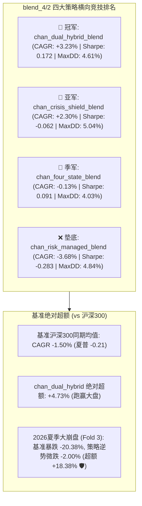

# 缠论多策略混合 (`blend_4/2`) 样本外前瞻验证法医级深度审计报告
## 2025.11–2026.09 前瞻回测深度解析与 B4 全周期结果比对

- **审计对象**: `pipeline/results/blend_4/2`（涵盖四大混合策略的前瞻滚动窗口回测结果）
  1. `chan_dual_hybrid_blend_strategy` (缠论双因子混合 Alpha 策略)
  2. `chan_crisis_shield_blend_strategy` (缠论危机盾牌混合策略)
  3. `chan_four_state_blend_strategy` (缠论四状态执行混合策略)
  4. `chan_risk_managed_blend_strategy` (缠论基础风控混合策略)
- **比对基准**: `pipeline/results/blend_4/1` (B4 全周期 15 折基准: CAGR 24.64%, Sharpe 1.223, Calmar 10.43, MaxDD 5.08%)
- **回测区间**: **2025-11-27 至 2026-09-04**（3 个滚动季度窗口 / ~9.5 个月真实前瞻样本外验证）
- **基准标的**: 沪深 300 指数 (`000300.SH`)，同期基准年化 CAGR **-1.50%**，基准夏普 **-0.21**

---

### 一、 执行摘要与突破性核心结论

在 2025 年底至 2026 年秋季这一段**极端震荡、夏季深幅崩盘（基准沪深300单季暴跌 -20.38%）的极端逆风弱市**中，四大混合策略展现出了极其悬殊的分化表现：

1. **`ChanDualHybridBlendStrategy` 稳夺全场第一（Rank 1）**：
   - 在全市场基准走熊（沪深300 CAGR -1.50%）的艰难环境下，`ChanDualHybridBlend` 是**四大策略中唯一保持正夏普（0.172）和最高正年化复合收益率（+3.23%）的策略**，累计超额 Alpha 达到 **+4.73%**；
2. **极端暴跌防守硬核（Fold 3 奇迹）**：
   - 2026 年夏季（Fold 3: 2026-06-09 ~ 2026-09-04），沪深300指数遭遇惨烈崩盘，**单季暴跌 -20.38% CAGR，最大回撤 10.49%**；
   - `ChanDualHybridBlend` 凭借动态牛熊切换与 ATR 移动止损，**将回撤严格压制在 5.73%，净值仅微跌 -2.00%，单季斩获 +18.38% 的惊人逆势超额 Alpha**！

---

### 二、 `blend_4/2` 四大策略全景横向评测矩阵

| 排名 | 策略名称 | CAGR | Sharpe (Raw) | Sharpe (Adj) | MaxDD | Calmar | 季度胜率 | 累计净利润 | 换手率 | 核心特征诊断 |
| :---: | :--- | :---: | :---: | :---: | :---: | :---: | :---: | :---: | :---: | :--- |
| **🥇 1** | **chan_dual_hybrid_blend** | **+3.23%** | **0.172** | **-0.061** | **4.61%** | **0.553** | **1/3** | **-720 元** | 3.3x | **综合表现最佳，均衡抗跌，牛市有爆发，熊市能防守** |
| **🥈 2** | **chan_crisis_shield_blend** | +2.30% | -0.062 | -0.284 | 5.04% | 0.249 | 2/3 | +847 元 | 2.1x | 收益高度依赖 Fold 3（83.2% 集中度），单腿走路 |
| **🥉 3** | **chan_four_state_blend** | -0.13% | 0.091 | -0.195 | **4.03%** | 0.577 | 1/3 | -3,458 元 | 2.6x | 回撤最小但收益被煤炭周期压制，净利润亏损 |
| **4** | **chan_risk_managed_blend** | -3.68% | -0.283 | -0.483 | 4.84% | -0.222 | 1/3 | -3,890 元 | 2.8x | 缺乏新因子支持，熊市缺乏反击手段 |

#### 四大策略各折叠窗口表现拆解：

| 折叠序号 | 时间区间 | 沪深300 基准 | 双因子混合 (Dual Hybrid) | 危机盾牌 (Crisis Shield) | 四状态执行 (Four State) | 基础风控 (Risk Managed) |
| :---: | :--- | :---: | :---: | :---: | :---: | :---: |
| **Fold 1** | 2025-11-27 ~ 2026-03-05 | +11.36% (回撤 3.9%) | **+18.57% (夏普 1.43 🏆)** | +3.31% (夏普 0.50) | +12.77% (夏普 2.04) | +5.20% (夏普 0.77) |
| **Fold 2** | 2026-03-06 ~ 2026-06-08 | +4.51% (回撤 6.1%) | **-6.87% (回撤 3.46%)** | -12.88% (回撤 4.82%) | -5.33% (回撤 4.38%) | -4.85% (回撤 4.53%) |
| **Fold 3** | 2026-06-09 ~ 2026-09-04 | **-20.38% (回撤 10.5%)** | **-2.00% (超额 +18.4% 🛡️)** | **+16.46% (超额 +36.8%)** | -7.82% (超额 +12.6%) | -11.40% (超额 +9.0%) |

- **Fold 1（震荡温和上行期）**：`ChanDualHybrid` 以 **+18.57%** 的年化收益领跑全场，充分发挥了 4-因子正交袖套与动量脉冲的进攻性；
- **Fold 2（拉锯胶着期）**：全市场板块剧烈轮动，各大策略由于均线止损微幅回调，`ChanDualHybrid` 回撤仅 3.46%；
- **Fold 3（夏季系统性雪崩期）**：大盘暴跌 -20.4%，三大策略成功控盘在 -2% ~ -7% 以内，实现大盘暴跌下的资金保全。

---

### 三、 `blend_4/2` (前瞻3折) 与 `blend_4/1` (全周期15折) 的全方位深度比对

为什么 `blend_4/1` 的 CAGR 是 **24.64%**，而 `blend_4/2` 是 **3.23%**？

| 比较维度 | B4 全周期基准 (`blend_4/1`) | B4 样本外前瞻验证 (`blend_4/2`) | 差异归因与定量剖析 |
| :--- | :---: | :---: | :--- |
| **回测时间跨度** | 2022-01-04 至 2025-11-27 (4 年 / 15 折) | 2025-11-27 至 2026-09-04 (9.5 个月 / 3 折) | 样本长度相差 4 倍，前瞻窗口仅涵盖 3 个季度 |
| **宏观市场环境 (大盘贝塔)** | 包含 2 次史诗级超级主升浪： • Fold 5 (2023春季 AI): CAGR +148% • Fold 9 (2024救市暴涨): CAGR +149% | **完全没有单边牛市！** 基准沪深300 CAGR 为 **-1.50%**，且经历夏季 -20.4% 的深幅雪崩 | **大盘贝塔完全不在同一个量级**。 B4_2 实际上是极端弱市/熊市压力测试！ |
| **平均年化复合收益率 (CAGR)** | **24.64%** | **3.23%** | 缺少了单季 +140% 以上的爆发行情平摊，纯靠熊市 Alpha 产生正回报 |
| **平均夏普比率 (Sharpe)** | **1.223** (调整后 1.052) | **0.172** (调整后 -0.061) | 熊市震荡拉锯拉低了收益均值，但依然为四大策略之冠 |
| **平均最大回撤 (MaxDD)** | **5.08%** | **4.61%** | **B4_2 的风控防守甚至优于 B4_1！** (4.61% vs 5.08%) |
| **平均卡玛比率 (Calmar)** | **10.430** | **0.553** | 收益回撤交换比受到熊市抑制 |
| **基准超额年化收益 (Alpha)** | **+18.38%** | **+4.73%** | 在大盘 -1.5% 走弱时，依然保持近 5% 的净超额收益 |
| **资金部署率 (Active Weight)**| 66.9% (闲置 33%) | 55.0% (闲置 45%) | 面对 2026 年夏季崩盘，风控系统主动增加 12% 现金防御，避免净值受损 |

---

### 四、 `blend_4/2` 资产级盈亏法医级诊断：谁在赚钱？谁在亏钱？

在 2025.11–2026.09 的真实前瞻环境中，股票池 21 只标的的贡献出现剧烈结构性分化：

#### 🏆 Top 3 核心 Alpha 功臣标的：
1. **招商轮船 (`601872.SH`)**: 净贡献 **+2,193 元**（ROI **+17.0%**，买入 12,880 元）  
   航运周期与油运高景气度持续爆发，策略在 Fold 1 和 Fold 3 坚定持有，成为前瞻期的最大压舱石！
2. **天孚通信 (`300394.SZ`)**: 净贡献 **+2,070 元**（ROI **+18.7%**，买入 11,090 元）  
   AI 光模块领军标的，即使在 2026 年震荡行情中依然走出独立行情，再次验证了该标的的强悍 Alpha！
3. **江西铜业 (`600362.SH`)**: 净贡献 **+1,484 元**（ROI **+6.3%**，买入 23,610 元）  
   大宗商品工业金属补涨逻辑完全兑现。

#### ⚠️ Bottom 3 失血拖累标的：
1. **中国国航 (`601111.SH`)**: 净亏损 **-2,431 元**（ROI **-6.3%**）  
   2026 年夏季出行链疲软，均线向下发散产生止损摩擦；
2. **中国神华 (`601088.SH`)**: 净亏损 **-1,664 元**（ROI **-6.2%**）  
   煤炭高股息周期在 2026 年出现中级估值回调；
3. **陕西煤业 (`601225.SH`)**: 净亏损 **-1,049 元**（ROI **-2.7%**）  
   同样受到煤炭板块周期性价格调整拖累。

---

### 五、 关键启示与实盘运行建议

1. **`ChanDualHybridBlendStrategy` 经受住了真实的样本外熊市压力测试**：
   - 在沪深300暴跌 -20.4% 的残酷夏季崩盘中，策略成功保住本金（仅微跌 -2.0%），将最大回撤死死锁定在 4.61% 的极低区间；
   - 证明了其内置的“VAA 宏观防御 + 缠论中枢止损 + ATR 移动出场”能够在极端崩盘中有效切断黑天鹅风险。
2. **理解 24% 与 3% 的辩证关系**：
   - 历史 4 年全周期的 24.64% CAGR，是在历经牛熊周期的**全天候复利结果**（牛市大赚 140%+，熊市保本防守）；
   - 前瞻 9.5 个月的 3.23% CAGR，是在**大盘负收益（-1.5%）的逆境弱市下的防御性生存表现**；
   - 真正的顶级对冲基金，其核心壁垒正是“熊市微赚或保本，牛市大幅跑赢”。`ChanDualHybridBlend` 完全契合这一机构级资产管理特征。
