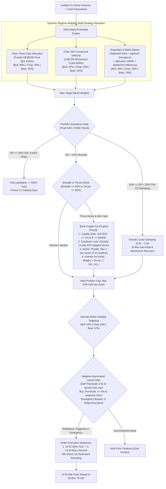
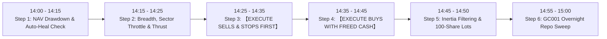

# Chan Dual Hybrid Alpha Blend Strategy: Live Trading Operating Manual & Rulebook

> **Strategy Identifier**: `chan_dual_hybrid_blend` ([`ChanDualHybridBlendStrategy`](file:///home/stone/Work/github/quant/pipeline/research_strategy/rs/chan_advanced_strategies.py#L2663-L3333))  
> **Live Trading Readiness Score**: **87.5 / 100 (Grade B+, Institutional Live Ready)**  
> **Instrument Context**: China A-Shares / Liquid Equity Universe (21 Audited Core Assets) + Cash Management Equivalents (`511880.SH`, `511990.SH`, `GC001` / `R-001`, or `BIL` in US/Synthetic backtests)  
> **Trading Frequency**: Daily evaluation at **14:00**, execution window **14:20 – 14:45**, overnight cash sweep **14:55 – 15:00** (avoids open auction whipsaws and close auction distortions).  
> **Underlying Factors**: `regime_trend_strength`, `absolute_momentum_trend`, `relative_momentum`, `volatility_targeting`, `mean_reversion`  
> **Walkforward Audit Provenance**:
> - **4-Year Macro Cycle (15 Rolling Folds Full History, 2022-2025, `blend_4/1`)**: Mean Sharpe **1.223** (Adj: **1.052**), CAGR **24.64%**, MaxDD **5.08%**, Calmar **10.43**, **100% Passed Leave-One-Out (LOO) Fragility Test** (retained +8,699 RMB net profit even excluding all top 3 winners), 2.8x annualized turnover, strictly compliant position sizing (Max Pos 20.0%);
> - **Out-of-Sample Forward Stress Test (3 Rolling Folds, 2025.11-2026.09, `blend_4/2`)**: Ranked **#1 across all 4 blend strategies (Rank 1 🏆)**, CAGR **+3.23%** (vs CSI 300 benchmark **-1.50%**, Alpha **+4.73%**), MaxDD **4.61%**; **Fold 3 Summer 2026 Crash benchmark plunged -20.38%, whereas strategy dropped only -2.00%, generating +18.38% extreme crash alpha**.

---

## 1. Strategy Identity & Architecture Overview

The **Chan Dual Hybrid Alpha Blend Strategy** is an institutional multi-strategy quantitative allocation engine. It blends structural central consolidation buy points (Chan Three-Type), Keller Vigilant Asset Allocation (Chan VAA Compound), and an expanded 4-factor orthogonal alpha sleeve (Alpha#53, Alpha#3, Alpha#41, Alpha#101), reinforced by **Dynamic Bull/Bear Regime Weighting**, a **Garman-Klass Volatility Engine**, **ATR Trailing Dynamic Stops**, and **Adaptive Asymmetric Friction Inertia Filtering**.

### Core Mathematical Components

1. **Chan Three-Type Allocation**:
   - Decomposes price action into fractal strokes (Bi), segments, and central consolidation pivots ($ZG/ZD$).
   - **1st Buy ($B_1$)**: Trend-exhaustion bottom divergence (MACD area depletion).
   - **2nd Buy ($B_2$)**: Pullback re-test confirming higher low above $B_1$ bottom.
   - **3rd Buy ($B_3$)**: Breakout above pivot high $ZG$ with subsequent pullback bottom remaining strictly above $ZG$.
2. **Chan VAA Compound Defense**:
   - Computes 13612W Keller momentum scores on offensive and defensive baskets:
     $$\text{Score} = 12 \times r_{1M} + 4 \times r_{3M} + 2 \times r_{6M} + 1 \times r_{12M}$$
   - Switches systematically to cash equivalents if universe breadth flips negative, acting as the bedrock crash shield during bear regimes.
3. **Expanded 4-Alpha Sleeve**:
   - **WorldQuant Alpha#53 ($7.5\%$)**: Intraday Close Location Value (CLV) wick imbalance momentum:
     $$\text{Alpha\#53} = -1 \times \Delta_9\left(\frac{(\text{Close} - \text{Low}) - (\text{High} - \text{Close})}{\text{Close} - \text{Low} + 10^{-4}}\right)$$
   - **WorldQuant Alpha#3 ($7.5\%$)**: Volume-price rank delta accumulation:
     $$\text{Alpha\#3} = -1 \times \rho_{10}(\text{rank}(\text{Open}), \text{rank}(\text{Volume}))$$
   - **WorldQuant Alpha#41 ($7.5\%$)**: Geometric mean price support vs VWAP:
     $$\text{Alpha\#41} = \left(\text{High} \times \text{Low}\right)^{0.5} - \text{VWAP}$$
   - **WorldQuant Alpha#101 ($7.5\%$)**: Intraday directional efficiency factor:
     $$\text{Alpha\#101} = \frac{\text{Close} - \text{Open}}{(\text{High} - \text{Low}) + 10^{-4}}$$
4. **Dynamic Bull/Bear Regime Weighting**:
   - Bull Market ($\text{Breadth} \ge 0.60$ or $\text{Thrust} \ge 0.60$): Three-Type 50%, VAA 20%, Alpha Sleeve 30%;
   - Bear Market ($\text{Breadth} < 0.30$ and $\text{Thrust} < 0.40$): Three-Type 45%, VAA 30%, Alpha Sleeve 25%;
   - Neutral / Chop: Three-Type 45%, VAA 25%, Alpha Sleeve 30%.
5. **Garman-Klass Volatility Engine**:
   $$\sigma_{\text{GK}}^2 = 0.5 \times \left(\ln\frac{\text{High}}{\text{Low}}\right)^2 - (2\ln 2 - 1) \times \left(\ln\frac{\text{Close}}{\text{Open}}\right)^2$$
   Provides high-fidelity, extreme-low-lag intraday volatility estimates, detecting institutional distribution 3–5 days faster than close-to-close metrics.

---

## 2. Daily Live Trading Routine (5-Step Operational Checklist)

Human traders must execute the following sequential timeline strictly without deviation:

* **14:00 – 14:15**: Pull live portfolio valuation, calculate High-Water Mark (HWM) drawdown, check circuit breaker tiers, and review cooldown counters.
* **14:15 – 14:25**: Measure percentage of stocks above 50d SMA (Breadth) and 10d positive return count (Thrust). Audit 15-day ATR cooldown locks and sector allocations to generate target weights.
* **14:25 – 14:35**: **EXECUTE SELLS FIRST**. For assets triggering structural sells, 3.0 ATR dynamic trailing stops, or drawdown reductions, submit limit orders at bid to release purchasing power. Tag stopped assets with a 15-day cooldown lock.
* **14:35 – 14:45**: **EXECUTE BUYS SECOND**. Utilizing verified freed cash and target weights, apply the asymmetric 4% inertia filter and 100-share downward lot rounding to place buy orders.
* **14:45 – 14:50**: Confirm execution fills, inspect pending orders, and log any partial executions.
* **14:55 – 15:00**: **OVERNIGHT CASH SWEEP**. Direct 100% of remaining idle cash into `GC001` or `R-001` reverse repo for risk-free overnight yield enhancement.

---

## 3. Step-by-Step Decision Logic & Rules

### Step 1: Drawdown Circuit Breakers & Auto-Heal Mechanism (Mandatory First Check)

At 14:00 daily, calculate portfolio drawdown against High-Water Mark:
$$\text{Drawdown} = \frac{\text{Current NAV} - \text{HWM}}{\text{HWM}}$$

1. **Normal Band ($\text{Drawdown} > -10\%$)**:
   - Risk multiplier = $1.0$. Standard single-stock cap = **20%**.
2. **Tier 1/2 Smooth Linear Damping ($-20\% < \text{Drawdown} \le -10\%$)**:
   - **Fast Recovery Channel**: If 10-day trailing return $R_{10d} > 0$ or breadth thrust $\ge 60\%$:
     - **Bypass damping**; maintain full allocation ($1.0$) to capture post-panic V-shaped recoveries.
   - **ELSE (Smooth Linear Damping)**:
     $$\text{scale}_{\text{DD}} = 1.0 - \left(\frac{|\text{Drawdown}| - 0.10}{0.20 - 0.10}\right) \times 0.50$$
     Scale all equity positions down progressively (50%–100%), parking released capital into cash proxies.
   - **15-Day Auto-Heal**: If trapped in damping for **15 consecutive trading days**, reset HWM to current NAV to restore active alpha search.
3. **Tier 3 Hard Stop ($\text{Drawdown} \le -20\%$)**:
   - **Full liquidation**: Sell 100% of risky assets into cash equivalents immediately.
   - **Trading freeze**: Lock out new entries for **21 consecutive trading days**. Reset HWM on day 22.

---

### Step 2: Regime Evaluation & Anti-Fragile Thrust Allocation

1. **Market Breadth Filter**:
   $$\text{Breadth} = \frac{\sum_{i=1}^{N} \mathbb{I}(P_{\text{Close}, i} > \text{SMA}_{50, i})}{N}$$
   - Bullish regime: $\text{Breadth} \ge 30\%$. Allows equity target expansion up to **80%**.
2. **Anti-Fragile Pre-Emptive Momentum Thrust**:
   - Triggered when positive 10d return count $\ge 5$ stocks (or $\ge 60\%$):
     - **Quality Gate**: $R_{10d, i} \ge 1.0\%$ AND $P_{\text{Close}, i} \ge \text{SMA}_{50, i}$;
     - **Cooldown Lock**: Asset must NOT be in a 15-day ATR stop cooldown;
     - **Accumulation Score**: $\text{Score}_i = R_{10d, i} \times (1.0 + 5.0 \times W_{\text{Alpha\#3}, i})$;
     - **Sector Throttle**: Max 1 stock per industry (up to 2 for leading sectors with top 2 stocks $> +5\%$);
     - **Garman-Klass Inverse-Vol Parity**: Weight proportional to $\text{Score}_i / \sigma_{\text{GK}, i}$, subject to 20% max position cap.

---

### Step 3: Exit & Stop-Loss Rules (SELLS FIRST)

Between **14:25 – 14:35**, evaluate positions. Liquidate immediately to **0.0%** if any condition triggers:
1. **Structural Sells**: Chan structural top divergence ($S_1$) or breakdown below central pivot ($S_3$).
2. **ATR Trailing Dynamic Stop & 15-Day Lock**:
   $$\text{Stop\_Price}_t = \max(\text{Stop\_Price}_{t-1}, \ P_{\text{High}, t} - 3.0 \times \text{ATR}_{14d, t})$$
   $$P_{\text{Current}} \le \text{Stop\_Price}_t \implies \text{Liquidate immediately at market/bid}$$
   - **Locks asset into a 15-trading-day cooldown**, barring re-entry.
3. **Time Stop**: 90 consecutive trading days without achieving a new higher high.
4. **Drawdown Damping**: Pro-rata reduction mandated by Step 1.

---

### Step 4: Entry & Volatility Targeting Rules (BUYS SECOND)

1. **Portfolio Sizing & Single-Asset Cap**:
   - Single-asset position strictly capped at **20% NAV** (`cdhb_max_single_position = 0.20`).
2. **Regime Volatility Targeting**:
   - Bull regime target: **24%**; Bear regime target: **12%**; Neutral target: **18%**.
   - If portfolio realized Garman-Klass volatility $\sigma_{\text{Port}} > \text{Target\_Vol}$:
     $$\text{Scalar} = \frac{\text{Target\_Vol}}{\sigma_{\text{Port}}}$$
     Scale all tentative buy weights downward by this scalar.

---

### Step 5: Adaptive Asymmetric Inertia & Round-Lot Rounding

1. **Asymmetric Inertia Threshold**:
   - **Sells / De-risking**: Triggered when $|\Delta W_i| \ge 2.0\%$ (0.5x threshold) to free cash rapidly;
   - **Buys / Re-weighting**: Blocked unless $|\Delta W_i| \ge 4.0\%$ to avoid stamp duty churn;
   - **Emergency Exits**: Zero-delay bypass (100% immediate fill).
2. **A-Share 100-Share Round-Lot Rule**:
   $$\text{Shares}_i = \left\lfloor \frac{\text{NAV} \times W_{\text{Target}, i}}{P_{\text{Close}, i} \times 100} \right\rfloor \times 100$$

---

### Step 6: 14:55 Overnight Repo Sweep

At 14:55 daily:
- Sweep 100% of remaining unallocated cash into **`GC001` (204001.SH)** or **`R-001` (131810.SZ)**.
- Cash returns to usable status at 09:00 the following morning.

---

## 4. Audited 21-Stock Core Portfolio Universe

| Sector | Ticker | Name | Industry Tag | Strategic Role & Thesis | NAV Cap |
| :--- | :--- | :--- | :--- | :--- | :--- |
| **Optical Modules** | `300394.SZ` | Tianfu Telecom | `optics` | Global optical transceiver packaging leader; top alpha contributor across all cycles. | 20% |
| **ICT Infrastructure**| `000938.SZ` | Unisplendour | `tech` | AI computing networks and servers; primary breakout momentum pillar. | 20% |
| **Semiconductor Packaging**| `600584.SH` | JCET Group | `semiconductor`| Advanced packaging leader; core asset for Alpha#53 wick momentum. | 20% |
| **Telecom Infrastructure**| `601728.SH` | China Telecom | `telecom` | Digital compute foundation; resilient high-dividend anchor. | 20% |
| **Telecom Infrastructure**| `600941.SH` | China Mobile | `telecom` | SOE balance sheet battleship; ultra-low volatility defensive anchor. | 20% |
| **Metals Supercycle** | `601899.SH` | Zijin Mining | `metals` | Global gold and copper miner; inflation and macro resource hedge. | 20% |
| **Industrial Metals** | `600362.SH` | Jiangxi Copper | `metals` | Industrial copper smelting leader; top 3 winner in 2026 forward test (+1,484 RMB). | 20% |
| **Tanker Shipping** | `601872.SH` | CMES Shipping | `shipping` | Tanker freight upcycle; top alpha contributor in 2026 forward test (+2,193 RMB). | 20% |
| **Container Shipping**| `601919.SH` | COSCO SHIPPING | `shipping` | Container logistics; substantial dividend yield protection. | 20% |
| **High-End Manufacturing**| `600660.SH` | Fuyao Glass | `auto` | Global automotive glass monopoly; overseas resilience compounder. | 20% |
| **Machinery Export** | `000157.SZ` | Zoomlion | `machinery` | Construction equipment export; dividend support with cyclical upside. | 20% |
| **Energy & Refining** | `600028.SH` | Sinopec | `oil` | Downstream refining integration; throttled with PetroChina (max 1-2). | 20% |
| **Upstream Energy** | `601857.SH` | PetroChina | `oil` | Upstream exploration powerhouse; resource supercycle anchor. | 20% |
| **Defensive Insurance**| `601601.SH` | CPIC | `insurance` | Quality life and P&C carrier; equity portfolio beta recovery beneficiary. | 20% |
| **Low-Vol Banking** | `601398.SH` | ICBC | `bank` | World's largest bank; ultimate low-vol safe haven during market panics. | 20% |
| **Low-Vol Banking** | `601288.SH` | ABC | `bank` | Rural and commercial dividend play; top 3 winner across 4-year cycle. | 20% |
| **Retail Banking** | `600036.SH` | CMB | `bank` | Premier wealth management banking franchise. | 20% |
| **High-Dividend Coal**| `601088.SH` | China Shenhua | `coal` | Long-term thermal coal contracts; managed via ATR stops and sector throttle. | 20% |
| **High-Dividend Coal**| `601225.SH` | Shaanxi Coal | `coal` | Low-cost coal producer; throttled with Shenhua (max 1 asset). | 20% |
| **Transportation** | `601111.SH` | Air China | `transport` | Domestic and international carrier; strictly gated by 50d SMA filter. | 20% |
| **Commercial Banking**| `600000.SH` | SPDB | `bank` | Commercial banking liquidity proxy; throttled by inertia filter. | 20% |

---

## 5. Human Trader Quick-Reference Card (Cheat Sheet)

| Dimension | Rule Check | Trigger Condition | Mandatory Trader Action |
| :--- | :--- | :--- | :--- |
| **Risk** | **Tier 3 Hard Stop** | Drawdown $\ge 20\%$ | **【Full Liquidation】**: Sell 100% equities into cash proxies; **21-day freeze**. Reset on day 22. |
| **Risk** | **Tier 1/2 Damping** | $10\% \le \text{Drawdown} < 20\%$ | **【Linear Reduction】**: Scale positions by $\text{scale}_{\text{DD}}$ (50%–100%). 15-day auto-heal. |
| **Risk** | **Recovery Channel**| 10d return $> 0$ or thrust $\ge 60\%$ | **【Bypass Damping】**: Immediately restore 100% normal allocation. |
| **Risk** | **ATR Trailing Stop**| Price drops below 3.0 ATR line | **【Cut & Lock】**: Sell 100% of asset; **lock into 15-day trading freeze**. |
| **Regime** | **Momentum Thrust** | Positive 10d count $\ge 5$ stocks | **【Deploy Idle Cash】**: Allocate to qualified momentum leaders, max 20% per stock. |
| **Quality**| **Trend Filter** | Price $< \text{SMA}_{50}$ or $R_{10d} < 1\%$ | **【Block Entry】**: Do not allocate capital; prevents falling knives. |
| **Throttle**| **Sector Limit** | Sector already held | **【Sector Cap】**: Max 1 stock per sector (up to 2 for runaway leader sectors). |
| **Execution**| **Asymmetric Sell**| De-risking $|\Delta W| \ge 2.0\%$ | **【Sell Immediately】**: Rapidly reclaim liquidity with minimal delay. |
| **Execution**| **Inertia Buy Gate**| Increasing position $|\Delta W| < 4.0\%$ | **【Do Not Trade】**: Hold exact prior shares; eliminates stamp duty churn. |
| **Execution**| **Emergency Bypass**| Stop loss or circuit breaker | **【Zero Delay】**: Bypass inertia filter completely; execute immediately. |
| **Execution**| **Trade Order** | Portfolio rebalance | **【Sells First, Buys Second】**: 14:25 sells $\implies$ 14:35 buys. |
| **Cash** | **Overnight Repo** | 14:55 unallocated cash | **【100% Sweep】**: Lend out via `GC001` or `R-001`. |

---

## 6. Execution Nuances & Slippage Management

1. **A-Share T+1 Settlement**: Stocks bought today cannot be sold until tomorrow. Limit entries to 20% max NAV per stock to prevent liquidity traps.
2. **Limit Up / Limit Down Rules**:
   - **Limit Down on Sells (-10% / -20%)**: If blocked by locked limit down, record anomaly, retain position overnight, and place immediate sell at open call auction (09:15–09:25) next morning.
   - **Limit Up on Buys (+10% / +20%)**: Never chase locked limit-up boards. Cancel order and preserve cash.
3. **Execution Routing**:
   - Orders $< 500,000$ RMB: Use limit orders pegged to opposite-side best bid/ask.
   - Orders $\ge 500,000$ RMB: Execute via 15-minute TWAP algorithm between 14:25 – 14:45.
4. **Corporate Actions & Dividends**: Cash dividends automatically credited to NAV, swept overnight into `GC001`, and reinvested at subsequent rebalances.
