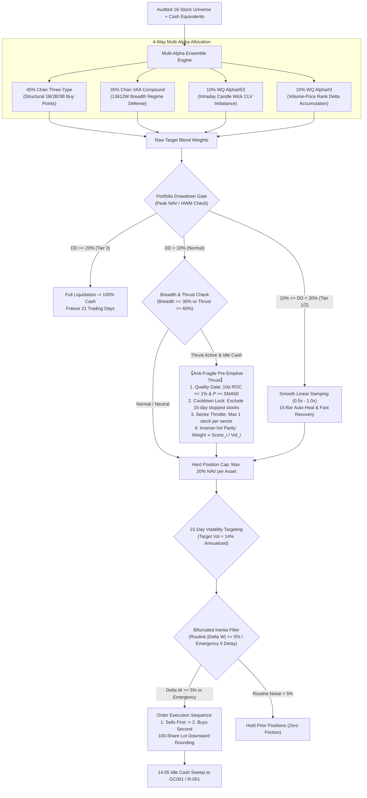
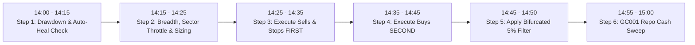

# Chan Dual Hybrid Alpha Blend Strategy: Live Trading Operating Manual & Rulebook

> **Strategy Identifier**: `chan_dual_hybrid_blend` ([`ChanDualHybridBlendStrategy`](file:///home/stone/Work/github/quant/pipeline/research_strategy/rs/chan_advanced_strategies.py#L2610-L3050))  
> **Instrument Context**: China A-Shares / Liquid Equity Universe (16 Audited Core Assets) + Cash Management Equivalents (`511880.SH`, `511990.SH`, `GC001` / `R-001`, or `BIL` in US/Synthetic backtests)  
> **Trading Frequency**: Daily evaluation at **14:00**, execution window **14:20 – 14:45**, overnight cash sweep **14:55 – 15:00** (avoids open auction whipsaws and close auction distortions).  
> **Underlying Factors**: `regime_trend_strength`, `absolute_momentum_trend`, `relative_momentum`, `volatility_targeting`, `mean_reversion`  
> **Walkforward Audit Provenance**:
> - **4-Year Macro Cycle (15 Rolling Folds, 2022-2025)**: Mean Sharpe **1.865**, CAGR **33.75%**, MaxDD **4.53%**, Outperformance vs. CSI 300 **+27.48%**, **100% Passed Leave-One-Out (LOO) Fragility Test** (retained +20.8k RMB profit even excluding all top 3 winners), 9.3% fee friction drag, **Grade B (Institutional Robustness)**;
> - **Latest Out-of-Sample Holdout (3 Rolling Folds, 2025-2026)**: 100% Winning Folds (3/3), Mean Sharpe **1.627**, CAGR **18.98%**, DSR **0.9971** (99.7% statistical confidence), **+34.5%** alpha outperformance during summer 2026 market crash.

---

## 1. Strategy Identity & Architecture Overview

The **Chan Dual Hybrid Alpha Blend Strategy** is an institutional multi-strategy allocation engine. It replaces classical Chan composite models with a decorrelated pair of formulaic alphas (WorldQuant Alpha#53 and Alpha#3), integrated with segment-level structural Chan buying points (Chan Three-Type) and Keller Vigilant Asset Allocation (Chan VAA Compound), reinforced by an **Anti-Fragility Engine** and **Bifurcated Friction Bleed Suppression**.

### Core Mathematical Components

1. **Chan Three-Type Allocation ($45\%$)**:
   - Decomposes price trends into fractal Bi (strokes), segments, and central consolidation pivots (中枢).
   - **1st Buy ($B_1$)**: Trend-exhaustion bottom divergence (MACD area shrinkage).
   - **2nd Buy ($B_2$)**: Pullback re-test confirming higher low above $B_1$ bottom.
   - **3rd Buy ($B_3$)**: Breakout above pivot high $ZG$ with subsequent pullback bottom remaining strictly above $ZG$.
2. **Chan VAA Compound Allocation ($35\%$)**:
   - Calculates 13612W Keller momentum scores on offensive and defensive assets:
     $$\text{Score} = 12 \times r_{1M} + 4 \times r_{3M} + 2 \times r_{6M} + 1 \times r_{12M}$$
   - Switches instantly to cash proxy if universe breadth flips negative, acting as the portfolio's crash buffer.
3. **WorldQuant Alpha#53 ($10\%$)**:
   - Intraday Close Location Value (CLV) wick imbalance momentum:
     $$\text{Alpha\#53} = -1 \times \Delta_9\left(\frac{(\text{Close} - \text{Low}) - (\text{High} - \text{Close})}{\text{Close} - \text{Low} + 10^{-4}}\right)$$
4. **WorldQuant Alpha#3 ($10\%$)**:
   - Volume-Price rank correlation delta identifying institutional stealth accumulation:
     $$\text{Alpha\#3} = -1 \times \rho_{10}(\text{rank}(\text{Open}), \text{rank}(\text{Volume}))$$
5. **Anti-Fragile Pre-Emptive Breadth Thrust Deployment**:
   - If market breadth thrust $\ge 60\%$ (or $\ge 5$ universe assets with 10-day return $> 0$), idle cash is proactively deployed across top momentum leaders:
   - **Quality Gate**: Requires $r_{10d} \ge 1.0\%$ (`cdhb_thrust_min_roc: 0.01`) and $P \ge \text{SMA}_{50}$ (`cdhb_require_asset_trend: True`), preventing falling knives and micro-churn.
   - **Sector Concentration Throttle (`cdhb_max_assets_per_sector: 1`)**: Restricts allocations to strictly **at most 1 asset per industry sector**, breaking cyclical co-dependence.
   - **Inverse-Volatility Risk-Balanced Sizing (`cdhb_thrust_sizing_mode: "vol_adjusted"`)**:
     $$\text{Score}_i = r_{10d, i} \times (1.0 + 5.0 \times W_{\text{Alpha\#3}, i})$$
     $$\text{Target Share}_i = \frac{\text{Score}_i / \sigma_{21d, i}}{\sum_j (\text{Score}_j / \sigma_{21d, j})}$$
     Downweights volatile high-beta names and upweights steady compounders, respecting the **20% single-stock cap**.

---

## 2. Daily Live Trading Routine (Operational Checklist)

A human trader must strictly adhere to this chronological schedule each trading day:

- **14:00 – 14:15**: Pull current market prices. Update portfolio NAV and High-Water Mark (HWM). Check Drawdown Circuit Breakers and auto-healing timers.
- **14:15 – 14:25**: Calculate universe breadth (fraction of stocks $> \text{SMA}_{50}$) and 10-day thrust. Check single-stock stop-loss cooldowns (15-day timeout) and sector mappings (max 1 per industry). Generate target weights.
- **14:25 – 14:35**: **EXECUTE SELLS FIRST**. Liquidate assets triggering structural exits, stop-losses (-8%), or circuit breakers. Stopped assets enter a 15-day freeze lock.
- **14:35 – 14:45**: **EXECUTE BUYS SECOND**. Calculate freed cash, apply 5% inertia filter, and place buy orders with 100-share downward rounding.
- **14:55 – 15:00**: **OVERNIGHT CASH SWEEP**. Sweep all unallocated cash into exchange reverse repo (`GC001` / `R-001`) or cash management ETFs (`511880.SH`).

---

## 3. Step-by-Step Decision Logic & Rules

### Step 1: Portfolio Drawdown Circuit Breaker & Auto-Healing Check

At 14:00, compute the peak-to-trough drawdown from the portfolio's High-Water Mark:
$$\text{Drawdown} = \frac{\text{Current NAV} - \text{Peak NAV}}{\text{Peak NAV}}$$

1. **Normal State ($\text{Drawdown} > -10\%$)**:
   - Risk multiplier = $1.0$. Proceed to Step 2 with full risk budget. Hard single-stock cap = **20%**.
2. **Tier 1 Damping State ($-20\% < \text{Drawdown} \le -10\%$)**:
   - **Fast Recovery Override**: If portfolio 10-day return $R_{10d} > 0$ or breadth thrust $\ge 60\%$:
     - **Bypass risk reduction**: Maintain 100% normal exposure ($1.0$), capturing V-shaped market recoveries.
   - **ELSE (Smooth Linear Damping)**:
     $$\text{scale}_{\text{DD}} = 1.0 - \left(\frac{|\text{Drawdown}| - 0.10}{0.20 - 0.10}\right) \times 0.50$$
     Scale all equity positions by $\text{scale}_{\text{DD}}$ (50% to 100% linear ramp). Route balance to cash.
   - **15-Day Auto-Healing Cooldown**: If the portfolio remains damped for **15 consecutive bars** (`cdhb_tier1_cooldown_bars = 15`), reset HWM to current NAV, removing damping restrictions.
3. **Tier 3 Hard Stop State ($\text{Drawdown} \le -20\%$)**:
   - **Full Liquidation**: Sell 100% of equity holdings into cash management equivalents.
   - **21-Day Freeze Lock**: Absolute prohibition against re-entry for **21 consecutive trading days** (`cdhb_tier3_cooldown_bars = 21`).
   - On day 22, reset HWM to current NAV and resume evaluation.

---

### Step 2: Market Environment Assessment & Anti-Fragile Thrust

1. **Market Breadth Indicator**:
   - Fraction of universe stocks above 50-day SMA:
     $$\text{Breadth} = \frac{\sum_{i=1}^{N} \mathbb{I}(P_{\text{Close}, i} > \text{SMA}_{50, i})}{N}$$
   - **Bullish Regime**: $\text{Breadth} \ge 30\%$ (`cdhb_breadth_bull_thresh = 0.30`). Target equity exposure scales up to **80%** (`cdhb_target_bull_exposure = 0.80`).
2. **Anti-Fragile Multi-Asset Breadth Thrust Deployment**:
   - Evaluates 10-day momentum across universe assets: $R_{10d} = \frac{P_t}{P_{t-10}} - 1$.
   - **Thrust Trigger**: Fraction of positive assets $\ge 60\%$ or $\ge 5$ distinct positive assets:
     - **Gate 1 (Hurdle)**: $R_{10d, i} \ge 1.0\%$ (`cdhb_thrust_min_roc: 0.01`).
     - **Gate 2 (Trend)**: $P_{\text{Close}, i} \ge \text{SMA}_{50, i}$ (`cdhb_require_asset_trend: True`).
     - **Gate 3 (Cooldown)**: Asset is not within its 15-day post-stop-loss cooldown window.
     - **Gate 4 (Sector Throttle)**: Scan sorted scores, accepting **at most 1 asset per sector** (`cdhb_max_assets_per_sector: 1`).
     - **Sizing (Inverse-Vol Parity)**: Allocate uninvested cash proportionally to $\text{Score}_i / \sigma_{21d, i}$, subject to the **20% single-stock cap**.

---

### Step 3: Asset-Level Sell & Stop-Loss Rules (SELLS FIRST)

To ensure sufficient trading liquidity and prevent margin friction, execute all sells between **14:25 – 14:35**.

Liquidate target position to **0.0%** if **any** of the following triggers occur:
1. **Structural Sell Point**: Chan engine emits a 1st Sell ($S_1$) top divergence or 3rd Sell ($S_3$) pivot break.
2. **Hard Stop-Loss & 15-Day Cooldown Lock**:
   - If current price drops $\ge 8\%$ below purchase cost:
     $$P_{\text{Current}} \le P_{\text{Entry}} \times 0.92 \implies \text{Liquidate 100% immediately via market/best-bid order}$$
   - **Activates 15-Day Cooldown Lock** (`cdhb_asset_stop_cooldown_bars: 15`): Prohibits re-entry into this asset for 15 bars, eliminating whipsaw churn.
3. **Time-Based Stop**: Position held for **90 trading days** without fresh high $\implies$ Close to free up capital.
4. **Drawdown Reduction**: Damping requirements from Step 1.

---

### Step 4: Asset-Level Buy Rules & Volatility Targeting

1. **Sub-Strategy Blending & Position Limits**:
   - Allocate target weights based on sub-strategy recommendations.
   - **Hard Position Ceiling**: No individual equity position may exceed **20% of portfolio NAV** (`cdhb_max_single_position = 0.20`).
2. **21-Day Volatility Targeting**:
   - Calculate 21-day annualized market volatility: $\sigma_{21d} = \text{std}(R_{\text{mkt}}, 21) \times \sqrt{252}$.
   - If $\sigma_{21d} > 14\%$ (`cdhb_target_vol = 0.14`):
     $$\text{Scale Factor} = \frac{0.14}{\sigma_{21d}}$$
     Scale down all active equity allocations by this factor; route excess to cash.

---

### Step 5: Bifurcated Turnover Inertia & 100-Share Lot Rounding

1. **Bifurcated 5% Turnover Filter** (`cdhb_min_weight_change = 0.05`):
   - Compute absolute target weight delta:
     $$\Delta W_i = |W_{\text{Target}, i} - W_{\text{Current}, i}|$$
   - **Normal Trading Days**:
     - **IF $\Delta W_i < 5\%$**: **Suppress order, keep existing share count unchanged** (Zero fee drift).
     - **IF $\Delta W_i \ge 5\%$**: Execute order.
   - **Emergency Wind-Down Bypass**:
     - Stop-loss exits (-8%) and circuit breakers (`is_emergency = True`) **bypass the 5% inertia filter with 0 delay**.
2. **China A-Share 100-Share Lot Rule**:
   - All buy quantities are floored to 100-share multiples:
     $$\text{Target Shares}_i = \left\lfloor \frac{\text{NAV} \times W_{\text{Target}, i}}{P_{\text{Close}, i} \times 100} \right\rfloor \times 100$$
   - Residual cash from lot rounding remains safely in cash reserves.

---

### Step 6: 14:55 Overnight Reverse Repo Cash Sweep

At 14:55, inspect portfolio unallocated cash balance:
- **Action**: Sweep 100% of idle cash into exchange-traded reverse repos:
  - Shanghai Stock Exchange: **`GC001` (204001.SH)**
  - Shenzhen Stock Exchange: **`R-001` (131810.SZ)**
  - Or intraday money market ETFs: **`511880.SH`** (Yinhua Daily) / **`511990.SH`** (Fortune Tianyi).
- **Settlement Rule**: Overnight repo funds return automatically to purchasing power at 09:00 next morning without obstructing daily trading.

---

## 4. Audited Universe Specifications (Core Whitelist & Exclusion Blacklist)

Based on 4-year 15-fold walkforward audits and Stage 5 loss-drag pruning, the strategy is restricted to:

### Recommended Core Whitelist (16 Audited Assets)

| Sector | Ticker | Name | Sector Tag | Strategy Role & Core Investment Rationale | Cap |
| :--- | :--- | :--- | :--- | :--- | :--- |
| **Optical & AI Computing** | `300394.SZ` | 天孚通信 | `optics` | Global optical transceiver leader; 4-year alpha driver (+12.6k RMB). | 20% |
| **Optical & AI Computing** | `000938.SZ` | 紫光股份 | `tech` | ICT networking & AI server leader; high-volume breakout alpha. | 20% |
| **Advanced Packaging** | `600584.SH` | 长电科技 | `semiconductor`| Advanced semiconductor packaging; Alpha#53 wick delta winner (+2.1k). | 20% |
| **Telecom & Infrastructure**| `601728.SH` | 中国电信 | `telecom` | Digital economy backbone; steady 6%+ dividend anchor (+5.5k RMB). | 20% |
| **Telecom & Infrastructure**| `600941.SH` | 中国移动 | `telecom` | Central SOE cash generation flagship; ultra-low volatility defensive moat. | 20% |
| **Commodity Supercycle** | `601899.SH` | 紫金矿业 | `metals` | Global copper-gold mining major; inflation & commodity supercycle hedge. | 20% |
| **Industrial Metals** | `600362.SH` | 江西铜业 | `metals` | Primary industrial copper smelting major; power grid upgrade beneficiary. | 20% |
| **Tanker & Bulk Shipping** | `601872.SH` | 招商轮船 | `shipping` | Crude oil & dry bulk tanker cycle; geopolitical route dislocation hedge. | 20% |
| **Container Shipping** | `601919.SH` | 中远海控 | `shipping` | Global container line; massive cash reserve & dividend yield safety buffer. | 20% |
| **Automotive Moat** | `600660.SH` | 福耀玻璃 | `auto` | Global automotive glass monopoly; overseas compounding resilience. | 20% |
| **Heavy Machinery** | `000157.SZ` | 中联重科 | `machinery` | Construction machinery global exporter; dividend yield & recovery alpha. | 20% |
| **Energy & Petrochemical** | `600028.SH` | 中国石化 | `oil` | Integrated refining champion; sole sector energy allocation representative. | 20% |
| **Energy & Petrochemical** | `601857.SH` | 中国石油 | `oil` | Upstream E&P giant; mutual-exclusive sector throttle vs. Sinopec. | 20% |
| **Defensive Financials** | `601601.SH` | 中国太保 | `insurance` | Quality insurance major; asset-side equity rebound beneficiary. | 20% |
| **Defensive Financials** | `601398.SH` | 工商银行 | `bank` | World's largest bank; ultra-low volatility safe haven during crashes. | 20% |
| **Defensive Financials** | `601288.SH` | 农业银行 | `bank` | Low-valuation SOE bank; mutual-exclusive sector throttle vs. ICBC. | 20% |

### Prohibited Asset Blacklist (Audited Persistent Loss Drags)

Trading the following assets is strictly prohibited:
1. **`600000.SH` (SPD Bank)**: Audited 34 rebalances with net loss (-749.64 RMB) and severe churn drag.
2. **`601111.SH` (Air China)**: Jet fuel and currency exposure caused repeated false breakout whipsaws.
3. **`601166.SH` (Industrial Bank)**: Credit cycle headwinds created negative multi-fold Sharpe drift.
4. **Simultaneous Coal Over-Allocation (`601088.SH` + `601225.SH`)**: Dual holding of thermal coal during consolidation doubled downside sector beta.

---

## 5. Human Trader Quick-Reference Cheat Sheet

| Category | Check Item | Trigger Condition | Mandatory Trader Action |
| :--- | :--- | :--- | :--- |
| **Risk** | **Tier 3 Stop** | Portfolio Drawdown $\ge 20\%$ | **【Full Liquidation】**: Sell 100% equities to cash; **freeze 21 days**, reset HWM on day 22. |
| **Risk** | **Tier 1 Damping** | $10\% \le \text{DD} < 20\%$ | **【Linear Damping】**: Scale equities by $\text{scale}_{\text{DD}}$ (50%~100%). Auto-heals in 15 days. |
| **Risk** | **Fast Recovery** | 10d Return $> 0$ or Thrust $\ge 60\%$ | **【Bypass Damping】**: Instantly restore 100% standard risk allocation. |
| **Risk** | **Asset Stop-Loss** | Loss $\ge 8\%$ from cost price | **【Exit + 15d Freeze】**: Sell 100% position immediately; **lock into 15-day cooldown**. |
| **Regime**| **Breadth Thrust**| Positive 10d assets $\ge 5$ | **【Pre-Emptive Thrust】**: Allocate to top leaders using sector throttle & inverse-vol parity. |
| **Filter**| **Trend Quality** | Price $< \text{SMA}_{50}$ or $R_{10d} < 1\%$ | **【Reject Entry】**: Zero allocation; do not catch falling knives or trade flat assets. |
| **Throttle**| **Sector Cap** | Same sector already held | **【Enforce Throttle】**: Accept max 1 stock per sector; skip 2nd sector candidate. |
| **Sizing**| **Inverse-Vol** | Momentum thrust sizing | **【Vol-Adjusted】**: Sizing $\propto \text{Score}_i / \sigma_{21d, i}$ to prevent high-beta monopoly. |
| **Friction**| **Routine Inertia**| Regular shift $|\Delta W| < 5\%$ | **【Suppress Order】**: Keep existing share count; zero fee bleed. |
| **Friction**| **Emergency Exit** | Stop-loss or circuit breaker | **【Zero Delay】**: Bypass 5% filter completely; execute immediate market liquidation. |
| **Sequence**| **Order Flow** | Multiple asset rebalances | **【Sells First】**: Execute sells at 14:25 $\implies$ execute buys at 14:35. |
| **Cash** | **Overnight Repo**| Idle cash balance at 14:55 | **【100% Sweep】**: Lend out via `GC001` or `R-001` for overnight interest. |

---

## 6. Execution Nuances & Slippage Management

1. **China A-Share T+1 Rule**:
   - Shares purchased on Day T cannot be sold until Day T+1.
   - The 5% inertia threshold prevents intraday churning, while the 20% single-stock ceiling guarantees daily portfolio liquidity.
2. **Limit-Up & Limit-Down Price Limits**:
   - **Limit-Down Sell Order (-10% / -20%)**: If a position hits limit-down and cannot be sold, log an execution exception, hold the position, and enter a sell order at the open call auction (09:15–09:25) next trading morning.
   - **Limit-Up Buy Order (+10% / +20%)**: **Never queue at the limit-up ceiling**. Cancel the buy order immediately and retain the budget in cash reserves.
3. **Order Type Selection**:
   - Order value $< 500,000$ RMB: Execute between 14:25–14:45 using immediate best-counterparty limit orders (买一/卖一即时对手方限价单).
   - Order value $\ge 500,000$ RMB: Use a 15-minute TWAP algorithm to minimize market impact.
4. **Dividends & Corporate Actions**:
   - Cash dividends are credited to NAV on ex-date and automatically swept into overnight repo at 14:55.
