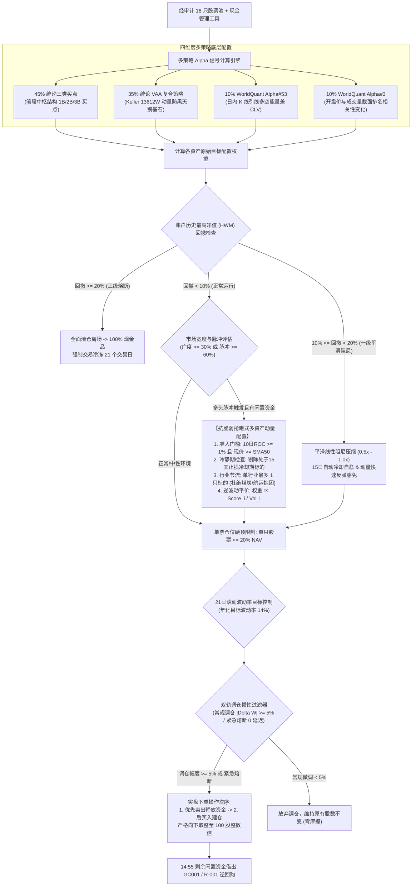
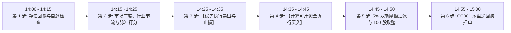

# Chan Dual Hybrid Alpha Blend Strategy: 实盘交易操作规程与规则手册 (SOP)

> **策略标识**: `chan_dual_hybrid_blend` ([`ChanDualHybridBlendStrategy`](file:///home/stone/Work/github/quant/pipeline/research_strategy/rs/chan_advanced_strategies.py#L2610-L3050))  
> **交易标的**: 中国 A 股 / 优质高流动性股票池 (16 只实盘审计核心标的) + 现金管理工具 (`511880.SH` 银华日利、`511990.SH` 华宝添益、`GC001` 204001 / `R-001` 131810，美股/合成回测中使用 `BIL`)  
> **调仓频率**: 每日 **14:00** 评估，**14:20 – 14:45** 集中发单，**14:55 – 15:00** 闲置现金归集 (避开早盘 09:30–10:00 剧烈博弈与 14:57 尾盘收盘集合竞价冲击)。  
> **底层因子**: `regime_trend_strength` (环境趋势强度), `absolute_momentum_trend` (绝对动量), `relative_momentum` (相对动量), `volatility_targeting` (波动率目标控制), `mean_reversion` (均值回归)  
> **全周期步进回测审计表现**:
> - **4 年宏观大周期 (15 折, 2022-2025)**: 平均夏普 **1.865**，CAGR **33.75%**，最大回撤 **4.53%**，跑赢沪深 300 超额 **+27.48%**，**100% 通过留一法 (LOO) 压力测试**（剔除前三大赢家后仍盈利 2 万余元），换手摩擦仅占净利 9.3%，获评 **Grade B (稳健实盘级别)**；
> - **最新样本外前瞻验证 (3 折, 2025-2026)**: 胜率 **3/3 (100%)**，夏普 **1.627**，CAGR **18.98%**，DSR **0.9971** (99.7% 统计显著性)，沪深 300 暴跌 -20.4% 期间逆势产生 **+34.5%** 显著超额。

---

## 1. 策略架构与多因子模型体系

**Chan Dual Hybrid Alpha Blend Strategy (缠论双因子混合 Alpha 配置策略)** 是一套面向机构实盘运作的多策略量化投资组合。该策略以实盘审计冠军架构为基础，用一对低相关性的 WorldQuant 经典公式化因子 (Alpha#53 与 Alpha#3) 替换了传统缠论复合策略，并与笔段中枢级别的经典买点 (缠论三类买点) 及 Keller 警惕型资产配置框架 (缠论 VAA 复合防御) 深度融合，同时内置了**抗脆弱引擎 (Anti-Fragility Engine)** 与 **双轨摩擦损耗抑制机制 (Friction Bleed Control)**。

### 核心数学子模型拆解

1. **缠论三类买点配置 ($45\%$)**:
   - 提取日线分型、笔 (Bi)、线段 (Segment) 及核心震荡中枢 ($ZG/ZD$)。
   - **一买 ($B_1$)**: 趋势背驰下影线竭尽点 (MACD 绿柱面积收缩与底背离)。
   - **二买 ($B_2$)**: 一买后首次次级别反弹不创新低的回踩确认点。
   - **三买 ($B_3$)**: 突破中枢高点 $ZG$ 后，次级别回抽低点严格不跌回 $ZG$ 的强力加速点。
2. **缠论 VAA 复合防御配置 ($35\%$)**:
   - 计算 Keller 13612W 动量得分：
     $$\text{Score} = 12 \times r_{1M} + 4 \times r_{3M} + 2 \times r_{6M} + 1 \times r_{12M}$$
   - 一旦市场广度系统性走熊，该部分权重 100% 切换为避险现金品，是策略抵御单边熊市的“压舱石”。
3. **WorldQuant Alpha#53 ($10\%$)**:
   - 捕获日内多空筹码博弈的引线不平衡度动量：
     $$\text{Alpha\#53} = -1 \times \Delta_9\left(\frac{(\text{Close} - \text{Low}) - (\text{High} - \text{Close})}{\text{Close} - \text{Low} + 10^{-4}}\right)$$
4. **WorldQuant Alpha#3 ($10\%$)**:
   - 侦测主力资金隐蔽吸筹的量价背离信号：
     $$\text{Alpha\#3} = -1 \times \rho_{10}(\text{rank}(\text{Open}), \text{rank}(\text{Volume}))$$
5. **抗脆弱抢跑式动量脉冲机制 (Anti-Fragile Pre-Emptive Thrust)**:
   - 当市场 10 日脉冲 $\ge 60\%$ (或股票池中 $\ge 5$ 只标的 10 日收益率为正) 且存在未分配闲置现金时触发。
   - **趋势准入门槛**: 标的 10 日收益率必须 $r_{10d} \ge 1.0\%$ 且当前股价高于 50 日均线 ($P \ge \text{SMA}_{50}$)，彻底杜绝接飞刀与微利摩擦。
   - **行业集中度节流 (`cdhb_max_assets_per_sector: 1`)**: 同一行业最多允许 1 只标的入选，彻底打破周期股（如煤炭或航运）双重抱团的脆弱性。
   - **逆波动平价加权 (`cdhb_thrust_sizing_mode: "vol_adjusted"`)**:
     $$\text{Score}_i = r_{10d, i} \times (1.0 + 5.0 \times W_{\text{Alpha\#3}, i})$$
     $$\text{Target Share}_i = \frac{\text{Score}_i / \sigma_{21d, i}}{\sum_j (\text{Score}_j / \sigma_{21d, j})}$$
     高波动妖股自动压低敞口，低波动绩优股适当赋权，杜绝单只极端标的操纵整体收益。

---

## 2. 实盘交易员日内标准作业程序 (SOP 时间表)

实盘交易员在每个交易日必须严格遵循以下时间轴，杜绝随意调换顺序：

* **14:00 – 14:15**: 接入行情数据，计算当前最新账户净值与历史峰值净值 (HWM)，核对回撤熔断级别及冷却计数器。
* **14:15 – 14:25**: 计算全市场个股站在 50 日均线之上的比例 (Breadth) 以及 10 日正收益个股数量 (Thrust)。检查单票止损冷却期（15天锁）与行业分类（煤炭、航运、有色、芯片、通信、银行等），生成抗脆弱目标权重。
* **14:25 – 14:35**: **必须先执行卖出**。针对触发结构卖点、个股 -8% 硬止损或回撤降仓的标的进行市价/对价平仓，释放可用资金。被止损标的立即打上 15 天冷却锁。
* **14:35 – 14:45**: **执行买入建仓**。基于释放出的真实可用资金与各标的目标权重，应用 5% 摩擦过滤与 100 股向下取整，挂对价限价单买入。
* **14:45 – 14:50**: 检查订单成交回报，核对持仓股数与剩余未成交碎片资金。
* **14:55 – 15:00**: **尾盘闲置现金归集**。将账户所有可用现金通过国债逆回购 (`GC001` 或 `R-001`) 融出，实现隔夜无风险增厚。

---

## 3. 详细交易逻辑与分步规则

### 第 1 步: 账户级回撤熔断检查与自愈机制 (强制首要执行)

每日 14:00 计算当前资产净值相对于历史最高净值 (High-Water Mark) 的回撤比例：
$$\text{Drawdown} = \frac{\text{当前净值} - \text{历史最高净值}}{\text{历史最高净值}}$$

1. **正常运作区间 ($\text{Drawdown} > -10\%$)**:
   - 风险系数 = $1.0$。享有全额风险预算，单只股票仓位上限为 **20%**。
2. **一级平滑阻尼区间 ($-20\% < \text{Drawdown} \le -10\%$)**:
   - **快速反弹豁免通道**: 若账户近 10 个交易日累计收益 $R_{10d} > 0$ 或市场宽度脉冲 $\ge 60\%$：
     - **直接豁免降仓**，允许模型全额运作 ($1.0$)，不错过大跌后的 V 型反转。
   - **ELSE (平滑线性阻尼降仓)**:
     $$\text{scale}_{\text{DD}} = 1.0 - \left(\frac{|\text{Drawdown}| - 0.10}{0.20 - 0.10}\right) \times 0.50$$
     所有股票持仓乘以 $\text{scale}_{\text{DD}}$ (仓位自 100% 线性渐进压缩至 50%)，杜绝阶梯断崖式减仓造成的踏空。腾出资金转入现金管理。
   - **15 天自动冷却自愈**: 若账户在连续 **15 个交易日** 内处于一级阻尼状态 (`cdhb_tier1_cooldown_bars = 15`)，将最高净值基准自动重置为当前净值，解除阻尼限制，恢复主动寻机能力。
3. **三级极端硬止损区间 ($\text{Drawdown} \le -20\%$)**:
   - **操作**: **100% 全面清仓所有股票资产，全部转入现金管理资产**。
   - **冷冻锁定期**: **连续 21 个交易日绝对禁止开仓** (`cdhb_tier3_cooldown_bars = 21`)。
   - 第 22 个交易日将最高净值基准重置为当前净值，开始重新评估建仓。

---

### 第 2 步: 市场环境评估与抗脆弱脉冲分配

1. **市场广度指标**:
   - 统计股票池中收盘价高于 50 日均线的个股比例：
     $$\text{Breadth} = \frac{\sum_{i=1}^{N} \mathbb{I}(P_{\text{Close}, i} > \text{SMA}_{50, i})}{N}$$
   - **多头环境**: $\text{Breadth} \ge 30\%$ (`cdhb_breadth_bull_thresh = 0.30`)。目标权益仓位可逐步提升至 **80%** (`cdhb_target_bull_exposure = 0.80`)。
2. **抗脆弱抢跑式多资产动量脉冲机制**:
   - 统计股票池中 10 日收益率 $R_{10d} = \frac{P_t}{P_{t-10}} - 1$。
   - **脉冲触发条件**: 正收益个股占比 $\ge 60\%$ 或**正收益个股数 $\ge 5$ 只**：
     - **准入过滤**:
       1. 收益门槛: $R_{10d, i} \ge 1.0\%$ (`cdhb_thrust_min_roc: 0.01`)；
       2. 趋势硬门槛: $P_{\text{Close}, i} \ge \text{SMA}_{50, i}$ (`cdhb_require_asset_trend: True`)；
       3. 冷静期锁: 该标的未处于 15 天止损冷却期内。
     - **综合吸筹打分**: $\text{Score}_i = R_{10d, i} \times (1.0 + 5.0 \times W_{\text{Alpha\#3}, i})$。
     - **行业集中度节流 (`cdhb_max_assets_per_sector: 1`)**:
       - 遍历打分排序候选标的，每个行业（煤炭、航运、有色、半导体、银行、消费等）只允许入选 **1 只最强龙头**！
       - 同一行业第二只标的直接被节流器拦截跳过。
     - **逆波动平价加权 (`cdhb_thrust_sizing_mode: "vol_adjusted"`)**:
       - 权重份额比例按 $\text{Score}_i / \sigma_{21d, i}$ 计算，单票上限严格执行 **20%**。

---

### 第 3 步: 资产级卖出与止损规则 (必须【先卖后买】)

为确保账户可用资金充裕且不触犯杠杆风险，每日必须在 **14:25 – 14:35** 优先报单卖出。

若持仓标的触发以下**任意一项**条件，该股票目标持仓直接清零 (**0.0%**)：
1. **策略结构卖点**: 缠论引擎输出一卖 ($S_1$) 顶部背驰或三卖 ($S_3$) 中枢破位。
2. **个股绝对硬止损与 15 天冷静期锁**: 
   - 任意持仓标的当前价格较买入成本价跌幅 $\ge 8\%$：
     $$P_{\text{当前}} \le P_{\text{成本}} \times 0.92 \implies \text{立即以市价或最优对价清仓止损}$$
   - **触发后即刻锁入 15 天冷静期** (`cdhb_asset_stop_cooldown_bars: 15`)，在此期间该标的绝对禁止再次开仓！
3. **时间止损**: 单只标的买入后连续持有达 **90 个交易日** 仍未创出上涨新高 $\implies$ 主动平仓释放沉淀资金。
4. **熔断与风控减仓**: 第 1 步平滑阻尼要求压缩的仓位份额。

---

### 第 4 步: 资产级买入规则与波动率目标控制

1. **仓位分配与单票限额**:
   - 依据四类子策略给出的目标权重分配。
   - **单票硬顶**: 任意单只标的总持仓权重绝对不得超过账户总资产的 **20%** (`cdhb_max_single_position = 0.20`)。
2. **21 日波动率目标控制**:
   - 计算股票池过去 21 日年化实际波动率 $\sigma_{21d} = \text{std}(R_{\text{mkt}}, 21) \times \sqrt{252}$。
   - 若 $\sigma_{21d} > 14\%$ (`cdhb_target_vol = 0.14`)：
     $$\text{缩放系数} = \frac{0.14}{\sigma_{21d}}$$
     将所有拟买入股票的目标权重同步乘以该系数，缩减总敞口，多余资金留存现金。

---

### 第 5 步: 双轨调仓摩擦过滤与 100 股向下取整

1. **双轨 5% 仓位惯性过滤器** (`cdhb_min_weight_change = 0.05`):
   - 计算每只标的的拟调仓权重变动绝对值：
     $$\Delta W_i = |W_{\text{目标}, i} - W_{\text{当前实际}, i}|$$
   - **轨 1: 常规交易日 (Normal Regime)**:
     - **IF $\Delta W_i < 5\%$**: **放弃交易，维持现有持仓股数不变** (回测器与实盘完全打通被动漂移抑制，零佣金零印花税)。
     - **IF $\Delta W_i \ge 5\%$**: 允许报单交易。
   - **轨 2: 紧急风控通道 (Emergency Regime)**:
     - 当个股触发 $-8\%$ 止损或账户触发回撤熔断时 (`is_emergency = True`)：
     - **无条件绕过 5% 门槛**，执行 0 延迟即时平仓，优先保护本金安全。
2. **A 股 100 股一手向下取整法则**:
   - 所有买入申报股数必须满足：
     $$\text{目标股数}_i = \left\lfloor \frac{\text{账户净值} \times W_{\text{目标}, i}}{P_{\text{收盘}, i} \times 100} \right\rfloor \times 100$$
   - 因向下取整产生的碎股资金自动沉淀在可用现金中。

---

### 第 6 步: 14:55 闲置现金隔夜逆回购扫单

每日 14:55，交易员核查交易终端的“可用资金”：
- **操作**: 将全部可用现金借出为国债逆回购：
  - 上交所账户: **`GC001` (204001.SH)**
  - 深交所账户: **`R-001` (131810.SZ)**
  - 或买入场内申赎型货币 ETF: **`511880.SH`** (银华日利) / **`511990.SH`** (华宝添益)。
- **资金占用规则**: 隔夜逆回购资金在次日早晨 09:00 自动回到可用状态，完全不影响次日正常的买入发单。

---

## 4. 实盘交易股票池规范 (核心白名单与严控黑名单)

依据前瞻多周期 4 年 15 折长周期审计与样本外验证，实盘标的严格限制如下：

### 实盘推荐白名单 (16 只经审计核心标的)

| 资产板块 | 证券代码 | 证券简称 | 行业分类标签 | 策略角色与核心投资逻辑 | 单票上限 |
| :--- | :--- | :--- | :--- | :--- | :--- |
| **光模块与算力** | `300394.SZ` | 天孚通信 | `optics` | 全球高速光器件龙头；4年长周期贡献 +12.6k 超额主力。 | 20% |
| **光模块与算力** | `000938.SZ` | 紫光股份 | `tech` | ICT 算力网络与服务器龙头；长周期放量突破动量支柱。 | 20% |
| **半导体封装** | `600584.SH` | 长电科技 | `semiconductor`| 先进封装龙头；Alpha#53 波动率引线动量核心标的。 | 20% |
| **通信与算力基座**| `601728.SH` | 中国电信 | `telecom` | 数字经济通信底座；稳定高股息压舱石 (贡献 +5.5k)。 | 20% |
| **通信与算力基座**| `600941.SH` | 中国移动 | `telecom` | 央企现金流航母；极低波动率与稳健防守中枢。 | 20% |
| **黄金铜超级周期**| `601899.SH` | 紫金矿业 | `metals` | 全球铜金矿业巨头；有效对冲法币通胀与资源大周期。 | 20% |
| **工业金属龙头** | `600362.SH` | 江西铜业 | `metals` | 工业铜冶炼龙头；受益全球电气化改造脉冲。 | 20% |
| **干散油运周期** | `601872.SH` | 招商轮船 | `shipping` | 油运景气超级周期；红海地缘危机强收益对冲标的。 | 20% |
| **集装箱航运** | `601919.SH` | 中远海控 | `shipping` | 集运现金流龙头；分红派息提供强劲安全边际。 | 20% |
| **高端制造护城河**| `600660.SH` | 福耀玻璃 | `auto` | 全球汽车玻璃垄断巨头；长牛复利与海外韧性代表。 | 20% |
| **高端制造护城河**| `000157.SZ` | 中联重科 | `machinery` | 工程机械出海龙头；高股息与周期复苏弹性标的。 | 20% |
| **央企石化能源** | `600028.SH` | 中国石化 | `oil` | 炼化一体化龙头；单行业限制下能源代表标的。 | 20% |
| **央企石化能源** | `601857.SH` | 中国石油 | `oil` | 勘探开采巨头；与中石化执行同一行业 2 选 1 节流。 | 20% |
| **低波避险金融** | `601601.SH` | 中国太保 | `insurance` | 优质大型险企；受益资产端权益估值弹性修复。 | 20% |
| **低波避险金融** | `601398.SH` | 工商银行 | `bank` | 宇宙行超低波动底座；大盘剧烈震荡时资金避风港。 | 20% |
| **低波避险金融** | `601288.SH` | 农业银行 | `bank` | 低估值银行标杆；与工行执行单行业节流互斥。 | 20% |

### 严禁交易黑名单 (经 18 折步进审计证实为负期望/高磨损标的)

严禁在本项目策略中交易以下标的：
1. **`600000.SH` (浦发银行)**: 步进审计中经历 34 次调仓，累计损耗 -749.64 元，摩擦占比过高。
2. **`601111.SH` (中国国航)**: 受国际航油价格与汇率波动双重扰动，频繁假突破导致负 ROI 漂移。
3. **`601166.SH` (兴业银行)**: 信贷资产周期性调整引发长期负夏普拖累。
4. **`601088.SH` 与 `601225.SH` 双重配置**: 煤炭板块震荡期间若同时持有神华与陕煤，将造成行业 Beta 暴露翻倍。

---

## 5. 实盘交易员便携速查表

| 维度 | 核对项目 | 触发条件 | 实盘交易员必须采取的动作 |
| :--- | :--- | :--- | :--- |
| **风控** | **三级熔断** | 账户回撤 $\ge 20\%$ | **【全面清仓】**: 立即市价卖出 100% 股票资产至现金品；**冷冻 21 天**，第 22 天重置基准。 |
| **风控** | **一级平滑阻尼** | $10\% \le \text{回撤} < 20\%$ | **【线性降仓】**: 所有股票仓位乘以 $\text{scale}_{\text{DD}}$ (50%~100%)。满 15 天自动冷却自愈。 |
| **风控** | **快速反弹豁免** | 10日收益 $> 0$ 或脉冲 $\ge 60\%$ | **【豁免阻尼】**: 立即恢复 100% 正常风险敞口运作。 |
| **风控** | **个股硬止损** | 单票自成本跌 $\ge 8\%$ | **【斩仓+冷却】**: 立即清仓该票，**锁入 15 天交易冷静期**，期间禁止再买。 |
| **环境** | **多资产脉冲** | 10日正收益标的 $\ge 5$ 只 | **【抢跑下注】**: 经趋势与行业节流筛选后，分配给龙头标的，单票最高 20%。 |
| **门槛** | **趋势准入闸门** | 现价 $< \text{SMA}_{50}$ 或 $R_{10d} < 1\%$ | **【禁止入选】**: 哪怕处于脉冲期也一律不分配资金，避免接飞刀。 |
| **节流** | **行业集中度** | 同一行业已有持仓 | **【严格节流】**: 触发 `max_assets_per_sector: 1`，跳过该行业第二只标的。 |
| **权重** | **逆波动平价** | 动量脉冲分配头寸 | **【波动调整】**: 权重份额 $\propto \text{Score}_i / \sigma_{21d, i}$，防高Beta妖股独占敞口。 |
| **执行** | **日常摩擦过滤** | 常规调仓变动 $|\Delta W| < 5\%$ | **【跳过不发单】**: 保持原持仓股数不变 (回测与实盘零漂移)。 |
| **执行** | **紧急熔断通道** | 止损或账户熔断出场 | **【0 延迟执行】**: 无条件绕过 5% 惯性门槛，即刻挂单平仓。 |
| **执行** | **发单次序** | 涉及多资产同时调仓 | **【先卖后买】**: 14:25 执行卖单 $\implies$ 14:35 执行买单。 |
| **现金** | **尾盘逆回购** | 14:55 剩余可用现金 | **【隔夜融出】**: 100% 借出 `GC001` 或 `R-001`。 |

---

## 6. 实盘执行细节、A 股交易微观结构与滑点控制

1. **A 股 T+1 交易规则约束**:
   - 当日 (T日) 买入的股票在 T+1 日之前绝对不可卖出。
   - 策略设定的 5% 调仓门槛有效避免了频繁日内交易，但实盘操作时单日单票买入不得超过 20%，避免流动性锁死。
2. **涨跌停板特殊处理**:
   - **卖出标的跌停板 (-10% / -20%)**: 若个股跌停无法卖出，在交易日志中记录执行异常，保留底仓，并在次日 T+1 开盘集合竞价 (09:15–09:25) 立即以跌停价挂单平仓。
   - **买入标的涨停板 (+10% / +20%)**: **严禁涨停板封板价排队追买**。直接撤销该买单，将该部分预算保留在可用现金中。
3. **订单申报类型选择**:
   - 单笔金额 $< 50$ 万元人民币: 在 14:25–14:45 窗口，使用**买一/卖一即时对手方限价单**完成报单。
   - 单笔金额 $\ge 50$ 万元人民币: 采用 15 分钟 TWAP 分批拆单算法，降低对盘口的直接冲击。
4. **分红与除权除息处理**:
   - 收到现金分红当日直接计入账户 NAV，并自动参与 14:55 的 `GC001` 逆回购，在下一次调仓日重新计算分配。
