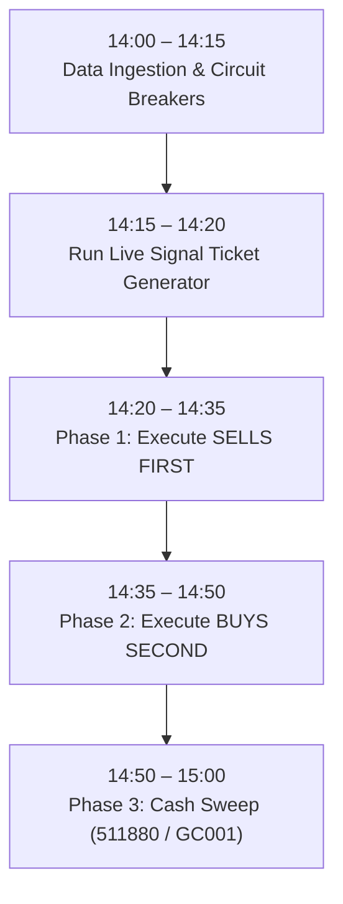

# Chan Four-State Risk-Managed Blend: Operational Live Deployment Guide

> **Strategy Key**: `chan_four_state_blend` ([`ChanFourStateBlendStrategy`](file:///home/stone/Work/github/quant/pipeline/research_strategy/rs/chan_advanced_strategies.py#L1768-L2078))  
> **Production Universe**: Cleaned Core A-Share Basket (11 Stocks) via [`docs/universe/china/14_stocks_pruned.txt`](file:///home/stone/Work/github/quant/docs/universe/china/14_stocks_pruned.txt)  
> **Cash Proxy**: `511880` / `511990` / `GC001` (A-Shares) or [`BIL`](file:///home/stone/Work/github/quant/pipeline/research_strategy/strategies_config.json) / `SGOV` (US Equities)  
> **Execution Tool**: [`scripts/run_live_four_state_blend.py`](file:///home/stone/Work/github/quant/scripts/run_live_four_state_blend.py)  

---

## 1. Operational Architecture Overview

The **Chan Four-State Risk-Managed Blend Strategy** combines:
1. **40% `ChanVaaCompoundStrategy`**: Dual-momentum VAA-G4 regime crash defense & cash anchor.
2. **40% `ChanThreeTypeStrategy`**: Structural segment pivot trend alpha ($B_1/B_2/B_3$).
3. **20% `ChanFourStateExecutionStrategy`**: 4-state operational execution machine with 5-bar gestation buffer, 1% ZG breakout tolerance, moving average entanglement filter, and Lesson 16 consolidation stagnation timeout.

### Operational Guardrails
* **Hard Single-Stock Cap**: $20\%$ NAV per stock ($30\%$ during bull breadth).
* **Drawdown Circuit Breakers**: Halve equity at $10\%$ DD; switch $100\%$ to defensive VAA at $15\%$ DD; hard stop to cash at $20\%$ DD with a 21-day freeze.
* **4% Turnover Friction Filter**: Ignores rebalance shifts $< 4\%$ unless an emergency stop or circuit breaker triggers.
* **Execution Sequence**: **SELLS FIRST** (release cash capacity) $\rightarrow$ **BUYS SECOND** (100-share lot rounded).

---

## 2. Daily Operational Schedule (14:00 – 15:00)



### Detailed Timeline:
1. **14:00 – 14:15: Portfolio Health & Macro Valuation**
   - Check current portfolio NAV against the High-Water Mark (HWM).
   - Verify if any circuit breaker tier is triggered:
     - $\text{Drawdown} \ge 20\%$: Emergency halt (liquidate all risk assets to cash, 21-day trading freeze).
     - $15\% \le \text{Drawdown} < 20\%$: Tactical defense (shift $100\%$ to VAA compound defensive mode).
     - $10\% \le \text{Drawdown} < 15\%$: Risk damping (halve equity exposure, sweep remainder to cash).
   - Verify 50-day market breadth ($\ge 30\%$) and 10-day breadth thrust ($\ge 60\%$) to determine if bull cash deployment is active.

2. **14:15 – 14:20: Generate Daily Execution Ticket**
   - Run the operational runner against your brokerage portfolio:
     ```bash
     uv run python scripts/run_live_four_state_blend.py \
       --portfolio-value <ACCOUNT_NAV> \
       --current-holdings '<HOLDINGS_JSON>' \
       --data-provider <marketdb|yfinance>
     ```

3. **14:20 – 14:35: Execute Sells First**
   - Review the `[PHASE 1: EXECUTE SELLS FIRST]` section of the output ticket.
   - Transmit limit orders pegged to the best bid/ask to liquidate down to target quantities.
   - Do **NOT** place buy orders until sell executions are confirmed and buying power is unlocked.

4. **14:35 – 14:50: Execute Buys Second**
   - Review the `[PHASE 2: EXECUTE BUYS SECOND]` section.
   - All buy quantities are automatically rounded down to 100-share lots.
   - Enter limit orders pegged to current market prices.

5. **14:50 – 15:00: Cash Proxy Sweep**
   - Allocate any remaining unallocated cash balance into liquidity yield assets (`511880`, `511990`, or overnight repo `GC001`).

---

## 3. Production CLI Run Commands

### A. Daily Rebalance Against Live Holdings File
Create a local `current_holdings.json` file representing your broker positions:
```json
{
  "300394.SZ": 0.12,
  "000938.SZ": 0.08,
  "600276.SH": 0.08,
  "BIL": 0.72
}
```

Execute the ticket generator:
```bash
uv run python scripts/run_live_four_state_blend.py \
  --current-holdings-file current_holdings.json \
  --portfolio-value 200000 \
  --universe-file docs/universe/china/14_stocks_pruned.txt \
  --data-provider marketdb
```

### B. Daily Rebalance Against Prior Model Rebalance
If running an automated account that tracks model targets without external drift:
```bash
uv run python scripts/run_live_four_state_blend.py \
  --portfolio-value 100000 \
  --universe-file docs/universe/china/14_stocks_pruned.txt \
  --data-provider marketdb
```

### C. Offline Simulation / Sanity Check (Synthetic Data)
```bash
uv run python scripts/run_live_four_state_blend.py \
  --data-provider synthetic \
  --as-of-date 2025-08-22 \
  --portfolio-value 100000
```

---

## 4. Operational Risk Management Checklist

| Risk Scenario | Action Trigger | Operational Procedure |
| :--- | :--- | :--- |
| **Individual Stock Hard Stop** | Loss $\ge 8\%$ from entry | Market exit immediately; bypass 4% inertia filter down to 0.1%. |
| **Consolidation Stagnation** | Inside pivot $\ge 8$ bars without upward momentum | Liquidate position down to 0.0% to release capital drag. |
| **Breakout Invalidation Stop** | Close $< ZG \times (1 - 0.01)$ | Exit position immediately. |
| **Tier 1 Circuit Breaker** | Portfolio DD $\ge 10\%$ from HWM | Cut all equity weights by 50%; sweep 50% to cash proxy. |
| **Tier 2 Circuit Breaker** | Portfolio DD $\ge 15\%$ from HWM | Liquidate active stocks; switch 100% to VAA Compound defense. |
| **Tier 3 Circuit Breaker** | Portfolio DD $\ge 20\%$ from HWM | 100% Cash liquidation; 21-day freeze (reset HWM on Day 22). |

---

## 5. Artifacts and Reference Files

- **Live Trading Rules (English)**: [`docs/ruleset/chan_four_state_blend/rules.md`](file:///home/stone/Work/github/quant/docs/ruleset/chan_four_state_blend/rules.md)
- **Live Trading Rules (Chinese)**: [`docs/ruleset/chan_four_state_blend/rules_cn.md`](file:///home/stone/Work/github/quant/docs/ruleset/chan_four_state_blend/rules_cn.md)
- **Execution Script**: [`scripts/run_live_four_state_blend.py`](file:///home/stone/Work/github/quant/scripts/run_live_four_state_blend.py)
- **Pruned Universe**: [`docs/universe/china/14_stocks_pruned.txt`](file:///home/stone/Work/github/quant/docs/universe/china/14_stocks_pruned.txt)
- **Generated Order Ticket**: [`docs/ruleset/chan_four_state_blend/live_trading_ticket.csv`](file:///home/stone/Work/github/quant/docs/ruleset/chan_four_state_blend/live_trading_ticket.csv)
