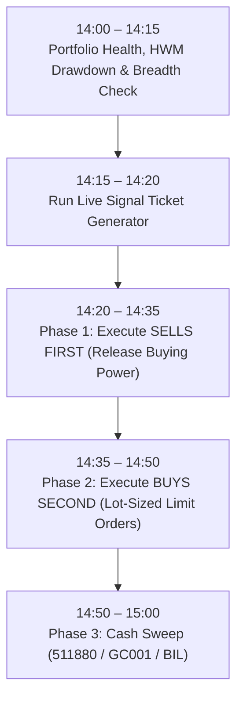

# Chan Four-State Risk-Managed Blend: Operational Live Deployment Guide

> **Strategy Key**: `chan_four_state_blend` ([`ChanFourStateBlendStrategy`](file:///home/stone/Work/github/quant/pipeline/research_strategy/rs/chan_advanced_strategies.py#L1768-L2078))  
> **Production Universes**: Multi-Market Core-Satellite 22-Stock Baskets  
> - **China A-Shares**: [`docs/universe/china/core_satellite_22_stocks.txt`](file:///home/stone/Work/github/quant/docs/universe/china/core_satellite_22_stocks.txt) (17 Dividend SOEs + 5 Satellite Growth Alpha)  
> - **US Equities**: [`docs/universe/us/core_satellite_22_stocks.txt`](file:///home/stone/Work/github/quant/docs/universe/us/core_satellite_22_stocks.txt) (16 Value/Cash Cow Core + 6 AI Tech Leaders)  
> - **Hong Kong Stocks**: [`docs/universe/hongkong/core_satellite_22_stocks.txt`](file:///home/stone/Work/github/quant/docs/universe/hongkong/core_satellite_22_stocks.txt) (16 High-Dividend SOEs + 6 Tech Platforms)  
> **Cash Proxies**: `511880` / `511990` / `GC001` (A-Shares), [`BIL`](file:///home/stone/Work/github/quant/pipeline/research_strategy/strategies_config.json) / `SGOV` (US), USD/HKD Cash Equivalents (HK)  
> **Daily Execution Tool**: [`scripts/run_live_four_state_blend.py`](file:///home/stone/Work/github/quant/scripts/run_live_four_state_blend.py)  
> **Deep Empirical Audit**: [`docs/reports/china/chan_four_state_blend/chan_four_state_blend_deep_analysis.md`](file:///home/stone/Work/github/quant/docs/reports/china/chan_four_state_blend/chan_four_state_blend_deep_analysis.md)  

---

## 1. Operational Architecture Overview

The **Chan Four-State Risk-Managed Blend Strategy** combines three complementary sub-strategies through a six-layer institutional risk management and dynamic cash deployment engine:


```mermaid
flowchart LR
    subgraph SubStrategies["1. Sub-Strategy Allocation"]
        FSE["ChanFourStateExecution<br/><b>25% Weight</b><br/>4-State Invalidation Machine"]
        TT["ChanThreeType<br/><b>45% Weight</b><br/>Segment Pivot Structural Alpha"]
        VAA["ChanVaaCompound<br/><b>30% Weight</b><br/>Dual-Momentum Crash Defense"]
    end

    subgraph RiskLayers["2. Multi-Layer Risk & Sizing Stack"]
        DD["Multi-Tier Drawdown<br/>Smooth Damping & Halts"]
        VT["Volatility Targeting<br/>σ=12% Barroso Scaling"]
        BT["Dynamic Cash & Thrust<br/>Max 80% Equity Exposure"]
        CAP["Strict Concentration<br/><b>Max 20% NAV / Stock</b>"]
        TF["Turnover Friction Filter<br/><b>5% Inertia Threshold</b>"]
    end

    subgraph Execution["3. Order Routing"]
        SELL["Phase 1: SELLS FIRST<br/>(Release Purchasing Power)"]
        BUY["Phase 2: BUYS SECOND<br/>(Lot-Rounded Execution)"]
        SWEEP["Phase 3: CASH SWEEP<br/>(BIL / 511880 / GC001)"]
    end

    SubStrategies --> RiskLayers
    RiskLayers --> SELL --> BUY --> SWEEP
```

### 1.1 Core Sub-Strategy Weights
1. **45% `ChanThreeTypeStrategy`** (`cfsb_three_type_weight = 0.45`):
   - Structural segment pivot trend alpha targeting confirmed Chan first, second, and third buy points ($B_1/B_2/B_3$).
   - Captures medium-term structural trend continuations and trend accelerations.
2. **30% `ChanVaaCompoundStrategy`** (`cfsb_vaa_weight = 0.30`):
   - Dual-momentum regime crash defense and macro capital protector (Keller & Keuning VAA-G4).
   - Holds 70% cash proxy defensive buffer whenever offensive regime conditions deteriorate.
3. **25% `ChanFourStateExecutionStrategy`** (`cfsb_four_state_weight = 0.25`):
   - Deterministic 4-state operational machine (`BUY` $\rightarrow$ `HOLD` $\rightarrow$ `HOLD_ALERT` $\rightarrow$ `SELL`).
   - Equipped with a 5-bar gestation buffer (`min_hold_bars = 5`), a 1% $ZG$ breakout tolerance band against false washouts, a moving average entanglement filter (MA5 > MA20 & positive slope), and Lesson 16 consolidation stagnation timeouts.

### 1.2 Institutional Risk Management Stack
* **Strict Single-Stock NAV Cap**: **20%** NAV maximum per individual stock (`cfsb_max_single_position = 0.20`, `cfsb_bull_max_single_position = 0.20`). Rigorously enforced across all market regimes to eliminate idiosyncratic concentration risk.
* **Volatility Targeting**: Barroso & Santa-Clara (2015) 21-day realized volatility rescaling targeting **12% annualized volatility** (`cfsb_enable_vol_targeting = true`, `cfsb_target_vol = 0.12`). Scales equity exposure continuously by $\min(1.0, 12\% / \sigma_{21d})$.
* **Dynamic Cash Deployment & Breadth Thrust**:
  - Targets up to **80%** total equity exposure (`cfsb_target_bull_exposure = 0.80`) when universe market breadth $\ge 30\%$ (percentage of stocks > SMA50) OR 10-day breadth thrust $\ge 60\%$ (stocks with positive 10-day return).
  - Unallocated cash during breadth thrusts is systematically dispersed across $\ge 5$ momentum leaders, preventing concentration.
* **Multi-Tier Drawdown Circuit Breakers**:
  - **Tier 1 (DD $\ge 10\%$)**: Smooth linear damping (`cfsb_smooth_drawdown = true`) continuously reduces equity exposure from 100% to 0% across 10%–20% drawdown.
  - **Tier 2 (DD $\ge 15\%$)**: Rotate 100% of allocation into `ChanVaaCompoundStrategy` defensive mode (holds 70% cash buffer).
  - **Tier 3 (DD $\ge 20\%$)**: Emergency halt — liquidate 100% of risky assets to Cash Proxy (`BIL` / `511880` / `GC001`) with a **21-day trading freeze**.
  - **Fast Recovery Override**: Immediate de-escalation of circuit breakers if short-term NAV recovery > 0 OR breadth thrust $\ge 60\%$.
  - **Auto-Healing Cooldown**: Tier 1/2 resets HWM after 15 sustained bars (`cfsb_tier1_cooldown_bars = 15`); Tier 3 resets HWM after 21 sustained bars.
* **5% Turnover Friction Filter**: Ignores rebalance shifts $|\Delta W| < 5\%$ (`cfsb_min_weight_change = 0.05`) to prevent transaction cost erosion. Emergency sells for circuit breakers or $-8\%$ hard stops bypass the filter down to $0.1\%$ ($|\Delta W| \ge 0.001$).
* **Execution Sequence**: **SELLS FIRST** (release cash and margin capacity) $\rightarrow$ **BUYS SECOND** (exact lot-rounded sizing).

---

## 2. Production Universes & Market Mechanics

The strategy is verified across three regional Core-Satellite pools designed to balance high-dividend defensiveness with hyper-growth alpha:

| Market | Production Universe File | Composition | Cash Proxy | Lot Sizing & Execution Nuances |
| :--- | :--- | :--- | :--- | :--- |
| **China A-Shares** | [`docs/universe/china/core_satellite_22_stocks.txt`](file:///home/stone/Work/github/quant/docs/universe/china/core_satellite_22_stocks.txt) | **17 Core** SOE Dividend Giants (Bank, Energy, Shipping)<br/>**5 Satellite** Alpha Leaders (CPO, Semis, Mining) | `511880` (银华日利)<br/>`511990` (华宝添益)<br/>`GC001` (国债逆回购) | **T+1 Rule**; Round down buys to **100-share lots**; 0.05% stamp duty on sells only; Price limits ±10% (±20% ChiNext). |
| **US Equities** | [`docs/universe/us/core_satellite_22_stocks.txt`](file:///home/stone/Work/github/quant/docs/universe/us/core_satellite_22_stocks.txt) | **16 Core** Cash Flow & Dividend Aristocrats<br/>**6 Satellite** Frontier AI & Tech Leaders | [`BIL`](file:///home/stone/Work/github/quant/pipeline/research_strategy/strategies_config.json) (1-3M T-Bill)<br/>`SGOV` (0-3M T-Bill) | **T+0 Rule**; Exact **1-share lot sizing**; SEC Section 31 fee on sells (0.00278%); No daily price limits. |
| **Hong Kong Stocks** | [`docs/universe/hongkong/core_satellite_22_stocks.txt`](file:///home/stone/Work/github/quant/docs/universe/hongkong/core_satellite_22_stocks.txt) | **16 Core** High-Dividend SOE & Utilities<br/>**6 Satellite** Tech/Platform & Auto Leaders | USD/HKD Cash Equivalents<br/>Money Market Funds | **T+0 Rule**; Exact **Board Lots by Ticker** (100 to 2,000 shares); 0.1085% stamp duty & levies on **BOTH** buys and sells. |

---

## 3. Daily Operational Timetable (14:00 – 15:00)


```mermaid
flowchart TD
    T1["14:00 – 14:15<br>Portfolio Health, HWM Drawdown & Breadth Check"] --> T2["14:15 – 14:20<br>Run Live Signal Ticket Generator"]
    T2 --> T3["14:20 – 14:35<br>Phase 1: Execute SELLS FIRST (Release Buying Power)"]
    T3 --> T4["14:35 – 14:50<br>Phase 2: Execute BUYS SECOND (Lot-Sized Limit Orders)"]
    T4 --> T5["14:50 – 15:00<br>Phase 3: Cash Sweep (511880 / GC001 / BIL)"]
```

### Detailed Execution Timeline:
1. **14:00 – 14:15: Stage 1 — Portfolio Health & Macro Valuation**
   - Run the dedicated Stage 1 pre-trade health gate:
     ```bash
     uv run python scripts/check_live_portfolio_health.py \
       --portfolio-value <ACCOUNT_NAV> \
       --peak-nav <PEAK_HWM_NAV> \
       --data-provider <marketdb|yfinance>
     ```
   - Check current portfolio NAV against the High-Water Mark (HWM).
   - Verify if any drawdown circuit breaker tier is triggered:
     - $\text{Drawdown} \ge 20\%$: **🔴 NO-GO**: Emergency halt (liquidate all risk assets to cash, 21-day trading freeze).
     - $15\% \le \text{Drawdown} < 20\%$: **🟠 CAUTION**: Tactical defense (shift 100% to VAA compound defensive mode).
     - $10\% \le \text{Drawdown} < 15\%$: **🟡 CAUTION**: Smooth linear damping (exposure reduces continuously towards 0%).
     - $\text{Drawdown} < 10\%$: **🟢 GO**: Normal risk budget.
   - Verify 50-day market breadth ($\ge 30\%$) and 10-day breadth thrust ($\ge 60\%$) to determine if bull cash deployment is active.

2. **14:15 – 14:20: Stage 2 — Generate Daily Execution Ticket**
   - If Stage 1 directive is **🟢 GO** or **🟡 CAUTION**, run the operational ticket generator against your brokerage portfolio:
     ```bash
     uv run python scripts/run_live_four_state_blend.py \
       --portfolio-value <ACCOUNT_NAV> \
       --current-holdings '<HOLDINGS_JSON>' \
       --data-provider <marketdb|yfinance>
     ```

3. **14:20 – 14:35: Phase 1 — Execute Sells First**
   - Review the `[PHASE 1: EXECUTE SELLS FIRST]` section of the output ticket.
   - Transmit limit orders pegged to the best bid/ask to liquidate down to target quantities.
   - Prioritize emergency stop-loss orders ($-8\%$) and structural invalidation exits.
   - **Do NOT place buy orders until sell executions are confirmed and buying power is unlocked.**

4. **14:35 – 14:50: Phase 2 — Execute Buys Second**
   - Review the `[PHASE 2: EXECUTE BUYS SECOND]` section.
   - Buy quantities are automatically rounded down according to market lot rules (100 shares for A-shares, 1 share for US, symbol board lots for HK).
   - Enter limit orders pegged to current bid/ask prices.

5. **14:50 – 15:00: Phase 3 — Cash Proxy Sweep**
   - Allocate any remaining unallocated cash balance into liquidity yield assets (`511880` / `511990` / `GC001` in China, `BIL` / `SGOV` in US).

---

## 4. Production CLI Run Commands

### 4.1 Stage 1: Portfolio Health & Macro Gate Commands (14:00 – 14:15)

#### A. China A-Shares Portfolio Health Check
```bash
uv run python scripts/check_live_portfolio_health.py \
  --portfolio-value 200000 \
  --peak-nav 210000 \
  --universe-file docs/universe/china/core_satellite_22_stocks.txt \
  --data-provider marketdb
```

#### B. US Equities Portfolio Health Check
```bash
uv run python scripts/check_live_portfolio_health.py \
  --portfolio-value 100000 \
  --peak-nav 105000 \
  --universe-file docs/universe/us/core_satellite_22_stocks.txt \
  --output-dir docs/ruleset/chan_four_state_blend/us \
  --data-provider yfinance
```

#### C. Hong Kong Stocks Portfolio Health Check
```bash
uv run python scripts/check_live_portfolio_health.py \
  --portfolio-value 500000 \
  --peak-nav 520000 \
  --universe-file docs/universe/hongkong/core_satellite_22_stocks.txt \
  --output-dir docs/ruleset/chan_four_state_blend/hongkong \
  --data-provider yfinance
```

#### D. Offline Sanity Check (Synthetic Data)
```bash
uv run python scripts/check_live_portfolio_health.py \
  --data-provider synthetic \
  --portfolio-value 100000
```

---

### 4.2 Stage 2: Daily Order Ticket Generation Commands (14:15 – 14:50)

#### A. Daily Rebalance Against Brokerage Holdings File (China A-Shares)
Create a local `current_holdings.json` file representing your broker positions with **exact share counts** (no need to specify cash; cash and stock weights are computed automatically from `--portfolio-value`):
```json
{
  "300394.SZ": 200,
  "601872.SH": 1000,
  "601728.SH": 1000
}
```

Execute the ticket generator:
```bash
uv run python scripts/run_live_four_state_blend.py \
  --current-holdings-file current_holdings.json \
  --portfolio-value 200000 \
  --universe-file docs/universe/china/core_satellite_22_stocks.txt \
  --data-provider marketdb
```

#### B. Daily Rebalance for US Equities Portfolio
```bash
uv run python scripts/run_live_four_state_blend.py \
  --universe-file docs/universe/us/core_satellite_22_stocks.txt \
  --output-dir docs/ruleset/chan_four_state_blend/us \
  --portfolio-value 100000 \
  --lot-size 1 \
  --data-provider yfinance
```

#### C. Daily Rebalance for Hong Kong Stocks Portfolio
```bash
uv run python scripts/run_live_four_state_blend.py \
  --universe-file docs/universe/hongkong/core_satellite_22_stocks.txt \
  --output-dir docs/ruleset/chan_four_state_blend/hongkong \
  --portfolio-value 500000 \
  --data-provider yfinance
```

#### D. Offline Ticket Simulation (Synthetic Data)
```bash
uv run python scripts/run_live_four_state_blend.py \
  --data-provider synthetic \
  --portfolio-value 100000
```

---

## 5. Operational Risk Management Checklist & Emergency SOP

| Risk Scenario | Action Trigger | Operational Procedure |
| :--- | :--- | :--- |
| **Individual Stock Hard Stop** | Loss $\ge 8\%$ from entry price | **Market exit immediately**; bypass 5% inertia filter down to 0.1%. |
| **Consolidation Stagnation** | Inside consolidation pivot $\ge 8$ bars without positive stroke momentum | Liquidate position down to 0.0% to eliminate capital drag (Lesson 16). |
| **Breakout Invalidation Stop** | Close $< ZG \times (1 - 0.01)$ | Exceeds 1% tolerance band; exit position immediately. |
| **Trailing Ratchet Stop** | Close $< ZG$ after upward stroke expansion | Exit position to lock in accrued segment gains. |
| **Time Stop** | Position held for $\ge 90$ trading days without progress | Close position and release capital. |
| **Tier 1 Circuit Breaker** | Portfolio DD $\ge 10\%$ from HWM | Smooth linear damping: scale exposure down towards 0%; sweep released equity to Cash Proxy. |
| **Tier 2 Circuit Breaker** | Portfolio DD $\ge 15\%$ from HWM | Rotate 100% of portfolio into `ChanVaaCompoundStrategy` defensive mode (70% cash buffer). |
| **Tier 3 Circuit Breaker** | Portfolio DD $\ge 20\%$ from HWM | **Emergency halt**: 100% Cash liquidation; 21-day trading freeze (reset HWM on Day 22). |
| **Fast Recovery Override** | Short-term NAV recovery > 0 OR 10d Thrust $\ge 60\%$ | Immediate de-escalation of circuit breakers; resume regular model target exposure. |
| **Friction / Inertia Threshold** | Weight adjustment $|\Delta W| < 5\%$ | **HOLD**: Do not place orders to avoid commission and slippage drag. |

---

## 6. Artifacts and Reference Files

- **Strategy Implementation**: [`pipeline/research_strategy/rs/chan_advanced_strategies.py`](file:///home/stone/Work/github/quant/pipeline/research_strategy/rs/chan_advanced_strategies.py#L1768-L2078)
- **Strategy Configuration**: [`pipeline/research_strategy/strategies_config.json`](file:///home/stone/Work/github/quant/pipeline/research_strategy/strategies_config.json)
- **Serialized Strategy Dump**: [`pipeline/research_strategy/results/strategy_dumps/chan_four_state_blend_strategy.json`](file:///home/stone/Work/github/quant/pipeline/research_strategy/results/strategy_dumps/chan_four_state_blend_strategy.json)
- **Live Trading Rules (English)**: [`docs/ruleset/chan_four_state_blend/rules.md`](file:///home/stone/Work/github/quant/docs/ruleset/chan_four_state_blend/rules.md)
- **Live Trading Rules (Chinese)**: [`docs/ruleset/chan_four_state_blend/rules_cn.md`](file:///home/stone/Work/github/quant/docs/ruleset/chan_four_state_blend/rules_cn.md)
- **Stage 1 Health Check Script**: [`scripts/check_live_portfolio_health.py`](file:///home/stone/Work/github/quant/scripts/check_live_portfolio_health.py)
- **Stage 1 Health Report (Markdown)**: [`docs/ruleset/chan_four_state_blend/stage1_health_report.md`](file:///home/stone/Work/github/quant/docs/ruleset/chan_four_state_blend/stage1_health_report.md)
- **Stage 1 Health Report (JSON)**: [`docs/ruleset/chan_four_state_blend/stage1_health_report.json`](file:///home/stone/Work/github/quant/docs/ruleset/chan_four_state_blend/stage1_health_report.json)
- **Account State & Cooldown Tracker**: [`docs/ruleset/chan_four_state_blend/account_state.json`](file:///home/stone/Work/github/quant/docs/ruleset/chan_four_state_blend/account_state.json)
- **Stage 2 Execution Script**: [`scripts/run_live_four_state_blend.py`](file:///home/stone/Work/github/quant/scripts/run_live_four_state_blend.py)
- **Production Universes**:
  - China A-Shares: [`docs/universe/china/core_satellite_22_stocks.txt`](file:///home/stone/Work/github/quant/docs/universe/china/core_satellite_22_stocks.txt)
  - US Equities: [`docs/universe/us/core_satellite_22_stocks.txt`](file:///home/stone/Work/github/quant/docs/universe/us/core_satellite_22_stocks.txt)
  - Hong Kong Stocks: [`docs/universe/hongkong/core_satellite_22_stocks.txt`](file:///home/stone/Work/github/quant/docs/universe/hongkong/core_satellite_22_stocks.txt)
- **Deep Walkforward Audit Reports**:
  - China Walkforward Analysis: [`docs/reports/china/chan_four_state_blend/chan_four_state_blend_deep_analysis.md`](file:///home/stone/Work/github/quant/docs/reports/china/chan_four_state_blend/chan_four_state_blend_deep_analysis.md)
  - US Walkforward Analysis: [`docs/reports/us/chan_four_state_blend/chan_four_state_blend_deep_analysis.md`](file:///home/stone/Work/github/quant/docs/reports/us/chan_four_state_blend/chan_four_state_blend_deep_analysis.md)
- **Generated Order Ticket**: [`docs/ruleset/chan_four_state_blend/live_trading_ticket.csv`](file:///home/stone/Work/github/quant/docs/ruleset/chan_four_state_blend/live_trading_ticket.csv)
