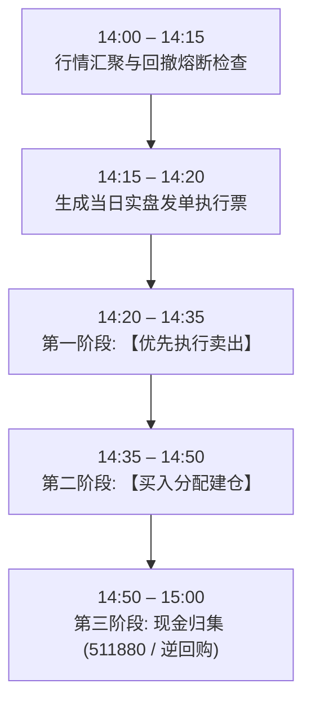

# Chan Four-State Risk-Managed Blend: 实盘运行与操作部署指南

> **策略标识**: `chan_four_state_blend` ([`ChanFourStateBlendStrategy`](file:///home/stone/Work/github/quant/pipeline/research_strategy/rs/chan_advanced_strategies.py#L1768-L2078))  
> **实盘标的池**: 剔除拖累标的后的精选 A 股核心池 (11 只个股)，配置文件见 [`docs/universe/china/14_stocks_pruned.txt`](file:///home/stone/Work/github/quant/docs/universe/china/14_stocks_pruned.txt)  
> **现金替代资产**: `511880` (银华日利) / `511990` (华宝添益) / 国债逆回购 `GC001` (A 股) 或 [`BIL`](file:///home/stone/Work/github/quant/pipeline/research_strategy/strategies_config.json) / `SGOV` (美股)  
> **专属执行脚本**: [`scripts/run_live_four_state_blend.py`](file:///home/stone/Work/github/quant/scripts/run_live_four_state_blend.py)  

---

## 1. 生产实盘配置架构

**Chan Four-State Risk-Managed Blend Strategy (缠论四态风控混合策略)** 融合三大核心支柱：
1. **40% `ChanVaaCompoundStrategy`**: VAA-G4 双动量宏观牛熊防御锚与防崩盘现金储备垫。
2. **40% `ChanThreeTypeStrategy`**: 线段中枢一二三类买卖点标准结构趋势主升浪。
3. **20% `ChanFourStateExecutionStrategy`**: 四态操作执行机，配备 5 日孕育缓冲区、1% ZG 容差防洗盘、均线缠绕过滤网及第 16 课中枢停滞超时平仓。

### 核心硬风控约束
* **单票持仓上限**: 基准 $20\%$（牛市宽度状态动态扩容至 $30\%$）。
* **多层账户回撤熔断**: 10% 减半风险、15% 全员切入防守 VAA、20% 全面清仓空仓冷冻 21 日。
* **4% 换手调仓摩擦过滤**: 单只标的权重调整未达 4% 不发单，避免无意义税费与滑点磨损。
* **交易顺序强制执行**: **必须【先卖后买】**，先卖出释放购买力，买入标的严格按 100 股整手数向下取整。

---

## 2. 交易员日内执行时间表 (14:00 – 15:00)



### 分时操作细则：
1. **14:00 – 14:15: 组合健康度与宏观检查**
   - 检查账户当前净值对比历史峰值净值 (HWM) 的回撤深度：
     - 若回撤 $\ge 20\%$：三级熔断生效，市价清空所有持仓，未来 21 个交易日冷冻。
     - 若 $15\% \le \text{回撤} < 20\%$：二级熔断生效，切断进攻仓位，转入防守模式。
     - 若 $10\% \le \text{回撤} < 15\%$：一级熔断生效，现存股票仓位对半减仓。
   - 检查全市场 50 日均线宽度（$\ge 30\%$）及 10 日冲力（$\ge 60\%$），判断牛市现金动用是否激活。

2. **14:15 – 14:20: 生成交易执行票据**
   - 在终端运行专属执行脚本（传入当前券商实际持仓）：
     ```bash
     uv run python scripts/run_live_four_state_blend.py \
       --portfolio-value <账户总资产> \
       --current-holdings '<当前持仓JSON>' \
       --data-provider <marketdb|yfinance>
     ```

3. **14:20 – 14:35: 【优先执行卖出】 (释放购买力)**
   - 查看生成的票据 `[PHASE 1: EXECUTE SELLS FIRST]` 部分。
   - 采用对盘限价单挂单卖出，确保资金额度可用。
   - **严禁在卖单成交前盲目开新仓**。

4. **14:35 – 14:50: 【执行买入】 (建仓与加仓)**
   - 查看票据 `[PHASE 2: EXECUTE BUYS SECOND]` 部分。
   - 脚本已自动完成 **100 股一手** 向下取整。
   - 按照计算的手数限价挂单买入。

5. **14:50 – 15:00: 闲置资金现金管理**
   - 账户剩余未用资金全部买入货币 ETF（如 `511880` 银华日利、`511990` 华宝添益）或参与尾盘国债逆回购（`GC001`）。

---

## 3. 生产常用执行命令

### A. 结合真实券商持仓发单
在本地创建 `current_holdings.json`：
```json
{
  "300394.SZ": 0.12,
  "000938.SZ": 0.08,
  "600276.SH": 0.08,
  "BIL": 0.72
}
```

执行生成当日调仓单：
```bash
uv run python scripts/run_live_four_state_blend.py \
  --current-holdings-file current_holdings.json \
  --portfolio-value 200000 \
  --universe-file docs/universe/china/14_stocks_pruned.txt \
  --data-provider marketdb
```

### B. 模型自主连续追踪模式 (无外部干预)
```bash
uv run python scripts/run_live_four_state_blend.py \
  --portfolio-value 100000 \
  --universe-file docs/universe/china/14_stocks_pruned.txt \
  --data-provider marketdb
```

### C. 盘前/周末离线模拟检验 (合成数据)
```bash
uv run python scripts/run_live_four_state_blend.py \
  --data-provider synthetic \
  --as-of-date 2025-08-22 \
  --portfolio-value 100000
```

---

## 4. 关键风控应急预案表

| 风险场景 | 判定条件 | 交易员必须采取的操作 |
| :--- | :--- | :--- |
| **单票硬止损** | 单只持仓亏损 $\ge 8\%$ | 立即市价清仓；无视 4% 过滤（0.1% 强制通过）。 |
| **中枢盘整停滞** | 买入后在中枢内连续横盘 $\ge 8$ 根 K 线 | 立即主动平仓换股，规避资金沉淀成本。 |
| **三买破位止损** | 收盘价跌破 $ZG \times 0.99$ | 超出 1% 容差，立即市价止损出局。 |
| **一级回撤熔断** | 组合净值回撤 $\ge 10\%$ | 现存持仓全部按市价减半，释放 50% 现金。 |
| **二级回撤熔断** | 组合净值回撤 $\ge 15\%$ | 清退进攻仓位，100% 切换至 VAA 防守模式。 |
| **三级回撤熔断** | 组合净值回撤 $\ge 20\%$ | 100% 清仓空仓，冷冻 21 个交易日禁止交易。 |

---

## 5. 相关核心文件一览

- **实盘操作手册 (中文版)**: [`docs/ruleset/chan_four_state_blend/rules_cn.md`](file:///home/stone/Work/github/quant/docs/ruleset/chan_four_state_blend/rules_cn.md)
- **实盘操作手册 (英文版)**: [`docs/ruleset/chan_four_state_blend/rules.md`](file:///home/stone/Work/github/quant/docs/ruleset/chan_four_state_blend/rules.md)
- **专属执行脚本**: [`scripts/run_live_four_state_blend.py`](file:///home/stone/Work/github/quant/scripts/run_live_four_state_blend.py)
- **精选标的池**: [`docs/universe/china/14_stocks_pruned.txt`](file:///home/stone/Work/github/quant/docs/universe/china/14_stocks_pruned.txt)
- **实盘发单导出文件**: [`docs/ruleset/chan_four_state_blend/live_trading_ticket.csv`](file:///home/stone/Work/github/quant/docs/ruleset/chan_four_state_blend/live_trading_ticket.csv)
