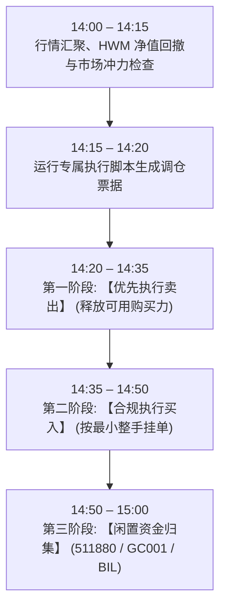

# Chan Four-State Risk-Managed Blend: 实盘运行与操作部署指南

> **策略标识**: `chan_four_state_blend` ([`ChanFourStateBlendStrategy`](file:///home/stone/Work/github/quant/pipeline/research_strategy/rs/chan_advanced_strategies.py#L1768-L2078))  
> **实盘标的池**: 跨市场核心-卫星 22 资产池 (Core-Satellite 22 Stocks)  
> - **A 股核心-卫星池**: [`docs/universe/china/core_satellite_22_stocks.txt`](file:///home/stone/Work/github/quant/docs/universe/china/core_satellite_22_stocks.txt) (17只高股息央国企红利底仓 + 5只高弹性产业Alpha领军者)  
> - **美股核心-卫星池**: [`docs/universe/us/core_satellite_22_stocks.txt`](file:///home/stone/Work/github/quant/docs/universe/us/core_satellite_22_stocks.txt) (16只价值投资与充沛现金流底仓 + 6只AI科技前沿领航引擎)  
> - **港股核心-卫星池**: [`docs/universe/hongkong/core_satellite_22_stocks.txt`](file:///home/stone/Work/github/quant/docs/universe/hongkong/core_satellite_22_stocks.txt) (16只高股息央国企及公用事业底仓 + 6只超级科技平台与出海领袖)  
> **现金替代资产**: A 股 `511880` (银华日利) / `511990` (华宝添益) / 国债逆回购 `GC001`; 美股 [`BIL`](file:///home/stone/Work/github/quant/pipeline/research_strategy/strategies_config.json) / `SGOV`; 港股 美元/港币货币市场工具  
> **专属发单工具**: [`scripts/run_live_four_state_blend.py`](file:///home/stone/Work/github/quant/scripts/run_live_four_state_blend.py)  
> **深度研报论证**: [`docs/reports/china/chan_four_state_blend/chan_four_state_blend_deep_analysis_cn.md`](file:///home/stone/Work/github/quant/docs/reports/china/chan_four_state_blend/chan_four_state_blend_deep_analysis_cn.md)  

---

## 1. 生产实盘配置架构

**Chan Four-State Risk-Managed Blend Strategy (缠论四态风控混合策略)** 深度融合三大核心子策略，并搭载六层机构级风控与动态资金分配中枢：


```mermaid
flowchart LR
    subgraph SubStrategies["1. 子策略权重配置"]
        FSE["ChanFourStateExecution<br/><b>25% 权重</b><br/>四态状态机与破位止损"]
        TT["ChanThreeType<br/><b>45% 权重</b><br/>线段中枢趋势主升浪"]
        VAA["ChanVaaCompound<br/><b>30% 权重</b><br/>双动量宏观牛熊防御锚"]
    end

    subgraph RiskLayers["2. 六层机构风控与头寸管理栈"]
        DD["多层净值回撤熔断<br/>线性阻尼与全面冷冻"]
        VT["波动率目标控制<br/>σ=12% Barroso 动态缩放"]
        BT["牛市动量动用与冲力<br/>最高 80% 权益暴露"]
        CAP["严格单票持仓上限<br/><b>单标的上限 20% NAV</b>"]
        TF["换手摩擦过滤门槛<br/><b>5% 换手惰性阈值</b>"]
    end

    subgraph Execution["3. 交易路由调度"]
        SELL["第一阶段: 【优先执行卖出】<br/>(释放资金购买力)"]
        BUY["第二阶段: 【合规执行买入】<br/>(按各市场最小整手数)"]
        SWEEP["第三阶段: 【闲置资金归集】<br/>(511880 / GC001 / BIL)"]
    end

    SubStrategies --> RiskLayers
    RiskLayers --> SELL --> BUY --> SWEEP
```

### 1.1 子策略生产权重
1. **45% `ChanThreeTypeStrategy`** (`cfsb_three_type_weight = 0.45`):
   - 基于缠论线段中枢形态学，捕捉经过验证的一、二、三类买卖点标准主升浪结构。
   - 捕捉中周期确定性趋势延续与向上突破形态。
2. **30% `ChanVaaCompoundStrategy`** (`cfsb_vaa_weight = 0.30`):
   - 依据 Keller & Keuning (2016) VAA-G4 双动量宏观防御模型，作为组合核心安全垫。
   - 当进攻资产动量恶化转负时，自动将 70% 的资金调配至现金替代资产进行坚壁清野。
3. **25% `ChanFourStateExecutionStrategy`** (`cfsb_four_state_weight = 0.25`):
   - 严格遵循四态确定性执行机 (`BUY` $\rightarrow$ `HOLD` $\rightarrow$ `HOLD_ALERT` $\rightarrow$ `SELL`)。
   - 配备 5 日孕育缓冲区 (`min_hold_bars = 5`)、1% $ZG$ 容差防洗盘机制、均线缠绕过滤网 (MA5 > MA20 且斜率大于零) 以及第 16 课中枢停滞超时平仓止损。

### 1.2 机构级多层硬风控体系
* **单票持仓硬上限**: **严格锁定为 20% NAV** (`cfsb_max_single_position = 0.20`, `cfsb_bull_max_single_position = 0.20`)。即便在牛市极强冲力状态下，也坚决不突破 20% 单票集中度，从根本上隔离单一资产黑天鹅爆雷风险。
* **波动率目标控制 (Volatility Targeting)**: 引入 Barroso & Santa-Clara (2015) 21 日已实现波动率动态缩放机制，锚定 **12% 目标年化波动率** (`cfsb_enable_vol_targeting = true`, `cfsb_target_vol = 0.12`)，通过 $\min(1.0, 12\% / \sigma_{21d})$ 自适应削减市场剧烈动荡期的权益敞口。
* **动态现金动用与宽度冲力 (Breadth Thrust)**:
  - 当全市场 50 日均线宽度 $\ge 30\%$ 或 10 日动量冲力 $\ge 60\%$ 时，激活牛市仓位扩展，整体权益仓位最高可达 **80%** (`cfsb_target_bull_exposure = 0.80`)。
  - 牛市冲力释放出的增量资金强制**分散配置于不少于 5 只动量龙头**，严禁单标的过度膨胀。
* **多层账户净值回撤熔断 (Drawdown Circuit Breakers)**:
  - **一级熔断 (回撤 $\ge 10\%$)**: 启动平滑线性阻尼减仓 (`cfsb_smooth_drawdown = true`)，在 10%–20% 回撤深度区间内将权益暴露平滑线性减至 0%。
  - **二级熔断 (回撤 $\ge 15\%$):** 组合 100% 权限切换至 `ChanVaaCompoundStrategy` 防守模式（配置 70% 现金防御垫）。
  - **三级熔断 (回撤 $\ge 20\%$):** 紧急避险全面平仓——市价清仓所有风险资产至现金替代资产 (`BIL` / `511880` / `GC001`)，**冷冻 21 个交易日禁止交易**。
  - **快速修复旁路 (Fast Recovery Override)**: 当组合净值从近期低点出现正向反弹或 10 日冲力 $\ge 60\%$ 时，立即撤销熔断压制恢复正常仓位。
  - **自愈重置机制 (Auto-Healing)**: 一/二级熔断持续 15 根 K 线自动重置 HWM；三级熔断冷冻满 21 根 K 线后于第 22 个交易日自动重置 HWM，避免系统永久锁死。
* **5% 换手调仓摩擦过滤**: 单只标的权重调整未达 **5%** (`cfsb_min_weight_change = 0.05`) 时坚决不发单，杜绝频繁微量交易带来的佣金、印花税与滑点侵蚀。**紧急例外**: 触及账户熔断或个股 $-8\%$ 硬止损时，卖出指令以 0.1% 门槛无阻碍立即执行。
* **交易顺序强制执行**: **必须【先卖后买】**，先卖出释放购买力，买入标的严格按各市场整手数规则向下取整。

---

## 2. 生产标的池与跨市场规则对比

该策略已在三大成熟市场的核心-卫星资产池中完成 18 期 Walkforward 实证检验，具体交易参数与约束如下：

| 市场区域 | 核心-卫星股票池文件 | 资产池架构与行业构成 | 现金替代资产 | 交易与报单细则 |
| :--- | :--- | :--- | :--- | :--- |
| **A 股市场** | [`docs/universe/china/core_satellite_22_stocks.txt`](file:///home/stone/Work/github/quant/docs/universe/china/core_satellite_22_stocks.txt) | **17只核心底仓**: 银行、公用事业、能源等央国企高股息红利蓝筹<br/>**5只卫星增强**: CPO算力、半导体装备、有色资源出海龙头 | `511880` (银华日利)<br/>`511990` (华宝添益)<br/>`GC001` (国债逆回购) | **T+1 规则**; 买入强制按 **100 股一手向下取整**; 卖方单边 0.05% 印花税; 涨跌停限制 ±10% (创业板 ±20%)。 |
| **美股市场** | [`docs/universe/us/core_satellite_22_stocks.txt`](file:///home/stone/Work/github/quant/docs/universe/us/core_satellite_22_stocks.txt) | **16只核心底仓**: 价值投资标杆、股息贵族与抗周期自由现金牛<br/>**6只卫星增强**: 全球生成式 AI、算力集群与颠覆式创新领军者 | [`BIL`](file:///home/stone/Work/github/quant/pipeline/research_strategy/strategies_config.json) (1-3月美债ETF)<br/>`SGOV` (0-3月美债ETF) | **T+0 规则**; 精确 **1 股下单 (1-share lot)**; 卖单缴纳 SEC Section 31 极微规费 (0.00278%); 无涨跌幅限制。 |
| **港股市场** | [`docs/universe/hongkong/core_satellite_22_stocks.txt`](file:///home/stone/Work/github/quant/docs/universe/hongkong/core_satellite_22_stocks.txt) | **16只核心底仓**: 极高股息 6%~9% 央企红利、通信与特许金融垄断<br/>**6只卫星增强**: 超级科技互联网、全球化智能电动车与先进制造 | 美元/港币现金管理<br/>货币市场公募基金 | **T+0 规则**; 严格按**各股票特定每手股数 (Board Lot)** 整数倍下单 (100 至 2000 股不等); 双边征收 0.1085% 印花税与规费。 |

---

## 3. 交易员日内执行时间表 (14:00 – 15:00)


```mermaid
flowchart TD
    T1["14:00 – 14:15<br>行情汇聚、HWM 净值回撤与市场冲力检查"] --> T2["14:15 – 14:20<br>运行专属执行脚本生成调仓票据"]
    T2 --> T3["14:20 – 14:35<br>第一阶段: 【优先执行卖出】 (释放可用购买力)"]
    T3 --> T4["14:35 – 14:50<br>第二阶段: 【合规执行买入】 (按最小整手挂单)"]
    T4 --> T5["14:50 – 15:00<br>第三阶段: 【闲置资金归集】 (511880 / GC001 / BIL)"]
```

### 分时操作细则：
1. **14:00 – 14:15: 第一阶段 — 组合健康度与宏观检查**
   - 运行专属的第一阶段盘中健康与风控检查脚本：
     ```bash
     uv run python scripts/check_live_portfolio_health.py \
       --portfolio-value <账户当前净值> \
       --peak-nav <历史峰值HWM> \
       --data-provider <marketdb|yfinance>
     ```
   - 检查账户当前净值对比历史峰值净值 (HWM) 的回撤深度：
     - 若回撤 $\ge 20\%$：**🔴 NO-GO 紧急熔断**，市价清空所有风险持仓，未来 21 个交易日冷冻。
     - 若 $15\% \le \text{回撤} < 20\%$：**🟠 CAUTION 战术防守**，切断进攻仓位，转入 VAA 防守模式（保留 70% 现金）。
     - 若 $10\% \le \text{回撤} < 15\%$：**🟡 CAUTION 线性阻尼**，启动平滑线性阻尼减仓。
     - 若回撤 $< 10\%$：**🟢 GO 放行通过**，全额正常风险预算。
   - 检查全市场 50 日均线宽度（$\ge 30\%$）及 10 日冲力（$\ge 60\%$），确认牛市资金动用是否处于激活状态。

2. **14:15 – 14:20: 第二阶段 — 生成交易执行票据**
   - 当第一阶段指令为 **🟢 GO** 或 **🟡 CAUTION** 时，在终端运行调仓票据生成器：
     ```bash
     uv run python scripts/run_live_four_state_blend.py \
       --portfolio-value <账户总资产> \
       --current-holdings '<当前持仓JSON>' \
       --data-provider <marketdb|yfinance>
     ```

3. **14:20 – 14:35: 【优先执行卖出】 (释放购买力)**
   - 查看生成的票据 `[PHASE 1: EXECUTE SELLS FIRST]` 部分。
   - 优先执行 $-8\%$ 个股硬止损、中枢超时平仓及一二三类卖点指令。
   - 采用对盘限价单挂单卖出，确保资金额度可用。
   - **严禁在卖单成交前盲目开新仓**。

4. **14:35 – 14:50: 【执行买入】 (建仓与加仓)**
   - 查看票据 `[PHASE 2: EXECUTE BUYS SECOND]` 部分。
   - 脚本已根据不同市场规则自动完成最小整手数取整（A股 100 股向下取整、美股 1 股精确下单、港股按 Board Lot 整手计算）。
   - 按照计算的手数限价挂单买入。

5. **14:50 – 15:00: 闲置资金现金管理**
   - 账户剩余未用资金全部买入货币 ETF（如 `511880` 银华日利、`511990` 华宝添益）或参与尾盘国债逆回购（`GC001`）。

---

## 4. 生产常用执行命令

### 4.1 第一阶段：组合健康度与宏观检查命令 (14:00 – 14:15)

#### A. A 股投资组合健康度与风控门禁检查
```bash
uv run python scripts/check_live_portfolio_health.py \
  --portfolio-value 200000 \
  --peak-nav 210000 \
  --universe-file docs/universe/china/core_satellite_22_stocks.txt \
  --data-provider marketdb
```

#### B. 美股投资组合健康度检查
```bash
uv run python scripts/check_live_portfolio_health.py \
  --portfolio-value 100000 \
  --peak-nav 105000 \
  --universe-file docs/universe/us/core_satellite_22_stocks.txt \
  --output-dir docs/ruleset/chan_four_state_blend/us \
  --data-provider yfinance
```

#### C. 港股投资组合健康度检查
```bash
uv run python scripts/check_live_portfolio_health.py \
  --portfolio-value 500000 \
  --peak-nav 520000 \
  --universe-file docs/universe/hongkong/core_satellite_22_stocks.txt \
  --output-dir docs/ruleset/chan_four_state_blend/hongkong \
  --data-provider yfinance
```

#### D. 盘前离线模拟检验 (合成数据)
```bash
uv run python scripts/check_live_portfolio_health.py \
  --data-provider synthetic \
  --portfolio-value 100000
```

---

### 4.2 第二阶段：调仓发单票据生成命令 (14:15 – 14:50)

#### A. 结合真实券商持仓发单 (A 股核心-卫星池)
在本地创建 `current_holdings.json`：
```json
{
  "300394.SZ": 0.10,
  "601872.SH": 0.08,
  "601728.SH": 0.08,
  "BIL": 0.74
}
```

执行生成当日调仓单：
```bash
uv run python scripts/run_live_four_state_blend.py \
  --current-holdings-file current_holdings.json \
  --portfolio-value 200000 \
  --universe-file docs/universe/china/core_satellite_22_stocks.txt \
  --data-provider marketdb
```

#### B. 美股核心-卫星池发单命令
```bash
uv run python scripts/run_live_four_state_blend.py \
  --universe-file docs/universe/us/core_satellite_22_stocks.txt \
  --output-dir docs/ruleset/chan_four_state_blend/us \
  --portfolio-value 100000 \
  --lot-size 1 \
  --data-provider yfinance
```

#### C. 港股核心-卫星池发单命令
```bash
uv run python scripts/run_live_four_state_blend.py \
  --universe-file docs/universe/hongkong/core_satellite_22_stocks.txt \
  --output-dir docs/ruleset/chan_four_state_blend/hongkong \
  --portfolio-value 500000 \
  --data-provider yfinance
```

#### D. 离线模拟发单检验 (合成数据)
```bash
uv run python scripts/run_live_four_state_blend.py \
  --data-provider synthetic \
  --portfolio-value 100000
```

---

## 5. 关键风控应急预案表

| 风险场景 | 判定条件 | 交易员必须采取的即时操作 |
| :--- | :--- | :--- |
| **单票硬止损** | 单只持仓亏损 $\ge 8\%$ | **立即市价清仓**；无视 5% 换手过滤（0.1% 门槛强制通过）。 |
| **中枢盘整停滞** | 买入后在中枢内连续横盘 $\ge 8$ 根 K 线且无向上动量 | **立即主动平仓换股**，彻底消除资金沉淀机会成本 (第16课)。 |
| **三买破位止损** | 收盘价跌破 $ZG \times (1 - 0.01)$ | 超出 1% 容差，立即市价止损出局，防范中枢反向破坏。 |
| **棘轮跟踪止盈** | 股价突破中枢上轨展开后回踩跌破 $ZG$ | **止盈出局**，锁定线段主升浪浮动收益。 |
| **时间周期止损** | 持仓达 90 个交易日仍无确定性向上进展 | 主动清仓离场，将资本释放给更高 Alpha 标的。 |
| **一级回撤熔断** | 组合净值回撤 $\ge 10\%$ | 启动平滑线性阻尼减仓，降低风险敞口，释放资金至现金替代资产。 |
| **二级回撤熔断** | 组合净值回撤 $\ge 15\%$ | 清退主动进攻股票，100% 切换至 VAA 防守模式（保留 70% 现金）。 |
| **三级回撤熔断** | 组合净值回撤 $\ge 20\%$ | **全员紧急避险**：100% 清仓空仓，冷冻 21 个交易日禁止交易。 |
| **快速修复通道** | 净值创近期反弹新高 或 10日冲力 $\ge 60\%$ | 立即撤销熔断压制，恢复模型标准目标配置。 |
| **5% 换手惰性过滤** | 单票权重变化 $|\Delta W| < 5\%$ | **保持现状不发单**，规避微量调整造成的佣金与滑点损耗。 |

---

## 6. 相关核心文件一览

- **策略代码实现**: [`pipeline/research_strategy/rs/chan_advanced_strategies.py`](file:///home/stone/Work/github/quant/pipeline/research_strategy/rs/chan_advanced_strategies.py#L1768-L2078)
- **策略配置注册表**: [`pipeline/research_strategy/strategies_config.json`](file:///home/stone/Work/github/quant/pipeline/research_strategy/strategies_config.json)
- **序列化策略快照**: [`pipeline/research_strategy/results/strategy_dumps/chan_four_state_blend_strategy.json`](file:///home/stone/Work/github/quant/pipeline/research_strategy/results/strategy_dumps/chan_four_state_blend_strategy.json)
- **实盘操作手册 (中文版)**: [`docs/ruleset/chan_four_state_blend/rules_cn.md`](file:///home/stone/Work/github/quant/docs/ruleset/chan_four_state_blend/rules_cn.md)
- **实盘操作手册 (英文版)**: [`docs/ruleset/chan_four_state_blend/rules.md`](file:///home/stone/Work/github/quant/docs/ruleset/chan_four_state_blend/rules.md)
- **第一阶段组合健康与宏观检查脚本**: [`scripts/check_live_portfolio_health.py`](file:///home/stone/Work/github/quant/scripts/check_live_portfolio_health.py)
- **第一阶段风控门禁审计报告 (Markdown)**: [`docs/ruleset/chan_four_state_blend/stage1_health_report.md`](file:///home/stone/Work/github/quant/docs/ruleset/chan_four_state_blend/stage1_health_report.md)
- **第一阶段风控门禁审计报告 (JSON)**: [`docs/ruleset/chan_four_state_blend/stage1_health_report.json`](file:///home/stone/Work/github/quant/docs/ruleset/chan_four_state_blend/stage1_health_report.json)
- **账户净值与冷冻期追踪状态文件**: [`docs/ruleset/chan_four_state_blend/account_state.json`](file:///home/stone/Work/github/quant/docs/ruleset/chan_four_state_blend/account_state.json)
- **第二阶段调仓发单执行脚本**: [`scripts/run_live_four_state_blend.py`](file:///home/stone/Work/github/quant/scripts/run_live_four_state_blend.py)
- **跨市场标的池**:
  - A 股核心-卫星池: [`docs/universe/china/core_satellite_22_stocks.txt`](file:///home/stone/Work/github/quant/docs/universe/china/core_satellite_22_stocks.txt)
  - 美股核心-卫星池: [`docs/universe/us/core_satellite_22_stocks.txt`](file:///home/stone/Work/github/quant/docs/universe/us/core_satellite_22_stocks.txt)
  - 港股核心-卫星池: [`docs/universe/hongkong/core_satellite_22_stocks.txt`](file:///home/stone/Work/github/quant/docs/universe/hongkong/core_satellite_22_stocks.txt)
- **深度 Walkforward 实证研报**:
  - A 股 Walkforward 实证研报: [`docs/reports/china/chan_four_state_blend/chan_four_state_blend_deep_analysis_cn.md`](file:///home/stone/Work/github/quant/docs/reports/china/chan_four_state_blend/chan_four_state_blend_deep_analysis_cn.md)
  - 美股 Walkforward 实证研报: [`docs/reports/us/chan_four_state_blend/chan_four_state_blend_deep_analysis_cn.md`](file:///home/stone/Work/github/quant/docs/reports/us/chan_four_state_blend/chan_four_state_blend_deep_analysis_cn.md)
- **实盘发单导出文件**: [`docs/ruleset/chan_four_state_blend/live_trading_ticket.csv`](file:///home/stone/Work/github/quant/docs/ruleset/chan_four_state_blend/live_trading_ticket.csv)
