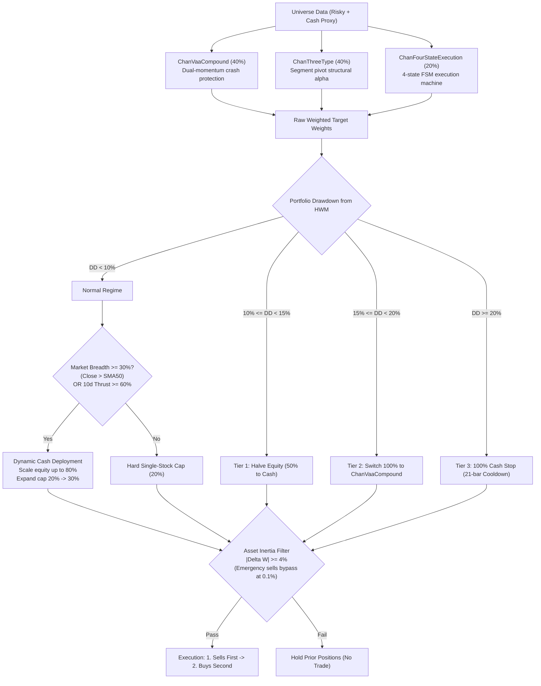
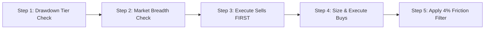

# Chan Four-State Risk-Managed Blend Strategy: Live Trading Operating Manual & Rulebook

> **Strategy Identifier**: `chan_four_state_blend` ([`ChanFourStateBlendStrategy`](file:///home/stone/Work/github/quant/pipeline/research_strategy/rs/chan_advanced_strategies.py#L1768-L2078))  
> **Instrument Context**: Equity / ETF Universe (US Equities or China A-Shares) + Cash Proxy ([`BIL`](file:///home/stone/Work/github/quant/pipeline/research_strategy/strategies_config.json) / `511880` / `511990` / Overnight Repo)  
> **Trading Frequency**: Daily rebalance evaluation, executing primarily between **14:00 – 14:50** (to avoid open auction volatility and end-of-day market-on-close distortions).  
> **Underlying Factors**: `regime_trend_strength`, `absolute_momentum_trend`, `relative_momentum`, `volatility_targeting`

---

## 1. Strategy Identity & Architecture Overview

The **Chan Four-State Risk-Managed Blend Strategy** is an institutional multi-strategy portfolio based directly on the validated `ChanRiskManagedBlendStrategy` architecture, but replaces the multi-stage composite scaling sleeve with the industrial 4-state operational execution machine (`ChanFourStateExecutionStrategy`):

### Core Model Triad & Baseline Allocations
* **40% `ChanVaaCompoundStrategy`**: Dual-momentum VAA-G4 13612W macro regime crash protection buffer & defensive anchor.
* **40% `ChanThreeTypeStrategy`**: Standard segment-level pivot structural breakout and divergence engine.
* **20% `ChanFourStateExecutionStrategy`**: Industrial-grade 4-state operational execution machine (BUY_CANDIDATE, HOLD, HOLD_ALERT, SELL_EXIT, WAIT_OBSERVE) incorporating:
  - 5-bar gestation buffer (`chan_fse_min_hold_bars = 5`) to allow structural pivots to develop without Day 1-2 churn.
  - 1% breakout tolerance on ZG (`chan_fse_zg_tolerance_pct = 0.01`) to resist false breakdown noise.
  - Moving average entanglement filter (`chan_fse_use_ma_filter = True`) to reject whipsaw consolidations.
  - Lesson 16 zero-consolidation stagnation avoidance timeout (`chan_fse_cons_timeout_bars = 8`).

---

## 2. Daily Live Trading Routine (Operational Checklist)

A human trader must follow this 5-step daily routine in strict sequential order before placing any trades:

---

## 3. Step-by-Step Decision Logic & Rules

### Step 1: Drawdown Circuit Breaker Check (Portfolio Level)
Calculate your current portfolio High-Water Mark (HWM) and peak-to-trough drawdown at 14:00:
$$\text{Drawdown} = \frac{\text{Current NAV} - \text{Peak NAV}}{\text{Peak NAV}}$$

* **IF Drawdown $< 10\%$ (Normal Regime)**:
  * Proceed to Step 2 with full risk budget. Standard single-stock cap = **$20\%$**.
* **IF $10\% \le \text{Drawdown} < 15\%$ (Tier 1: Risk Damping)**:
  * **Action**: Cut all active stock positions by **$50\%$**.
  * Maximum total equity exposure = **$50\%$**; remaining $50\%$ must sit in Cash Proxy (`BIL`).
  * No new breakout buys allowed unless funded from the $50\%$ reduced budget.
* **IF $15\% \le \text{Drawdown} < 20\%$ (Tier 2: Tactical Defense)**:
  * **Action**: Disengage four-state and three-type models; route **100% of capital into `ChanVaaCompoundStrategy`**.
  * **Behavior**: In defensive regime, VAA holds $70\%$ in Cash Proxy / Short-term Treasuries and up to $30\%$ in the strongest defensive asset.
* **IF Drawdown $\ge 20\%$ (Tier 3: Hard Stop / Emergency Halt)**:
  * **Action**: **Liquidate $100\%$ of all risk assets into Cash Proxy immediately**.
  * **Lockout**: **Do not buy for 21 consecutive trading days**. On Day 22, reset HWM to current NAV to allow fresh cycle re-entry.

---

### Step 2: Market Breadth & 10-Day Breadth Thrust Check (Capacity & Exposure Scaling)
Calculate universe breadth: percentage of tracked stocks trading above their 50-day Simple Moving Average ($\text{Close} > \text{SMA}_{50}$, `cfsb_breadth_lookback = 50`) and short-term 10-day breadth thrust (percentage of stocks with positive 10-day return, $\text{ROC}_{10} > 0$, `cfsb_thrust_lookback = 10`):

* **IF (Market Breadth $\ge 30\%$ OR 10-Day Breadth Thrust $\ge 60\%$) AND Drawdown $< 10\%$**:
  * **Dynamic Cash Deployment Triggered**:
    * If 10-day breadth thrust $\ge 60\%$ (`cfsb_thrust_thresh = 0.60`): **Fast Rebound Override** immediately sets maximum bull scaling factor (1.0).
    * If standard breadth $\ge 30\%$ (`cfsb_breadth_bull_thresh = 0.30`): scales smoothly from $30\%$ to $75\%$ breadth.
  * **Max Single-Stock Cap**: Expands from $20\%$ up to **$30\%$** (`cfsb_bull_max_single_position`).
  * **Target Total Equity Exposure**: Up to **$80\%$** (`cfsb_target_bull_exposure`), deploying idle cash into top conviction setups.
* **ELSE (Market Breadth $< 30\%$ AND Thrust $< 60\%$, OR Drawdown $\ge 10\%$)**:
  * **Max Single-Stock Cap**: Hard limit of **$20\%$** per stock.
  * **Target Total Equity Exposure**: Standard unscaled exposure (typically $40\%–60\%$, balance in Cash Proxy `BIL`).

---

### Step 3: Asset-Level Sell Rules (Execute Sells FIRST)
Always execute sell orders before buy orders to guarantee purchasing power and avoid margin strain.

Liquidate an asset down to **$0.0\%$** if **ANY** of the following conditions trigger:

1. **Chan Structural Sell Points ($S_1 / S_2 / S_3$)**:
   * **$S_1$ (Top Divergence / 顶背驰)**: Stock makes a new high, but MACD histogram area or amplitude is clearly smaller than the previous upward stroke.
   * **$S_2$ (Second Sell Point / 二卖)**: Upward rebound fails to break the prior high and prints a lower-high pivot.
   * **$S_3$ (Third Sell Point / 三卖)**: Downward stroke breaks through the lower boundary of a consolidation pivot, and the subsequent pullback fails to re-enter the pivot zone.
2. **Four-State Machine Structural Invalidation Stops**:
   * **$B_1$ Entry Stop**: Close breaks below the lowest price of the $B_1$ bar low.
   * **$B_2$ Entry Stop**: Close breaks below the lowest price of the preceding consolidation pivot low ($DD$).
   * **$B_3$ Breakout Invalidation**: Close breaks below $ZG \times (1 - 0.01)$ (exceeds the 1% breakout tolerance band).
   * **Trailing Ratchet Stop**: As price trades above $ZG$, ratchet the exit stop up to $ZG$. Any close below $ZG$ exits the position.
3. **Lesson 16 Zero-Consolidation Stagnation Timeout**:
   * Position has lingered inside consolidation (`in_zs`) for $\ge 8$ consecutive bars (`chan_fse_cons_timeout_bars = 8`) without positive stroke momentum (`stroke_dir <= 0`) $\rightarrow$ **Sell immediately** to eliminate capital drag.
4. **Hard Stop-Loss**:
   * Asset drops **$\ge 8\%$** below entry price $\rightarrow$ **Market exit immediately** (`chan_fse_stop_loss_pct = 0.08`).
5. **Time Stop**:
   * Position held for **$\ge 90$ trading days** without new structural continuation $\rightarrow$ Close position and release capital (`chan_fse_max_holding_days = 90`).

---

### Step 4: Asset-Level Buy Rules (Position Sizing & Entry Filters)
Buy candidates qualify across the 3 sub-strategies:
1. **Four-State Execution Sleeve (20%)**:
   * **$B_1$ Bottom Fishing**: Requires price above MACD zero-axis reclaim or positive stroke divergence. Held with a **5-bar gestation buffer** (`min_hold_bars = 5`) to allow the pivot to develop.
   * **$B_2$ Pullback Buy**: Higher-low pivot formation after upward stroke.
   * **$B_3$ Breakout Buy**: Clear breakout above $ZG$. Gated by the **MA Entanglement Filter** (requires fast MA > slow MA and slope > 0 to avoid false range breakouts).
2. **Three-Type Sleeve (40%)**:
   * Allocates to confirmed $B_1, B_2, B_3$ setups across the universe with 20% single-stock ceiling.
3. **VAA Macro Compound Sleeve (40%)**:
   * Allocates to top 1-2 offensive assets with highest 13612W momentum score, or sweeps 70% to Cash Proxy when canary assets drop negative.
4. **Single-Stock Cap**: Never allocate more than **$20\%$** of total portfolio NAV to any single ticker (expands to **$30\%$** during bull breadth regimes).

---

### Step 5: Turnover & Minimum Trade Filter ($\Delta W \ge 4\%$)
Before entering an order into your broker terminal, calculate the weight change:
$$\Delta W = |W_{\text{target}} - W_{\text{current}}|$$

* **Normal Trading Days**:
  * **IF $\Delta W < 4\%$**: **DO NOT TRADE**. Hold prior quantity. (Prevents commission drag and slippage on micro-adjustments).
  * **IF $\Delta W \ge 4\%$**: Place order.
* **Circuit Breaker Days (Emergency Override)**:
  * If a circuit breaker triggered (Tier 1/2/3) or an asset hit an $8\%$ stop-loss:
    * **Emergency Sells**: Bypass the $4\%$ rule down to **$0.1\%$** ($|\Delta W| \ge 0.001$) and execute sales immediately.
    * **Emergency Buys**: Still require the full **$4\%$** threshold ($|\Delta W| \ge 0.04$) to prevent buying into a declining market.

---

## 4. Human Trader Quick-Reference Card

Keep this table handy during the market session:

| Check | Item | Condition | Human Trader Action |
| :--- | :--- | :--- | :--- |
| **Risk** | **HWM Drawdown** | $\ge 20\%$ | **STOP ALL TRADING**: Liquidate $100\%$ to cash proxy. Freeze 21 days (HWM resets Day 22). |
| **Risk** | **HWM Drawdown** | $15\% - 19.9\%$ | **DEFENSIVE SHIFT**: Route $100\%$ to ChanVaaCompound (holds $70\%$ cash in defense mode). |
| **Risk** | **HWM Drawdown** | $10\% - 14.9\%$ | **HALVE RISK**: Cut all open equity weights by $50\%$; sweep remainder to cash. |
| **Regime** | **Market Breadth** | $\ge 30\%$ above SMA50 or 10d Thrust $\ge 60\%$ | **BULL SCALING**: Increase single-stock cap to $30\%$; total equity up to $80\%$. |
| **Regime** | **Market Breadth** | $< 30\%$ above SMA50 and Thrust $< 60\%$ | **CONSERVATIVE**: Keep single-stock cap at $20\%$; standard cash buffer. |
| **Exit** | **Stop-Loss** | Loss $\ge 8\%$ from entry | **EXIT IMMEDIATELY**: Sell $100\%$ of position at market/limit. |
| **Exit** | **Time Stop** | Held $\ge 90$ days no progress| **EXIT**: Close position to release capital. |
| **Exit** | **Stagnation Timeout** | Held $\ge 8$ bars in consolidation | **EXIT**: Sell position to avoid Lesson 16 drag. |
| **Exit** | **Chan Sells / Invalidation**| $S_1, S_2, S_3$ or Breakout Stop | **EXIT**: Sell position to $0.0\%$. |
| **Entry** | **Four-State Machine**| Valid $B_1/B_2/B_3$ + MA Filter | **BUY**: Allocate with 5-bar gestation buffer. |
| **Execution**| **Friction Filter** | $|\Delta W| < 4\%$ | **SKIP**: Do not place order if change is under $4\%$ portfolio NAV. |
| **Execution**| **Sequence** | Multi-asset rebalance | **SELLS FIRST** (free up cash) $\rightarrow$ **BUYS SECOND**. |

---

## 5. Execution Nuances & Slippage Management

1. **Execution Window**: 
   * Evaluate data at **14:00**.
   * Transmit orders between **14:20 – 14:45**. 
   * Avoid trading in the first 30 minutes of the open (09:30–10:00) where bid-ask spreads are widest.
2. **Order Style**:
   * For highly liquid instruments (large-cap ETFs/stocks): Use **limit orders pegged to current bid/ask** or TWAP slices over 15 minutes.
   * For emergency stop-losses or Tier 3 circuit breakers: Use **market or immediate-or-cancel limit orders** to guarantee execution.
3. **Cash Proxy Management**:
   * Any capital not allocated to stocks should be parked in risk-free yield assets (e.g., [`BIL`](file:///home/stone/Work/github/quant/pipeline/research_strategy/strategies_config.json) / `SGOV` in US markets, or `511880` / `511990` / GC001 in China A-shares) rather than uninvested non-earning cash.
