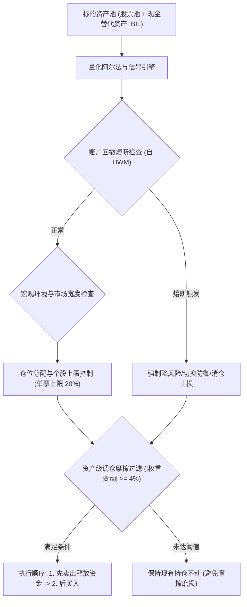
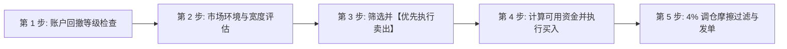

# Chan Four-State Risk-Managed Blend Strategy: 实盘交易操作规程与规则手册

> **策略标识**: `chan_four_state_blend` (`ChanFourStateBlendStrategy`)  
> **交易标的**: 股票 / ETF 股票池 + 现金管理替代资产 (`BIL` / `511880` / `511990` / 国债逆回购)  
> **调仓频率**: 日频评估与决策，实盘下单主要集中在 **14:00 – 14:50** (避开早盘集合竞价剧烈波动及尾盘收盘集合竞价冲击)。  
> **底层因子**: `regime_trend_strength`, `absolute_momentum_trend`, `relative_momentum`, `volatility_targeting`

---

## 1. 策略架构与模型体系

**Chan Four-State Risk-Managed Blend Strategy** 是一套严谨的量化实盘投资策略，旨在通过结构化信号与风险控制实现可持续收益。

### 策略简介
Institutional ensemble based on Chan Risk-Managed Blend, replacing Chan Composite with Chan Four-State Execution Strategy (25%) alongside Chan Three-Type (45%) and Chan VAA Compound (30%), with 20% single-stock cap, multi-level drawdown circuit breakers with 15-bar auto-healing cooldown and fast-recovery override, 5% turnover filter, 30% breadth bull threshold, and pre-emptive breadth thrust cash deployment.

---

## 2. 实盘交易员日内标准作业程序 (SOP)

实盘交易员在每个交易日下午 **14:00 – 14:50** 严格按照以下五个先后次序执行检查与下单：

---

## 3. 详细交易逻辑与分步规则

### 第 1 步: 账户级回撤熔断检查 (强制首要执行)
每日 14:00 计算当前资产净值相对于历史最高净值 (High-Water Mark) 的回撤比例：
$$\text{回撤幅度 (Drawdown)} = \frac{\text{当前净值} - \text{历史峰值净值}}{\text{历史峰值净值}}$$

* **IF 回撤 < 10% (正常运作区间)**:
  * 进入第 2 步，享有完整风险预算。单个股票仓位上限为 **20%**。
* **IF 10% <= 回撤 < 15% (一级熔断: 风险减半抑制)**:
  * **操作**: 现存所有股票持仓**强制压缩减半 (乘 0.5)**。
  * 释放出的资金转入现金管理资产 (`BIL`)。
* **IF 15% <= 回撤 < 20% (二级熔断: 战术防御切换)**:
  * **操作**: 清退所有常规进攻仓位。
  * 仓位**100% 切换至防御模式**：保留至少 70% 现金管理资产，最多仅允许 30% 配置于最强防御标的。
* **IF 回撤 >= 20% (三级熔断: 极端硬止损空仓)**:
  * **操作**: **100% 全面清仓所有风险资产，全部移至现金替代品**。
  * **冷却锁定期**: **连续 21 个交易日绝对禁止开仓**。第 22 个交易日将峰值基准重置为当前净值，方可重新开始评估买入。

---

### 第 2 步: 市场环境与宽度评估
* **IF 市场环境处于多头/适宜状态**:
  * 按照模型信号正常开仓，充分利用多头风险预算。
* **ELSE (市场弱势或震荡不明确)**:
  * 严格遵守单票 **20%** 硬顶限制。
  * 剩余未用资金一律留在现金管理资产中。

---

### 第 3 步: 资产级卖出与止损规则 (必须【先卖后买】)
**必须先执行卖出订单，待可用资金到账后，再行分配买入，严禁盲目加仓拉高杠杆。**

若持仓标的触发以下**任意一项**条件，该股票目标仓位直接降为 **0.0% (清仓)**：
1. **模型结构卖点**: 策略信号引擎给出正式卖出/平仓信号。
2. **结构失效/破位**: 价格跌破关键防守位或形态破坏。
3. **个股硬止损**: 任意单只标的跌幅达到或超过成本价的 **-8%** -> **市价立即止损出局**。
4. **时间止损**: 买入后持有达 **90 个交易日** 仍未走出有效上涨 -> 主动平仓释放沉淀资金。

---

### 第 4 步: 资产级分批买入与加仓规则 (金字塔建仓)
1. **信号确认**: 仅在 14:00 评估时确认有效的买入信号方可入场。
2. **分批建仓**: 推荐采用分批金字塔试仓机制（如 30% 初试底仓、40% 回踩确认、30% 突破加速），切忌一次性满仓追高。
3. **单票限额**: 任意单只标的总持仓市值不得超过账户总资金的 **20%**。

---

### 第 5 步: 交易调仓摩擦过滤规则 (|Delta W| >= 4%)
在交易终端输入发单前，必须计算单票调仓权重变动绝对值：
$$\Delta W = |\text{目标权重} - \text{当前实际持仓权重}|$$

* **普通交易日 (常规调仓)**:
  * **IF $\Delta W < 4%$**: **放弃交易，维持原有持仓不变** (杜绝微幅调仓产生的摩擦磨损)。
  * **IF $\Delta W \ge 4%$**: 正式发单。
* **熔断与风控日 (紧急通道)**:
  * 一旦触发熔断等级或个股硬止损：
    * **紧急卖出**: 门槛放宽至 **0.1%** ($|\Delta W| \ge 0.001$) 即刻发单执行减仓/清仓。
    * **紧急买入**: 仍须严格满足 **4%** 门槛 ($|\Delta W| \ge 0.0400$)，防止弱市中逆势加仓。

---

## 4. 实盘交易员便携速查表

| 维度 | 核对项目 | 触发条件 | 实盘交易员必须采取的操作 |
| :--- | :--- | :--- | :--- |
| **风控** | **账户总回撤** | >= 20% | **【三级熔断】** 全面清仓至 `BIL`；冷冻 21 天，第 22 天重置净值基准。 |
| **风控** | **账户总回撤** | 15% - 20% | **【二级熔断】** 撤出进攻仓位；70% 锁入现金品，仅留至多 30% 最强防御。 |
| **风控** | **账户总回撤** | 10% - 15% | **【一级熔断】** 现存所有股票仓位砍半；腾出资金划转至现金品。 |
| **环境** | **市场环境** | 强势多头 | **【正常配置】** 按模型满配，充分发挥选股优势。 |
| **环境** | **市场环境** | 弱势/中性 | **【防守为主】** 单票上限锁死 20%；维持标准现金缓冲。 |
| **卖出** | **硬止损** | 单票自成本跌 >= 8% | **【立即离场】** 无论任何形态，市价或积极限价平仓 100%。 |
| **卖出** | **时间止损** | 持仓达 90 交易日停滞 | **【超时平仓】** 获利或微损平仓，释放资金效率。 |
| **卖出** | **模型卖点** | 触发策略平仓信号 | **【清仓出局】** 该股目标权重直降为 0.0%。 |
| **买入** | **模型买点** | 确认有效买入信号 | **【分步建仓】** 分批买入，单票严禁超过 20%。 |
| **执行** | **摩擦过滤** | 拟调仓变动 < 4% | **跳过不发单**，保持原仓位不变。 |
| **执行** | **发单次序** | 涉及多资产同时调仓 | **【先卖出后买入】**：卖单确认成交/资金释放后再挂买单。 |

---

## 5. 实盘执行细节与冲击成本控制

1. **发单时间窗口**:
   * **14:00 – 14:15**: 汇总全天数据，计算当日回撤与市场环境。
   * **14:20 – 14:45**: 发出卖出与买入委托。
   * 严禁在早盘开盘前 30 分钟 (09:30–10:00) 追涨杀跌。
2. **订单执行类型**:
   * 高流动性标的 (大盘宽基 ETF、高成交股票): 挂买一/卖一限价单，或分批 15 分钟 TWAP 下单。
   * 紧急止损单或三级熔断平仓: 采用市价或最优五档即时成交剩余撤销单，确保绝对离场。
3. **现金替代品归集**:
   * 未买入股票的闲置资金切勿闲置在 0 利率现金账户中，应配置于 `BIL` / 货币 ETF / 逆回购获取稳健无风险收益。
