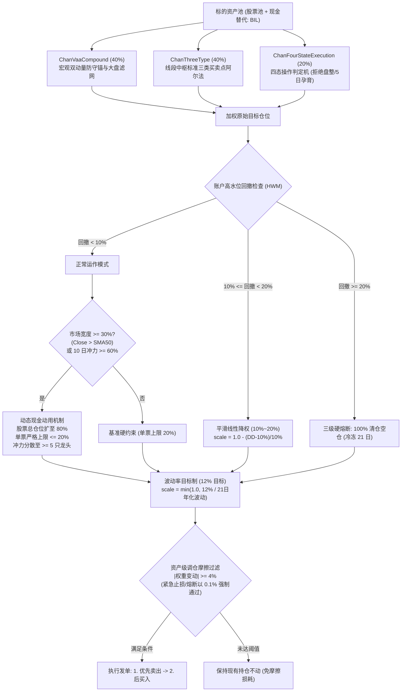
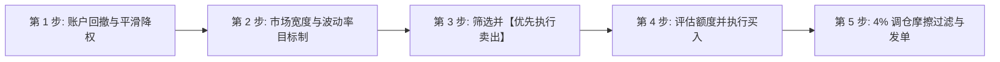

# Chan Four-State Risk-Managed Blend Strategy: 实盘交易操作规程与规则手册

> **策略标识**: `chan_four_state_blend` ([`ChanFourStateBlendStrategy`](file:///home/stone/Work/github/quant/pipeline/research_strategy/rs/chan_advanced_strategies.py#L1768-L2078))  
> **交易标的**: 股票 / ETF 股票池 (美股或 A 股全市场) + 现金管理替代资产 ([`BIL`](file:///home/stone/Work/github/quant/pipeline/research_strategy/strategies_config.json) / `511880` / `511990` / 国债逆回购)  
> **调仓频率**: 日频评估与决策，实盘下单主要集中在 **14:00 – 14:50** (避开早盘集合竞价剧烈波动及尾盘收盘集合竞价冲击)。  
> **底层因子**: `regime_trend_strength`, `absolute_momentum_trend`, `relative_momentum`, `volatility_targeting`

---

## 1. 策略架构与模型体系

**Chan Four-State Risk-Managed Blend Strategy (缠论四态风控混合策略)** 直接承袭了前行优化表现卓越的 `ChanRiskManagedBlendStrategy` 架构体系，将原有基于阶梯分批试仓的 Composite 模块，升级替换为工业级**四态操作判定机策略 (`ChanFourStateExecutionStrategy`)**：

### 核心子策略三位一体配置权重
* **40% `ChanVaaCompoundStrategy` (排名第一)**: VAA-G4 13612W 动量宏观牛熊防御锚，为整个组合提供深幅下跌保护与大类资产安全垫。
* **40% `ChanThreeTypeStrategy` (排名第二)**: 线段/中枢级别一二三类买卖点结构阿尔法，捕捉确定的趋势与中枢突破主升浪。
* **20% `ChanFourStateExecutionStrategy` (四态执行操作机)**: 严格执行缠中说禅“中小资金拒绝盘整”教条的四态执行机 (候选开仓、持股、预警、卖出、观望)：
  - **5 天孕育缓冲区 (`chan_fse_min_hold_bars = 5`)**：彻底避免左侧买入（如一买/二买）次日因短暂在中枢下方震荡即被过早止损洗出。
  - **1% 中枢高点容差 (`chan_fse_zg_tolerance_pct = 0.01`)**：三买突破后回踩 ZG 允许 1% 影线杂波缓冲，不被轻微回踩破位误伤。
  - **均线缠绕过滤网 (`chan_fse_use_ma_filter = True`)**：长短均线缠绕无序时禁止开仓，仅在多头排列时执行突破。
  - **第 16 课零盘整耗损超时 (`chan_fse_cons_timeout_bars = 8`)**：在中枢内部横盘超过 8 根 K 线且向上笔动量耗尽时主动平仓止盈/换股。

---

## 2. 实盘交易员日内标准作业程序 (SOP)

实盘交易员在每个交易日下午 **14:00 – 14:50** 严格按照以下五个先后次序执行检查与下单：

---

## 3. 详细交易逻辑与分步规则

### 第 1 步: 账户级回撤风控检查 (强制首要执行)
每日 14:00 计算当前资产净值相对于历史最高净值 (High-Water Mark) 的回撤比例：
$$\text{回撤幅度 (Drawdown)} = \frac{\text{当前净值} - \text{历史峰值净值}}{\text{历史峰值净值}}$$

* **IF 回撤 $< 10\%$ (正常运作区间)**:
  * 进入第 2 步，享有完整风险预算。单个股票基准仓位上限为 **$20\%$**。
* **IF $10\% \le \text{回撤} < 20\%$ (平滑线性风控衰减, `cfsb_smooth_drawdown = True`)**:
  * **操作**: 废除传统阶梯式断崖减仓，采用**平滑连续线性降权**：
    $$\text{Scale}_{\text{dd}} = \max\left(0.0, 1.0 - \frac{\text{回撤幅度} - 10\%}{20\% - 10\%}\right)$$
  * **行为**: 回撤达到 $10\%$ 时保留 $100\%$ 正常仓位；达到 $15\%$ 时平滑降至 $50\%$ 仓位；达到 $18\%$ 时降至 $20\%$ 仓位，剥离的资金全部转入无风险现金品。
  * **快速恢复机制**: 若短期 10 日收益率翻正或 10 日冲力爆发，立即豁免回撤降权，恢复正常多头仓位。
  * **自动愈合机制**: 回撤持续 15 个交易日未破新低后，基准峰值净值自动愈合至当前净值，避免永久性踏空。
* **IF 回撤 $\ge 20\%$ (三级硬熔断: 极端硬止损空仓)**:
  * **操作**: **100% 全面清仓所有风险资产，全部转入现金管理资产**。
  * **冷却锁定期**: **连续 21 个交易日绝对禁止开仓**。第 22 个交易日将峰值基准重置为当前净值，方可重新开始评估买入。

---

### 第 2 步: 市场宽度、10 日冲力与波动率目标制 (杠杆与分散配置)
1. **波动率目标制叠加 (`cfsb_enable_vol_targeting = True`, `cfsb_target_vol = 0.12`)**:
   * 基于 Barroso & Santa-Clara (2015) 波动率目标模型，跟踪股票池最近 21 日年化实现波动率 $\sigma_{21d}$。
   * 当市场波动剧烈 ($\sigma_{21d} > 12\%$) 时，将所有股票目标权重按 $\min(1.0, 12\% / \sigma_{21d})$ 连续同比例缩放，剩余仓位保留在现金中，有效切断市场极端恐慌时的尾部暴跌风险。
2. **市场宽度与 10 日冲力分散配置**:
   * 每日 14:00 计算全市场 50 日均线宽度（收盘价高于 50 日 SMA 的个股占比）以及 10 日市场冲力（10 日涨幅为正的个股占比）：
   * **IF (市场宽度 $\ge 30\%$ OR 10 日冲力 $\ge 60\%$) 且当前回撤 $< 10\%$**:
     * **触发动态现金动用机制**: 总权益仓位提升至至多 **$80\%$** (`cfsb_target_bull_exposure`)。
     * **单票上限严格控制在 $\le 20\%$** (`cfsb_bull_max_single_position = 0.20`): 坚决杜绝单票仓位放大至 30% 造成的集中度暴险。
     * **冲力多资产分散**: 触发 10 日宽度冲力时，闲置资金必须分散配置给**至少 5 只**不同动量领涨龙头股票（每只配置 5%–8%），严禁单票孤注一掷重仓。
   * **ELSE (市场宽度 $< 30\%$ 且冲力 $< 60\%$, 或账户处于回撤状态)**:
     * **单票上限**: 严格锁定在 **$20\%$** 硬顶。
     * **总股票仓位**: 保持基准配置（通常为 $40\%–60\%$，余量驻留现金品 `BIL`）。

---

### 第 3 步: 资产级卖出与止损规则 (必须【先卖后买】)
**必须先执行卖出订单，待可用资金到账后，再行分配买入，严禁盲目加仓拉高杠杆。**

若持仓标的触发以下**任意一项**条件，该股票目标仓位直接降为 **$0.0\%$ (清仓)**：

1. **缠论经典结构卖点 ($S_1 / S_2 / S_3$)**:
   * **$S_1$ (顶背驰)**: 股价创出新高，但 MACD 红柱面积或向上笔振幅显著弱于前一向上段。
   * **$S_2$ (第二类卖点)**: 反弹高点无法突破前高，形成明显次高点。
   * **$S_3$ (第三类卖点)**: 向下笔跌破前中枢下沿 $ZD$，反抽无法重新站回中枢内部。
2. **四态执行机确定性结构止损**:
   * **一买持仓破位止损**: 收盘价跌破该一买 K 线的最低点。
   * **二买持仓破位止损**: 收盘价跌破该二买形成时的前中枢极低点 ($DD$)。
   * **三买突破失效止损**: 收盘价跌破 $ZG \times (1 - 0.01)$ (超出 1% 假突破缓冲下沿)。
   * **移动止损棘轮机制**: 股价上行脱离中枢后，止损位自动上推至中枢高点 $ZG$，跌破 $ZG$ 立即锁利平仓。
3. **第 16 课中枢停滞超时 (拒绝盘整)**:
   * 买入后在中枢内部 (`in_zs`) 连续滞留 $\ge 8$ 根 K 线，且笔方向不再向上 (`stroke_dir <= 0`) $\rightarrow$ **立即清仓换股**，规避沉淀资金机会成本。
4. **硬止损底线**:
   * 任意单只标的跌幅达到或超过成本价的 **$-8\%$** $\rightarrow$ **市价立即止损出局**。
5. **时间止损**:
   * 持有达 **90 个交易日** 仍未走出有效向上笔脱离中枢 $\rightarrow$ 主动平仓释放沉淀资金。

---

### 第 4 步: 资产级买入规则与选股条件
买入候选标的来自三个子模块的信号交集：
1. **四态执行机袖珍进攻仓 (20%)**:
   * **一买**: MACD 零轴下方柱体收敛背驰或回升至零轴上方。享受 **5 天孕育缓冲区**，不受开仓前几天的震荡洗盘影响。
   * **二买**: 突破向上笔后的回踩确认不创新低。
   * **三买**: 突破中枢上沿 $ZG$ 后的强势回踩确认。开仓必须通过**均线缠绕过滤网**（5日均线 > 20日均线且斜率向上）。
2. **三类买卖点阿尔法底仓 (40%)**:
   * 全市场中枢线段级别的标准一二三买标的。
3. **VAA 宏观复合防护仓 (40%)**:
   * 全市场 13612W 动量最高的 1-2 只核心多头标的；金丝雀警报拉响时全额退守现金/短债。
4. **单票限额**: 单只标的总配置上限严格控制在 **$\le 20\%$** (`cfsb_bull_max_single_position = 0.20`)，彻底杜绝冲力期间将单票仓位打至 30% 造成的集中暴险。

---

### 第 5 步: 交易调仓摩擦过滤规则 ($\Delta W \ge 4\%$)
在交易终端输入发单前，必须计算单票调仓权重变动绝对值：
$$\Delta W = |\text{目标权重} - \text{当前实际持仓权重}|$$

* **普通交易日 (常规调仓)**:
  * **IF $\Delta W < 4\%$**: **放弃交易，维持原有持仓不变** (杜绝微幅调仓产生的佣金印花税与滑点磨损)。
  * **IF $\Delta W \ge 4\%$**: 正式发单。
* **熔断与风控日 (紧急通道)**:
  * 一旦触发熔断等级或个股硬止损：
    * **紧急卖出**: 门槛降低至 **$0.1\%$** ($|\Delta W| \ge 0.001$)，无视 4% 过滤，必须立即以市价或积极限价卖出清仓。
    * **紧急买入**: 仍须严格执行 **$4\%$** 变动门槛，坚决不在左侧下跌中盲目低吸。

---

## 4. 实盘交易员极简速查表 (Cheat Sheet)

盘中交易时请常备此表：

| 维度 | 检查项 | 触发条件 | 实盘交易员必须采取的操作 |
| :--- | :--- | :--- | :--- |
| **风控** | **账户历史回撤** | $\ge 20\%$ | **【三级硬熔断】全面清仓停止交易**: 100% 撤出至现金替代品，冷冻 21 个交易日 (第22天重置峰值)。 |
| **风控** | **账户历史回撤** | $10\% - 19.9\%$ | **【平滑线性风控】连续降权**: 依 $1.0 - (\text{DD}-10\%)/10\%$ 平滑压缩风险敞口，无断崖暴跌。 |
| **风控** | **市场波动率** | 21日年化波动 $> 12\%$ | **【波动率目标制】连续缩放**: 按 $12\% / \sigma_{21d}$ 比例压缩股票总暴露，削减极端暴跌风险。 |
| **环境** | **全市场宽度/冲力**| 50日宽度 $\ge 30\%$ 或 10日冲力 $\ge 60\%$ | **【多头激活动用】**: 股票总仓位允许动用现金扩张至 80%，单票上限严格 $\le 20\%$，冲力分散至 $\ge 5$ 只龙头。 |
| **环境** | **全市场宽度/冲力**| 宽度 $< 30\%$ 且冲力 $< 60\%$ | **【保守防守运作】**: 保持单票 20% 硬上限，保留常规现金储备。 |
| **卖出** | **个股硬止损** | 自买入价亏损 $\ge 8\%$ | **立即清仓出局**: 限价挂单或市价挂单全部斩仓。 |
| **卖出** | **时间止损** | 持仓达 90 个交易日停滞 | **平仓走人**: 释放流动性与仓位。 |
| **卖出** | **盘整停滞超时** | 中枢内连续横盘 $\ge 8$ 根 K 线 | **平仓出局**: 执行第 16 课中小资金拒绝盘整教条。 |
| **卖出** | **结构失效卖点** | 跌破买点底/ZG容差/S1/S2/S3 | **平仓至 0.0%**: 结构破坏确认。 |
| **买入** | **四态操作机进场**| 一二三买 + 均线发散 + 5日孕育 | **按比例建仓**: 遵守 $\le 20\%$ 单票上限。 |
| **执行** | **摩擦过滤** | 目标变动 $|\Delta W| < 4\%$ | **跳过不发单**: 避免无意义调仓摩擦。 |
| **执行** | **多股调仓顺序**| 同时存在买卖信号 | **必须【先卖后买】**: 先卖出换取购买力，再买入新标的。 |

---

## 5. 交易执行细节与滑点管理

1. **执行时间窗口**: 
   * **14:00**: 汇聚最新分时与日 K 数据，进行回撤计算与四态信号扫描。
   * **14:20 – 14:45**: 发单成交时间窗口。
   * 严禁在早盘开盘前 30 分钟 (09:30–10:00) 追高或恐慌斩仓，此时点买卖价差最大、虚假突破最多。
2. **挂单类型**:
   * 对于高流动性标的 (大盘蓝筹、主流宽基 ETF)：采用**对盘限价单 (Limit Orders pegged to Best Bid/Ask)** 或 15 分钟 TWAP 分批挂单。
   * 对于个股 $-8\%$ 止损或三级熔断：采用**市价单或立即成交/撤销 (IOC)** 挂单，确保不计代价出清风险。
3. **现金管理替代资产**:
   * 凡处于未分配或防守状态的闲置资金，实盘应自动买入高流动性货币基金或国债逆回购（美股买入 [`BIL`](file:///home/stone/Work/github/quant/pipeline/research_strategy/strategies_config.json) / `SGOV`，A股买入 `511880` / `511990` 或参与隔夜逆回购 GC001），杜绝资本闲置无息沉淀。
