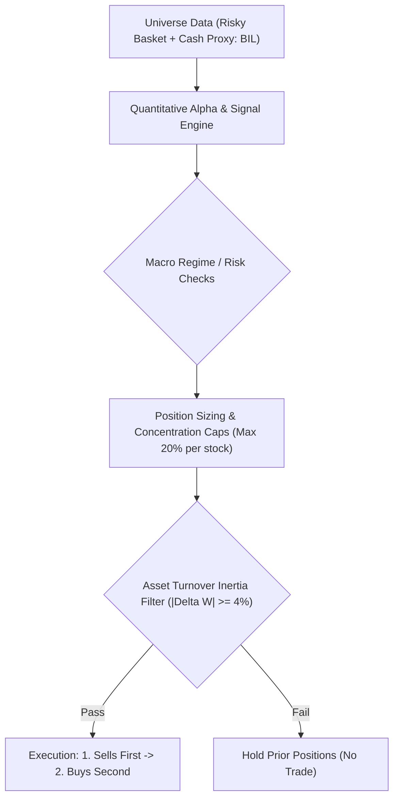
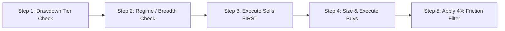

# Chan Four-State Operational Machine Strategy: Live Trading Operating Manual & Rulebook

> **Strategy Identifier**: `chan_four_state_execution` (`ChanFourStateExecutionStrategy`)  
> **Instrument Context**: Equity / ETF Universe + Cash Proxy (`BIL`)  
> **Trading Frequency**: Daily rebalance evaluation, executing between **14:00 – 14:50** (to avoid open auction volatility and end-of-day market-on-close distortions).  
> **Underlying Factors**: `regime_trend_strength`, `absolute_momentum_trend`, `mean_reversion`

---

## 1. Strategy Identity & Architecture Overview

**Chan Four-State Operational Machine Strategy** is a quantitative trading strategy designed for disciplined portfolio execution.

### Strategy Description
Industrial-grade Chan execution strategy implementing the 4-state operational machine (BUY_CANDIDATE, HOLD, HOLD_ALERT, SELL_EXIT, WAIT_OBSERVE) with deterministic structural invalidation stops (1B bar low, 2B dd low, 3B zg pivot high), ratcheting trailing stop to ZG, moving average entanglement filter, and Lesson 16 zero-consolidation drag.

---

## 2. Daily Live Trading Routine (Operational Checklist)

A human trader must follow this 5-step daily routine in strict sequential order before placing any trades:

---

## 3. Step-by-Step Decision Logic & Rules

### Step 1: Drawdown Circuit Breaker Check (Portfolio Level)
Calculate your current portfolio High-Water Mark (HWM) and peak-to-trough drawdown at 14:00:
$$\text{Drawdown} = \frac{\text{Current NAV} - \text{Peak NAV}}{\text{Peak NAV}}$$

* **IF Drawdown < 10% (Normal Regime)**:
  * Proceed to Step 2 with full risk budget. Standard single-stock cap = **20%**.
* **IF 10% <= Drawdown < 15% (Tier 1: Risk Damping)**:
  * **Action**: Cut all active stock positions by **50%**.
  * Remaining 50% must sit in Cash Proxy (`BIL`).
* **IF 15% <= Drawdown < 20% (Tier 2: Tactical Defense)**:
  * **Action**: Liquidate discretionary offensive positions.
  * Switch into defensive mode: Hold 70% in Cash Proxy, and up to 30% only in leading defensive assets.
* **IF Drawdown >= 20% (Tier 3: Hard Stop / Emergency Halt)**:
  * **Action**: **Liquidate 100% of all risk assets into Cash Proxy immediately**.
  * **Lockout**: **Do not buy for 21 consecutive trading days**. On Day 22, reset HWM to current NAV to allow fresh cycle re-entry.

---

### Step 2: Regime & Market Breadth Check
* **IF Market Regime is Favorable**:
  * Allocate up to target equity exposure according to model conviction.
  * Dynamically deploy cash into top qualifying assets without exceeding position caps.
* **ELSE (Market Regime is Bearish or Indeterminate)**:
  * Enforce standard hard cap of **20%** per stock.
  * Retain remaining capital in Cash Proxy (`BIL`).

---

### Step 3: Asset-Level Sell Rules (Execute Sells FIRST)
Always execute sell orders before buy orders to guarantee purchasing power and avoid margin strain.

Liquidate an asset down to **0.0%** if **ANY** of the following conditions trigger:
1. **Model Sell Signal**: Formal Chan exit signal (1S / 2S / 3S sell points, or Lesson 92-99 dangerous pivot penetration).
2. **Structural Invalidation Stops (Deterministic Table 3 Rules)**:
   * **3B Breakout Positions**: Price drops below $ZG \times (1 - 1\% \text{ tolerance})$. Re-entering the pivot disproves the breakout thesis.
   * **2B Pullback Positions**: Price breaches below prior swing low $DD$.
   * **1B Divergence Positions**: Price breaches below the 1B fractal candle low.
3. **Lesson 16 Zero-Consolidation Drag Rules (Small/Medium Fund Capital Efficiency)**:
   * **1B / 2B Gestation Buffer (5 Days)**: Bottom and pullback entries are granted a **5 trading days** (`chan_fse_min_hold_bars = 5`) gestation buffer to develop toward the pivot without being prematurely churned on minor fluctuations.
   * **Stagnation Consolidation Timeout (8 Days)**: If a 1B/2B position remains stagnant inside the consolidation box ($ZD \le P \le ZG$) for **$\ge 8$ trading days** (`chan_fse_cons_timeout_bars = 8`) with non-positive stroke momentum ($\le 0$), **liquidate immediately** to avoid dead money drag. If upward stroke momentum is active ($+1$), continue holding to give the breakout attempt room to run.
4. **Ratcheting Trailing Stop**: When price trades above the pivot ($P > ZG$), the stop level automatically ratchets upward to $ZG \times 0.99$, locking in breakout gains.
5. **Hard Stop-Loss**: Asset drops **>= 8%** below entry price -> **Market exit immediately**.
6. **Time Stop**: Position held for **>= 90 trading days** without follow-through -> Close position and release capital.

---

### Step 4: Asset-Level Buy Rules (Position Sizing & Operational States)
1. **The 4 Operational States**:
   * **BUY_CANDIDATE**: Triggered on confirmed 1B (底背驰), 2B (次低点回抽), or 3B (中枢突破回踩).
     * For 3B breakouts: require moving average confirmation ($MA5 \ge MA20$, bullish arrangement).
   * **HOLD**: Price is above pivot ($P > ZG$) and stroke direction is UP ($+1$). Maintain position; trailing stop ratchets up to $ZG \times 0.99$.
   * **HOLD_ALERT**: Price is above $ZG$ but current stroke turns DOWN (minor pullback) OR moving averages entangle ($|MA5 - MA20| / P < 2\%$, Lessons 11-14 "吻"). Tighten stop strictly to $ZG \times 0.99$.
   * **WAIT_OBSERVE**: Price is in pivot ($ZD \le P \le ZG$) or below pivot without a fresh buy point -> 0.0% allocation (hold Cash Proxy `BIL`).
2. **Single-Stock Cap**: Never allocate more than **20%** of total portfolio NAV to any single ticker.
3. **Execution Size**: Max 20% per qualified stock, remaining unallocated capital sweeps 100% to Cash Proxy (`BIL`).

---

### Step 5: Turnover & Minimum Trade Filter (|Delta W| >= 4%)
Before entering an order into your broker terminal, calculate the weight change:
$$\Delta W = |W_{\text{target}} - W_{\text{current}}|$$

* **Normal Trading Days**:
  * **IF $\Delta W < 4%$**: **DO NOT TRADE**. Hold prior quantity to avoid transaction fee erosion.
  * **IF $\Delta W \ge 4%$**: Place order.
* **Circuit Breaker Days (Emergency Override)**:
  * If a circuit breaker triggered or an asset hit a hard stop-loss:
    * **Emergency Sells**: Bypass the 4% rule down to **0.1%** ($|\Delta W| \ge 0.001$) and execute sales immediately.
    * **Emergency Buys**: Still require the full **4%** threshold ($|\Delta W| \ge 0.0400$) to avoid buying into falling markets.

---

## 4. Human Trader Quick-Reference Card

| Check | Item | Condition | Human Trader Action |
| :--- | :--- | :--- | :--- |
| **Risk** | **HWM Drawdown** | >= 20% | **STOP ALL TRADING**: Liquidate 100% to `BIL`. Freeze 21 days (HWM resets Day 22). |
| **Risk** | **HWM Drawdown** | 10% - 15% | **HALVE RISK**: Cut all open equity weights by 50%; sweep remainder to cash. |
| **State** | **HOLD (Above ZG)** | $P > ZG$, Stroke UP | **HOLD & TRAIL**: Ratchet stop to $ZG \times 0.99$. |
| **State** | **HOLD_ALERT** | MA entanglement ($<2\%$) or Stroke DOWN | **TIGHTEN STOP**: Tighten stop strictly to $ZG \times 0.99$. |
| **Exit** | **3B Invalidation** | Close $< ZG \times 0.99$ | **EXIT**: Breakout invalidated; close position. |
| **Exit** | **2B Invalidation** | Low $< DD$ swing low | **EXIT**: Pullback thesis invalidated; sell to 0.0%. |
| **Exit** | **1B Invalidation** | Low $< 1B$ candle low | **EXIT**: Divergence low breached; sell to 0.0%. |
| **Exit** | **Stagnation Timeout**| Held $\ge 5$d, in pivot $\ge 8$d, stroke $\le 0$ | **EXIT (Lesson 16)**: Eliminate consolidation drag. |
| **Exit** | **Stop-Loss** | Loss >= 8% from entry | **EXIT IMMEDIATELY**: Sell 100% of position. |
| **Exit** | **Time Stop** | Held >= 90 days no progress | **EXIT**: Close position to release capital. |
| **Entry** | **1B / 2B Buy** | Valid bottom / pullback | **ENTER (20% cap)**: 5-day gestation buffer granted. |
| **Entry** | **3B Breakout Buy**| Valid retest + $MA5 \ge MA20$ | **ENTER (20% cap)**: Invalidation stop at $ZG \times 0.99$. |
| **Execution**| **Friction Filter**| |Delta W| < 4% | **SKIP**: Do not place order if change is under 4% portfolio NAV. |
| **Execution**| **Sequence** | Multi-asset rebalance | **SELLS FIRST** (free up cash) -> **BUYS SECOND**. |

---

## 5. Execution Nuances & Slippage Management

1. **Execution Window**: 
   * Evaluate data at **14:00**.
   * Transmit orders between **14:20 – 14:45**. 
   * Avoid trading in the first 30 minutes of the market open (09:30–10:00).
2. **Order Style**:
   * For standard liquid equities/ETFs: Use **limit orders pegged to current bid/ask** or TWAP slices over 15 minutes.
   * For emergency stop-losses or circuit breakers: Use **market or aggressive limit orders** to guarantee fills.
3. **Cash Proxy Management**:
   * Unallocated capital must be held in interest-bearing cash equivalents (`BIL`).
