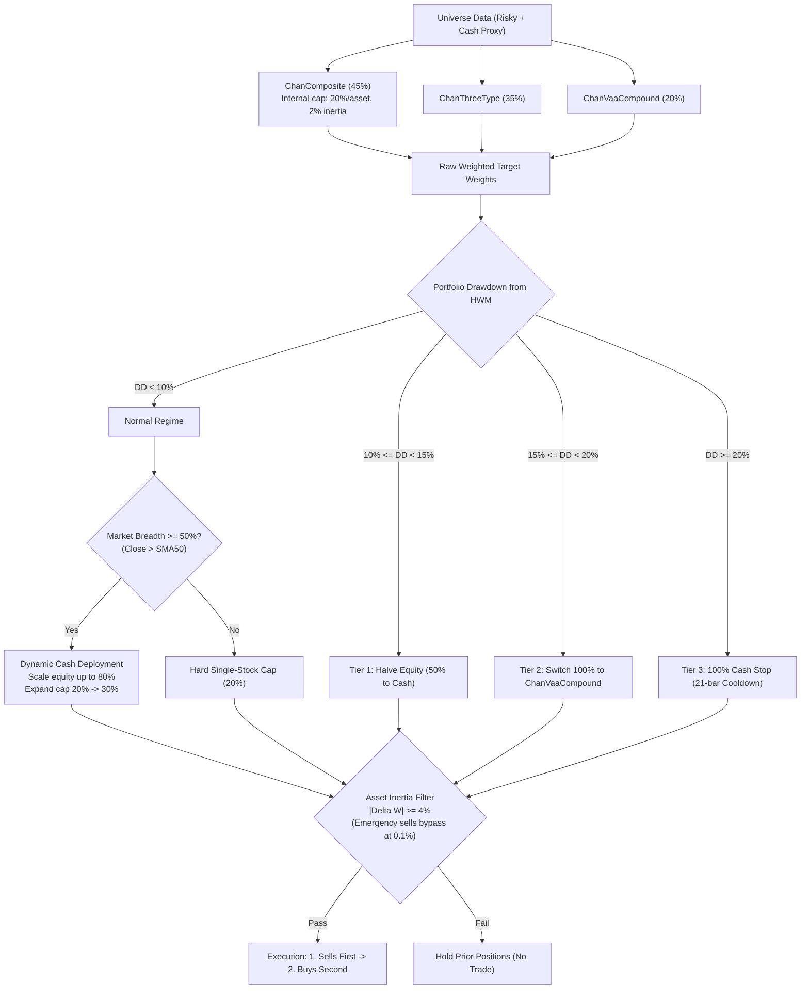
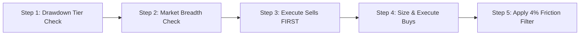

# Chan Risk-Managed Blend: Live Trading Operating Manual & Rulebook

> **Strategy Identifier**: `chan_risk_managed_blend` ([`ChanRiskManagedBlendStrategy`](file:///home/stone/Work/github/quant/pipeline/research_strategy/rs/chan_advanced_strategies.py#L1193-L1453))  
> **Instrument Context**: Equity / ETF Universe (US Equities or China A-Shares) + Cash Proxy ([`BIL`](file:///home/stone/Work/github/quant/pipeline/research_strategy/strategies_config.json#L295) / `511880` / `511990` / Overnight Repo)  
> **Trading Frequency**: Daily rebalance evaluation, executing primarily between **14:00 – 14:50** (to avoid open auction volatility and end-of-day market-on-close distortions).

---

## 1. Strategy Identity & Architecture Overview

The **Chan Risk-Managed Blend Strategy** is an institutional multi-strategy portfolio designed to combine micro/macro structural price action alpha with rigorous risk controls and dynamic capital allocation.

### Core Model Triad & Baseline Allocations
* **45% `ChanCompositeStrategy`**: Dynamic multi-stage $B_1/B_2/B_3$ position pyramiding, equipped with the Lessons 92–99 dangerous pivot relation brake. (Note: applies internal 20% single-stock cap and 2% inertia filter before blending, contributing at most $45\% \times 20\% = 9\%$ per stock).
* **35% `ChanThreeTypeStrategy`**: Standard segment-level pivot structural breakout and divergence engine.
* **20% `ChanVaaCompoundStrategy`**: VAA-G4 13612W dual-momentum macro regime crash protection buffer.



---

## 2. Daily Live Trading Routine (Operational Checklist)

A human trader must follow this 5-step daily routine in strict sequential order before placing any trades:



---

## 3. Step-by-Step Decision Logic & Rules

### Step 1: Drawdown Circuit Breaker Check (Portfolio Level)
Calculate your current portfolio High-Water Mark (HWM) and peak-to-trough drawdown at 14:00:
$$\text{Drawdown} = \frac{\text{Current NAV} - \text{Peak NAV}}{\text{Peak NAV}}$$

* **IF Drawdown $< 10\%$ (Normal Regime)**:
  * Proceed to Step 2 with full risk budget. Standard single-stock cap = **$20\%$**.
* **IF $10\% \le \text{Drawdown} < 15\%$ (Tier 1: Risk Damping)**:
  * **Action**: Cut all active stock positions by **$50\%$**.
  * Maximum total equity exposure = **$50\%$**; remaining $50\%$ must sit in Cash Proxy.
  * No new breakout buys allowed unless funded from the $50\%$ reduced budget.
* **IF $15\% \le \text{Drawdown} < 20\%$ (Tier 2: Tactical Defense)**:
  * **Action**: Disengage composite and three-type models; route **100% of capital into `ChanVaaCompoundStrategy`**.
  * **Behavior**: In defensive regime, VAA holds $70\%$ in Cash Proxy / Short-term Treasuries and up to $30\%$ in the strongest defensive asset. (If VAA momentum remains bullish, it holds disciplined momentum breakout positions).
* **IF Drawdown $\ge 20\%$ (Tier 3: Hard Stop / Emergency Halt)**:
  * **Action**: **Liquidate $100\%$ of all risk assets into Cash Proxy immediately**.
  * **Lockout**: **Do not buy for 21 consecutive trading days**. On Day 22, reset HWM to current NAV to allow fresh cycle re-entry.

---

### Step 2: Market Breadth Regime Check (Capacity & Exposure Scaling)
Calculate universe breadth: percentage of tracked stocks trading above their 50-day Simple Moving Average ($\text{Close} > \text{SMA}_{50}$):

* **IF Market Breadth $\ge 50\%$ (Bull Breadth Regime) AND Drawdown $< 10\%$**:
  * **Max Single-Stock Cap**: Expands from $20\%$ up to **$30\%$** (`crb_bull_max_single_position`).
  * **Target Total Equity Exposure**: Up to **$80\%$** (`crb_target_bull_exposure`), deploying idle cash into top conviction setups.
* **ELSE (Market Breadth $< 50\%$ OR Drawdown $\ge 10\%$)**:
  * **Max Single-Stock Cap**: Hard limit of **$20\%$** per stock.
  * **Target Total Equity Exposure**: Standard unscaled exposure (typically $40\%–60\%$, balance in Cash Proxy).

---

### Step 3: Asset-Level Sell Rules (Execute Sells FIRST)
Always execute sell orders before buy orders to guarantee purchasing power and avoid margin strain.

Liquidate an asset down to **$0.0\%$** if **ANY** of the following conditions trigger:

1. **Chan Structural Sell Points ($S_1 / S_2 / S_3$)**:
   * **$S_1$ (Top Divergence / 顶背驰)**: Stock makes a new high, but MACD histogram area or amplitude is clearly smaller than the previous upward stroke.
   * **$S_2$ (Second Sell Point / 二卖)**: Upward rebound fails to break the prior high and prints a lower-high pivot.
   * **$S_3$ (Third Sell Point / 三卖)**: Downward stroke breaks through the lower boundary of a consolidation pivot, and the subsequent pullback fails to re-enter the pivot zone.
2. **Structural Risk Brake (Lessons 92–99 Dangerous Pivot Violation)**:
   * A newly formed pivot's extreme price penetrates past the prior pivot in the counter-trend direction $\rightarrow$ **Sell immediately**, even if no formal $S_1/S_2/S_3$ has completed.
3. **Hard Stop-Loss**:
   * Asset drops **$\ge 8\%$** below your average entry price $\rightarrow$ **Market exit immediately** (matching `stop_loss_pct = 0.08` across sub-strategies).
4. **Time Stop (Stagnation Net)**:
   * Position has been held for **$\ge 90$ trading days** without generating a higher pivot or new buy continuation $\rightarrow$ Close position and release capital (matching `max_holding_days = 90`).

---

### Step 4: Asset-Level Buy Rules (Tranche Pyramiding)
Do not buy an entire position in a single order. Scale into positions using the 3 Chan buy points:

```
[B1: Bottom Divergence]   ──> Buy 30% of target position  (Left-side probe)
           │
[B2: Higher Low Pullback] ──> Add +40% of target position (Right-side confirmation)
           │
[B3: Pivot Breakout Retest]──> Add +30% of target position (Trend acceleration)
```

1. **Tranche 1: $B_1$ Bottom Divergence (Base 30%)**:
   * **Setup**: Price makes a fresh low on a downward stroke, but MACD histogram area is smaller than the prior downward wave (momentum exhaustion).
   * **Order**: Buy **$30\%$** of target position size (e.g., $6\%$ of total portfolio if target cap is $20\%$).
2. **Tranche 2: $B_2$ Higher Low Pullback (Add +40%)**:
   * **Setup**: First downward pullback after $B_1$ holds **above** the $B_1$ low, followed by a bullish reversal bar.
   * **Order**: Add **$+40\%$** of target position size (total position now at $70\%$).
3. **Tranche 3: $B_3$ Pivot Breakout Retest (Add +30%)**:
   * **Setup**: Price breaks out strongly above a prior consolidation pivot; the subsequent pullback bar low remains strictly **above** the upper boundary of that pivot.
   * **Order**: Add the remaining **$+30\%$** of target position size (total position now at $100\%$ of target cap).

---

### Step 5: Turnover & Minimum Trade Filter ($\Delta W \ge 4\%$)
Before entering an order into your broker terminal, calculate the weight change:
$$\Delta W = |W_{\text{target}} - W_{\text{current}}|$$

* **Normal Trading Days**:
  * **IF $\Delta W < 4\%$**: **DO NOT TRADE**. Hold prior quantity. (Prevents commission drag and slippage on micro-adjustments).
  * **IF $\Delta W \ge 4\%$**: Place order.
* **Circuit Breaker Days (Emergency Override)**:
  * If a circuit breaker triggered (Tier 1/2/3) or an asset hit an $8\%$ stop-loss:
    * **Emergency Sells**: Bypass the $4\%$ rule down to **$0.1\%$** ($|\Delta W| \ge 0.001$) and execute sales immediately.
    * **Emergency Buys**: Still require the full **$4\%$** threshold ($|\Delta W| \ge 0.04$) to prevent buying into a declining market.

---

## 4. Human Trader Quick-Reference Card

Keep this table handy during the market session:

| Check | Item | Condition | Human Trader Action |
| :--- | :--- | :--- | :--- |
| **Risk** | **HWM Drawdown** | $\ge 20\%$ | **STOP ALL TRADING**: Liquidate $100\%$ to cash proxy. Freeze 21 days (HWM resets Day 22). |
| **Risk** | **HWM Drawdown** | $15\% - 19.9\%$ | **DEFENSIVE SHIFT**: Route $100\%$ to ChanVaaCompound (holds $70\%$ cash in defense mode). |
| **Risk** | **HWM Drawdown** | $10\% - 14.9\%$ | **HALVE RISK**: Cut all open equity weights by $50\%$; sweep remainder to cash. |
| **Regime** | **Market Breadth** | $\ge 50\%$ above SMA50 | **BULL SCALING**: Increase single-stock cap to $30\%$; total equity up to $80\%$. |
| **Regime** | **Market Breadth** | $< 50\%$ above SMA50 | **CONSERVATIVE**: Keep single-stock cap at $20\%$; standard cash buffer. |
| **Exit** | **Stop-Loss** | Loss $\ge 8\%$ from entry | **EXIT IMMEDIATELY**: Sell $100\%$ of position at market/limit. |
| **Exit** | **Time Stop** | Held $\ge 90$ days no progress| **EXIT**: Close position to release capital. |
| **Exit** | **Chan Sells** | $S_1, S_2, S_3$ or Pivot Danger | **EXIT**: Sell position to $0.0\%$. |
| **Entry** | **Tranche 1 ($B_1$)**| Bottom MACD divergence | **BUY 30%** of target allocation. |
| **Entry** | **Tranche 2 ($B_2$)**| Higher low pullback | **BUY +40%** of target allocation (cumulative 70%). |
| **Entry** | **Tranche 3 ($B_3$)**| Breakout retest above pivot | **BUY +30%** of target allocation (cumulative 100%). |
| **Execution**| **Friction Filter** | $|\Delta W| < 4\%$ | **SKIP**: Do not place order if change is under $4\%$ portfolio NAV. |
| **Execution**| **Sequence** | Multi-asset rebalance | **SELLS FIRST** (free up cash) $\rightarrow$ **BUYS SECOND**. |

---

## 5. Execution Nuances & Slippage Management

1. **Execution Window**: 
   * Evaluate data at **14:00**.
   * Transmit orders between **14:20 – 14:45**. 
   * Avoid trading in the first 30 minutes of the open (09:30–10:00) where bid-ask spreads are widest.
2. **Order Style**:
   * For highly liquid instruments (large-cap ETFs/stocks): Use **limit orders pegged to current bid/ask** or TWAP slices over 15 minutes.
   * For emergency stop-losses or Tier 3 circuit breakers: Use **market or immediate-or-cancel limit orders** to guarantee execution.
3. **Cash Proxy Management**:
   * Any capital not allocated to stocks should be parked in risk-free yield assets (e.g., [`BIL`](file:///home/stone/Work/github/quant/pipeline/research_strategy/strategies_config.json#L295) / `SGOV` in US markets, or `511880` / `511990` / GC001 in China A-shares) rather than uninvested non-earning cash.
