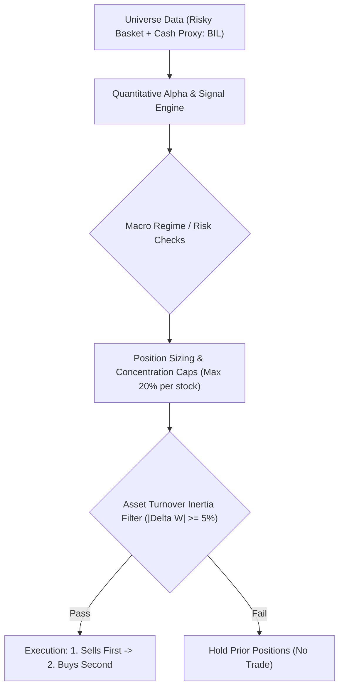
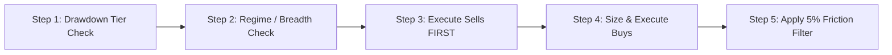

# Chan Risk-Managed Blend Strategy: Live Trading Operating Manual & Rulebook

> **Strategy Identifier**: `chan_risk_managed_blend` (`ChanRiskManagedBlendStrategy`)  
> **Instrument Context**: Equity / ETF Universe + Cash Proxy (`BIL`)  
> **Trading Frequency**: Daily rebalance evaluation, executing between **14:00 – 14:50** (to avoid open auction volatility and end-of-day market-on-close distortions).  
> **Underlying Factors**: `regime_trend_strength`, `absolute_momentum_trend`, `relative_momentum`, `volatility_targeting`

---

## 1. Strategy Identity & Architecture Overview

**Chan Risk-Managed Blend Strategy** is a quantitative trading strategy designed for disciplined portfolio execution.

### Strategy Description
Walkforward-optimized institutional ensemble blending the top 3 Chan strategies (chan_three_type 45%, chan_vaa_compound 35%, chan_composite 20%) with institutional risk controls: 20% single-stock cap, multi-level drawdown circuit breakers with 15-bar auto-healing cooldown and fast-recovery override, 5% turnover filter, 30% breadth bull threshold, and pre-emptive breadth thrust cash deployment.

---

## 2. Daily Live Trading Routine (Operational Checklist)

A human trader must follow this 5-step daily routine in strict sequential order before placing any trades:

---

## 3. Step-by-Step Decision Logic & Rules

### Step 1: Drawdown Circuit Breaker Check (Portfolio Level)
Calculate your current portfolio High-Water Mark (HWM) and peak-to-trough drawdown at 14:00:
$$\text{Drawdown} = \frac{\text{Current NAV} - \text{Peak NAV}}{\text{Peak NAV}}$$

* **IF Drawdown < 10% (Normal Regime)**:
  * Proceed to Step 2 with full risk budget. Standard single-stock cap = **20%**.
* **IF 10% <= Drawdown < 15% (Tier 1: Risk Damping)**:
  * **Action**: Cut all active stock positions by **50%**.
  * Remaining 50% must sit in Cash Proxy (`BIL`).
* **IF 15% <= Drawdown < 20% (Tier 2: Tactical Defense)**:
  * **Action**: Liquidate discretionary offensive positions.
  * Switch into defensive mode: Hold 70% in Cash Proxy, and up to 30% only in leading defensive assets.
* **IF Drawdown >= 20% (Tier 3: Hard Stop / Emergency Halt)**:
  * **Action**: **Liquidate 100% of all risk assets into Cash Proxy immediately**.
  * **Lockout**: **Do not buy for 21 consecutive trading days**. On Day 22, reset HWM to current NAV to allow fresh cycle re-entry.

---

### Step 2: Regime & Market Breadth Check
* **IF Market Regime is Favorable**:
  * Allocate up to target equity exposure according to model conviction.
  * Dynamically deploy cash into top qualifying assets without exceeding position caps.
* **ELSE (Market Regime is Bearish or Indeterminate)**:
  * Enforce standard hard cap of **20%** per stock.
  * Retain remaining capital in Cash Proxy (`BIL`).

---

### Step 3: Asset-Level Sell Rules (Execute Sells FIRST)
Always execute sell orders before buy orders to guarantee purchasing power and avoid margin strain.

Liquidate an asset down to **0.0%** if **ANY** of the following conditions trigger:
1. **Model Sell Signal**: Formal exit or sell signal printed by the strategy engine.
2. **Structural Invalidation**: Price action invalidates the setup or breaks key support.
3. **Hard Stop-Loss**: Asset drops **>= 8%** below entry price -> **Market exit immediately**.
4. **Time Stop**: Position held for **>= 90 trading days** without upward follow-through -> Close position and release capital.

---

### Step 4: Asset-Level Buy Rules (Position Sizing)
1. **Entry Confirmation**: Only buy when entry signals are confirmed at the 14:00 evaluation.
2. **Tranche Pyramiding**: Scale into positions progressively (e.g. 30% initial base tranche, 40% confirmation tranche, 30% breakout tranche) rather than buying 100% upfront.
3. **Single-Stock Cap**: Never allocate more than **20%** of total portfolio NAV to any single ticker.

---

### Step 5: Turnover & Minimum Trade Filter (|Delta W| >= 5%)
Before entering an order into your broker terminal, calculate the weight change:
$$\Delta W = |W_{\text{target}} - W_{\text{current}}|$$

* **Normal Trading Days**:
  * **IF $\Delta W < 5%$**: **DO NOT TRADE**. Hold prior quantity to avoid transaction fee erosion.
  * **IF $\Delta W \ge 5%$**: Place order.
* **Circuit Breaker Days (Emergency Override)**:
  * If a circuit breaker triggered or an asset hit a hard stop-loss:
    * **Emergency Sells**: Bypass the 5% rule down to **0.1%** ($|\Delta W| \ge 0.001$) and execute sales immediately.
    * **Emergency Buys**: Still require the full **5%** threshold ($|\Delta W| \ge 0.0500$) to avoid buying into falling markets.

---

## 4. Human Trader Quick-Reference Card

| Check | Item | Condition | Human Trader Action |
| :--- | :--- | :--- | :--- |
| **Risk** | **HWM Drawdown** | >= 20% | **STOP ALL TRADING**: Liquidate 100% to `BIL`. Freeze 21 days (HWM resets Day 22). |
| **Risk** | **HWM Drawdown** | 15% - 20% | **DEFENSIVE SHIFT**: Route 100% to defensive mode (70% cash proxy buffer). |
| **Risk** | **HWM Drawdown** | 10% - 15% | **HALVE RISK**: Cut all open equity weights by 50%; sweep remainder to cash. |
| **Regime** | **Regime Gate** | Bullish | **NORMAL / EXPANDED**: Target full model exposure up to caps. |
| **Regime** | **Regime Gate** | Bearish / Neutral | **CONSERVATIVE**: Keep single-stock cap at 20%; hold cash buffer. |
| **Exit** | **Stop-Loss** | Loss >= 8% from entry | **EXIT IMMEDIATELY**: Sell 100% of position. |
| **Exit** | **Time Stop** | Held >= 90 days no progress | **EXIT**: Close position to release capital. |
| **Exit** | **Signal Exit** | Model Sell / S-point | **EXIT**: Sell position to 0.0%. |
| **Entry** | **Signal Buy** | Valid Model Buy Signal | **SCALE IN**: Buy tranche up to single-stock cap (20%). |
| **Execution**| **Friction Filter**| |Delta W| < 5% | **SKIP**: Do not place order if change is under 5% portfolio NAV. |
| **Execution**| **Sequence** | Multi-asset rebalance | **SELLS FIRST** (free up cash) -> **BUYS SECOND**. |

---

## 5. Execution Nuances & Slippage Management

1. **Execution Window**: 
   * Evaluate data at **14:00**.
   * Transmit orders between **14:20 – 14:45**. 
   * Avoid trading in the first 30 minutes of the market open (09:30–10:00).
2. **Order Style**:
   * For standard liquid equities/ETFs: Use **limit orders pegged to current bid/ask** or TWAP slices over 15 minutes.
   * For emergency stop-losses or circuit breakers: Use **market or aggressive limit orders** to guarantee fills.
3. **Cash Proxy Management**:
   * Unallocated capital must be held in interest-bearing cash equivalents (`BIL`).
