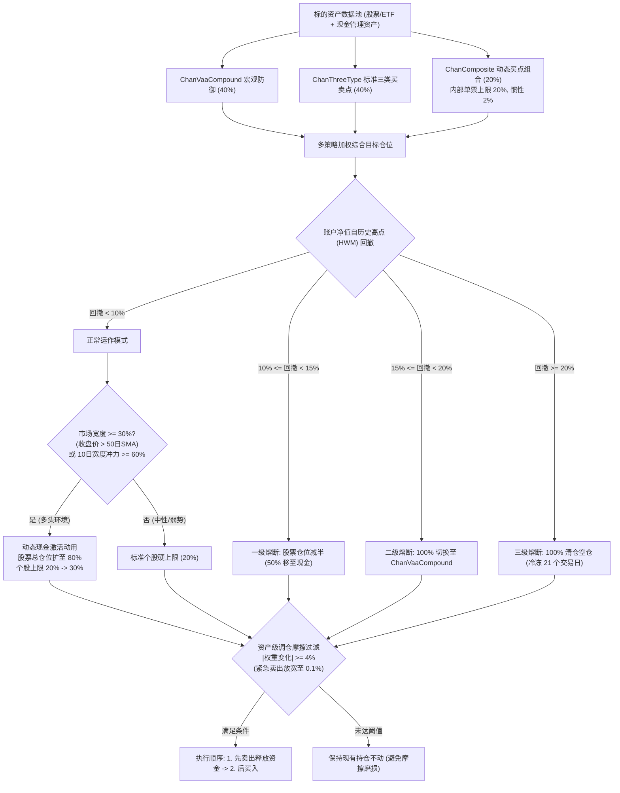
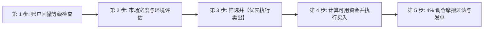

# 缠论风控混合配置策略 (Chan Risk-Managed Blend): 实盘交易操作规程与规则手册

> **策略标识**: `chan_risk_managed_blend` ([`ChanRiskManagedBlendStrategy`](file:///home/stone/Work/github/quant/pipeline/research_strategy/rs/chan_advanced_strategies.py#L1193-L1453))  
> **交易标的**: 股票 / ETF 股票池 (A股或美股) + 现金管理替代资产 ([`BIL`](file:///home/stone/Work/github/quant/pipeline/research_strategy/strategies_config.json#L295) / `511880` 华宝添益 / `511990` 银华日利 / 国债逆回购)  
> **调仓频率**: 日频评估与决策，实盘下单主要集中在 **14:00 – 14:50** (避开早盘集合竞价剧烈波动及尾盘收盘集合竞价冲击)。

---

## 1. 策略架构与模型体系

**缠论风控混合配置策略 (Chan Risk-Managed Blend)** 是一套融合微观缠论结构 Alpha、宏观动量防崩塌 (VAA)、市场宽度动态仓位调节及机构级多级回撤熔断的综合投资体系。

### 核心子策略三元组与基准权重
* **40% `ChanVaaCompoundStrategy` (中枢MACD与VAA动量宏观防御)**: 基于 VAA-G4 13612W 动量模型的宏观崩塌保护与进攻防御切换引擎，作为核心压舱石防御缓冲。
* **40% `ChanThreeTypeStrategy` (标准三类买卖点波段策略)**: 基于严格笔/线段中枢与 MACD 面积背驰的标准结构波段策略。
* **20% `ChanCompositeStrategy` (一二三类买点动态组合建仓)**: 依据一买、二买、三买分批金字塔式建仓，内建缠论92–99课中枢关系危险破坏防线。(注：该子策略内部自带单票 20% 上限与 2% 惯性过滤，对混合组合单票贡献上限为 $20\% \times 20\% = 4\%$)。



---

## 2. 实盘交易员日内标准作业程序 (SOP)

实盘交易员在每个交易日下午 **14:00 – 14:50** 严格按照以下五个先后次序执行检查与下单：



---

## 3. 详细交易逻辑与分步规则

### 第 1 步: 账户级回撤熔断检查 (强制首要执行)
每日 14:00 计算当前资产净值相对于历史最高净值 (High-Water Mark) 的回撤比例：
$$\text{回撤幅度 (Drawdown)} = \frac{\text{当前净值} - \text{历史峰值净值}}{\text{历史峰值净值}}$$

* **IF 回撤 $< 10\%$ (正常运作区间)**:
  * 进入第 2 步，享有完整风险预算。单个股票仓位上限为 **$20\%$**。
* **IF $10\% \le \text{回撤} < 20\%$ (平滑线性风控衰减, `crb_smooth_drawdown = True`)**:
  * **操作**: 废除传统阶梯式断崖减仓，采用**平滑连续线性降权**：
    $$\text{Scale}_{\text{dd}} = \max\left(0.0, 1.0 - \frac{\text{回撤幅度} - 10\%}{20\% - 10\%}\right)$$
  * **行为**: 回撤达到 $10\%$ 时仍保留 $100\%$ 正常仓位；达到 $15\%$ 时平滑降至 $50\%$ 仓位；达到 $18\%$ 时降至 $20\%$ 仓位，剥离的资金全部转入无风险现金品。
  * **快速恢复机制**: 若短期 10 日收益率翻正或 10 日冲力爆发，立即豁免回撤降权，恢复正常多头仓位。
  * **自动愈合机制**: 回撤持续 15 个交易日未破新低后，基准峰值净值自动愈合至当前净值，避免永久性踏空。
* **IF 回撤 $\ge 20\%$ (三级硬熔断: 极端硬止损空仓)**:
  * **操作**: **100% 全面清仓所有风险资产，全部移至现金替代品**。
  * **冷却锁定期**: **连续 21 个交易日绝对禁止开仓**。第 22 个交易日将峰值基准重置为当前净值，方可重新开始评估买入。

---

### 第 2 步: 市场宽度、10 日宽度冲力与波动率目标制 (杠杆与分散配置)
1. **波动率目标制叠加 (`crb_enable_vol_targeting = True`, `crb_target_vol = 0.12`)**:
   * 基于 Barroso & Santa-Clara (2015) 波动率目标模型，跟踪股票池最近 21 日年化实现波动率 $\sigma_{21d}$。
   * 当市场波动剧烈 ($\sigma_{21d} > 12\%$) 时，将所有股票目标权重按 $\min(1.0, 12\% / \sigma_{21d})$ 连续同比例缩放，剩余仓位保留在现金中，有效切断市场极端恐慌时的尾部暴跌风险。
2. **市场宽度与 10 日冲力分散配置**:
   * 计算跟踪股票池中站上 50 日均线的股票比例 ($\text{收盘价} > \text{SMA}_{50}$, `crb_breadth_lookback = 50`) 及短期 10 日宽度冲力（10 日收益率为正的股票比例, $\text{ROC}_{10} > 0$, `crb_thrust_lookback = 10`）:
   * **IF (市场宽度 $\ge 30\%$ OR 10 日宽度冲力 $\ge 60\%$) AND 账户回撤 $< 10\%$**:
     * **动态现金动用激活**: 总权益仓位提升至至多 **$80\%$** (`crb_target_bull_exposure`)。
     * **单票上限严格控制在 $\le 20\%$** (`crb_bull_max_single_position = 0.20`): 坚决杜绝单票仓位放大至 30% 造成的集中度暴险。
     * **冲力多资产分散**: 触发 10 日宽度冲力时，闲置资金必须分散配置给**至少 5 只**不同动量领涨龙头股票（每只配置 5%–8%），严禁单票孤注一掷重仓。
   * **ELSE (市场宽度 $< 30\%$ 且冲力 $< 60\%$, 或账户处于回撤状态)**:
     * **单票上限**: 严格执行 **$20\%$** 硬顶。
     * **总权益仓位**: 维持标准不放大状态 (通常为 $40\%–60\%$，剩余保持现金品 `BIL`)。

---

### 第 3 步: 资产级卖出与止损规则 (必须【先卖后买】)
**必须先执行卖出订单，待可用资金到账后，再行分配买入，严禁盲目加仓拉高杠杆。**

若持仓标的触发以下**任意一项**条件，该股票目标仓位直接降为 **$0.0\%$ (清仓)**：

1. **缠论结构卖点 ($S_1 / S_2 / S_3$)**:
   * **一卖 ($S_1$: 顶背驰)**: 股价创出新高，但上涨段或笔的 MACD 柱体面积/振幅明显小于前一上涨波段 (多头动能耗尽)。
   * **二卖 ($S_2$: 次级别反弹不创新高)**: 次级别向上反弹无力，未能超越前期高点，形成向下分型中枢下移。
   * **三卖 ($S_3$: 跌破中枢反弹确认)**: 向下破位跌穿盘整中枢下沿，随后回抽反弹低点完全无法触及中枢下沿。
2. **中枢结构破坏危险制动 (缠论 92–99 课核心规则)**:
   * 新中枢形成的极端价位逆势穿透前一中枢的界线 $\rightarrow$ **立即清仓离场**，无需等待后续正式卖点确认。
3. **个股硬止损**:
   * 任意单只标的跌幅达到或超过成本价的 **$-8\%$** $\rightarrow$ **市价立即止损出局** (与各子策略底层 `stop_loss_pct = 0.08` 保持一致)。
4. **时间止损 (盘整超期注销)**:
   * 买入后持有达 **$90$ 个交易日** 仍未能走出向上新中枢或未触发新的买点延续 $\rightarrow$ 主动平仓释放沉淀资金 (与各子策略底层 `max_holding_days = 90` 保持一致)。

---

### 第 4 步: 资产级分批买入与加仓规则 (金字塔建仓)
严禁单笔直接打满单票配额。必须依据缠论一二三类买点结构分三批逐步递增建仓：

```
[一买 B1: 底背驰初试]    ──> 买入目标仓位的 30% (左侧初试探底)
          │
[二买 B2: 次次回抽不破低] ──> 加仓目标仓位的 40% (右侧确认，累计达 70%)
          │
[三买 B3: 中枢突破回踩]  ──> 加仓目标仓位的 30% (趋势加速，打满 100%)
```

1. **第一批: 一买 $B_1$ 底背驰 (底仓 30%)**:
   * **图表形态**: 下跌段创新低，但对应笔或段的 MACD 绿柱面积明显缩小，形成底背驰。
   * **下单动作**: 买入该股目标总仓位的 **$30\%$** (若单票上限规划为 $20\%$，此处即为总资金的 $6\%$)。
2. **第二批: 二买 $B_2$ 次级别回踩不破低 (加仓 40%)**:
   * **图表形态**: 一买上涨后的首次次级别回调，底点**坚决守在 $B_1$ 最低价上方**，随后出现底部转折阳线。
   * **下单动作**: 追加该股目标总仓位的 **$+40\%$** (该股累计仓位达到目标满仓的 $70\%$)。
3. **第三批: 三买 $B_3$ 中枢突破回踩确认 (加仓 30%)**:
   * **图表形态**: 强力向上拉升脱离盘整中枢，其次级别回调的最低点**完全不跌回原中枢上沿之上**。
   * **下单动作**: 追加剩余 **$+30\%$** 仓位，完成该标的 $100\%$ 配额打满。

---

### 第 5 步: 交易调仓摩擦过滤规则 ($|\Delta W| \ge 4\%$)
在交易终端输入发单前，必须计算单票调仓权重变动绝对值：
$$\Delta W = |\text{目标权重} - \text{当前实际持仓权重}|$$

* **普通交易日 (常规调仓)**:
  * **IF $\Delta W < 4\%$**: **放弃交易，维持原有股数不变** (杜绝微幅再平衡所产生的佣金、印花税及冲击成本)。
  * **IF $\Delta W \ge 4\%$**: 正式发单。
* **熔断与风控日 (紧急通道)**:
  * 一旦触发一级/二级/三级熔断，或触及 $-8\%$ 个股止损线：
    * **紧急卖出**: 门槛放宽至 **$0.1\%$** ($|\Delta W| \ge 0.001$) 即刻发单执行减仓/清仓。
    * **紧急买入**: 仍须严格满足 **$4\%$** 门槛 ($|\Delta W| \ge 0.04$)，防止弱市中逆势加仓。

---

## 4. 实盘交易员便携速查表

建议将下表置于交易工位显示器旁备查：

| 维度 | 核对项目 | 触发条件 | 实盘交易员必须采取的操作 |
| :--- | :--- | :--- | :--- |
| **风控** | **账户总回撤** | $\ge 20\%$ | **【三级硬熔断】** 全面清仓至现金替代品；冷冻 21 天，第 22 天重置净值基准。 |
| **风控** | **账户总回撤** | $10\% - 19.9\%$ | **【平滑线性风控】** 依 $1.0 - (\text{DD}-10\%)/10\%$ 连续降权，平滑卸杠杆，无断崖暴跌。 |
| **风控** | **市场波动率** | 21日年化波动 $> 12\%$ | **【波动率目标制】** 按 $12\% / \sigma_{21d}$ 比例压缩股票总暴露，削减极端暴跌风险。 |
| **环境** | **市场宽度** | $\ge 30\%$ 位于50日线上 或 10日冲力 $\ge 60\%$ | **【多头激活动用】** 股票总仓可配至 $80\%$；单票上限严格 $\le 20\%$；冲力分散至 $\ge 5$ 只龙头。 |
| **环境** | **市场宽度** | $< 30\%$ 位于50日线上 且 冲力 $< 60\%$ | **【防御基准】** 单票上限锁死 $20\%$；维持标准现金缓冲。 |
| **卖出** | **硬止损** | 单票自成本跌 $\ge 8\%$ | **【立即离场】** 无论任何形态，市价或积极限价平仓 $100\%$。 |
| **卖出** | **时间止损** | 持仓达 90 交易日停滞 | **【超时平仓】** 获利或微损平仓，释放资金效率。 |
| **卖出** | **缠论卖点** | $S_1, S_2, S_3$ 或中枢破坏| **【清仓出局】** 该股目标权重直降为 $0.0\%$。 |
| **买入** | **一买 ($B_1$)**| 底背驰出现 | **买入 30%** 规划额度。 |
| **买入** | **二买 ($B_2$)**| 回踩不破一买低点 | **加仓 40%** 规划额度 (累计达 70%)。 |
| **买入** | **三买 ($B_3$)**| 突破中枢回抽不破顶 | **加仓 30%** 规划额度 (打满 100%)。 |
| **执行** | **摩擦过滤** | 拟调仓变动 $< 4\%$ | **跳过不发单**，保持原仓位不变。 |
| **执行** | **发单次序** | 涉及多资产同时调仓 | **【先卖出后买入】**：卖单确认成交/资金释放后再挂买单。 |

---

## 5. 实盘执行细节与冲击成本控制

1. **发单时间窗口**:
   * **14:00 – 14:15**: 汇总全天数据，计算当日回撤与市场宽度。
   * **14:20 – 14:45**: 发出卖出与买入委托。
   * 严禁在早盘开盘前 30 分钟 (09:30–10:00) 追涨杀跌，该时段买卖价差最大、虚假信号最多。
2. **订单执行类型**:
   * 高流动性标的 (大盘宽基 ETF、高成交股票): 挂买一/卖一限价单，或分批 15 分钟 TWAP 下单。
   * 紧急止损单或三级熔断平仓: 采用市价或最优五档即时成交剩余撤销单，确保绝对离场。
3. **现金替代品归集**:
   * 未买入股票的闲置资金切勿闲置在 0 利率现金账户中。
   * A股账户：收盘前将可用资金申购或买入 `511880` (华宝添益)、`511990` (银华日利) 或参与 `GC001` (国债逆回购)。
   * 美股账户：配置于短期超短国债 ETF ([`BIL`](file:///home/stone/Work/github/quant/pipeline/research_strategy/strategies_config.json#L295) / `SGOV`) 获取稳健无风险基准收益。
